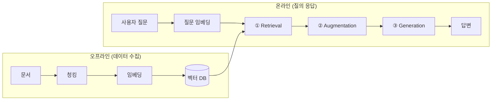

# RAG (Retrieval-Augmented Generation, 검색 증강 생성)

> [!tldr] 한줄 요약
> LLM이 응답을 생성하기 전에 **외부 지식 베이스에서 관련 정보를 검색**해서 컨텍스트로 제공하는 아키텍처. 학습 데이터에 없는 최신/도메인 정보도 정확하게 답변할 수 있게 한다.

## 핵심 내용

### 왜 필요한가?

LLM의 근본적 한계:
- **지식 단절(Knowledge Cutoff)**: 학습 시점 이후의 정보를 모름
- **환각(Hallucination)**: 모르는 것도 자신 있게 답변함
- **도메인 특화 지식 부족**: 사내 문서, 비공개 데이터를 학습하지 않음

RAG는 이 문제를 "모델을 재학습시키지 않고" 해결한다.

### 핵심 파이프라인 (3단계)

**① Retrieval (검색)**
- 사용자 질문을 임베딩으로 변환
- 벡터 DB에서 의미적으로 유사한 청크를 검색
- 질문에 답하는 데 필요한 문서 조각(chunk)을 찾아냄

**② Augmentation (증강)**
- 검색된 청크를 프롬프트에 컨텍스트로 삽입
- "아래 문서를 참고하여 답변하세요" 형태

**③ Generation (생성)**
- LLM이 원래 질문 + 검색된 컨텍스트를 기반으로 답변 생성
- 근거가 있으므로 환각이 크게 줄어듦

### 데이터 수집 파이프라인 (오프라인)

검색이 가능하려면 사전에 지식 베이스를 구축해야 한다 (위 다이어그램의 오프라인 영역):

- **청킹**: 문서를 적절한 크기로 분할. 512 토큰 고정 크기 또는 재귀적 분할(recursive splitting)이 기본 권장
- **임베딩**: 각 청크를 벡터로 변환 (문서 임베딩과 질문 임베딩은 같은 모델 사용)
- **인덱싱**: 벡터 DB(Pinecone, Weaviate, Chroma 등)에 저장

### RAG의 진화 단계

| 세대 | 특징 | 적합한 경우 |
|------|------|------------|
| **Naive RAG** | 단순 검색 → 생성. 구현이 쉽지만 정확도 한계 | 소규모 정적 문서, PoC |
| **Advanced RAG** | Re-ranking, 하이브리드 검색, 피드백 루프 추가 | 프로덕션 서비스 |
| **Modular RAG** | 검색/메모리/라우팅/퓨전 등을 독립 모듈로 분리, 교체 가능 | 엔터프라이즈 시스템 |
| **Agentic RAG** | AI 에이전트가 질문을 분해하고 도구를 선택하며 반복 추론 | 복잡한 멀티스텝 워크플로 |

### Advanced RAG의 주요 기법

- **Hybrid Search**: BM25(키워드) + Dense(벡터) 검색을 결합해 recall 향상
- **Re-ranking**: Cross-encoder로 검색 결과를 재정렬해 precision 향상
- **Query Expansion**: 원래 질문을 변형/확장해 더 다양한 관련 문서 검색
- **Metadata Filtering**: 벡터 검색 전에 메타데이터(날짜, 카테고리 등)로 사전 필터링

### 한계점

#### 검색 품질에 전적으로 의존

RAG의 답변 품질은 **검색이 올바른 문서를 가져오는지**에 달려 있다. 의미적 불일치(Semantic Gap)로 질문과 답이 담긴 문서의 표현이 다르면 검색이 실패한다.

#### 청킹의 딜레마

- 청크가 **너무 작으면** 문맥이 잘려서 의미가 훼손됨
- 청크가 **너무 크면** 관련 없는 내용이 섞여 LLM이 혼동
- 표, 이미지, 코드 블록 같은 **구조화된 콘텐츠**는 단순 분할로 의미를 보존하기 어려움

#### 환각을 완전히 제거하지 못함

검색된 문서가 있어도 LLM이 문서에 없는 내용을 추론해서 덧붙이거나, 여러 청크의 정보를 잘못 조합하거나, 검색 결과를 무시하고 학습된 지식으로 답변할 수 있다.

#### 멀티홉 추론의 어려움

"A팀의 매니저가 담당하는 프로젝트의 예산은?"처럼 **여러 문서를 순차적으로 검색**해야 답할 수 있는 질문에 Naive RAG는 단일 검색만 수행한다. Agentic RAG가 해결하려 하지만 복잡도와 비용이 크게 증가한다.

#### 평가의 어려움

- **검색 품질(Retrieval relevance)**: 올바른 청크를 가져왔는가?
- **답변 충실도(Faithfulness)**: 검색된 문서에 근거한 답변인가?
- **답변 정확도(Correctness)**: 사실적으로 맞는가?

세 지표가 모두 높아야 하지만, 자동 평가가 어려워 사람이 직접 검증해야 하는 경우가 많다.

> [!tip] RAG vs 파인튜닝
> RAG는 **외부 지식 접근**에, 파인튜닝은 **모델 행동 변경**에 적합하다. "최신 제품 정보로 답변하라" → RAG, "특정 톤과 형식으로 답변하라" → 파인튜닝. 둘을 결합하는 것이 가장 효과적이다.

## 참고 자료

- [Retrieval-Augmented Generation: A Practical Guide - Comet](https://www.comet.com/site/blog/retrieval-augmented-generation/)
- [RAG Explained: The Complete 2026 Guide - Zedtreeo](https://zedtreeo.com/rag-explained-guide/)
- [14 types of RAG - Meilisearch](https://www.meilisearch.com/blog/rag-types)
- [RAG, AI Agents, and Agentic RAG - DigitalOcean](https://www.digitalocean.com/community/conceptual-articles/rag-ai-agents-agentic-rag-comparative-analysis)
- [What is RAG? - IBM](https://www.ibm.com/think/topics/retrieval-augmented-generation)

## 관련 노트

- [벡터 임베딩(Vector Embedding)](til/vector-db/vector-embedding.md) - 텍스트를 벡터로 변환하는 원리
- [거리 메트릭(Distance Metrics)](til/vector-db/distance-metrics.md) - 벡터 간 유사도 측정 방법
- [유사도 검색(Similarity Search)](til/vector-db/similarity-search.md) - 벡터 DB에서의 검색 원리
- [Harness Engineering(하네스 엔지니어링)](til/ai-engineering/harness-engineering.md) - RAG 포함 AI 시스템의 프로덕션 환경 설계