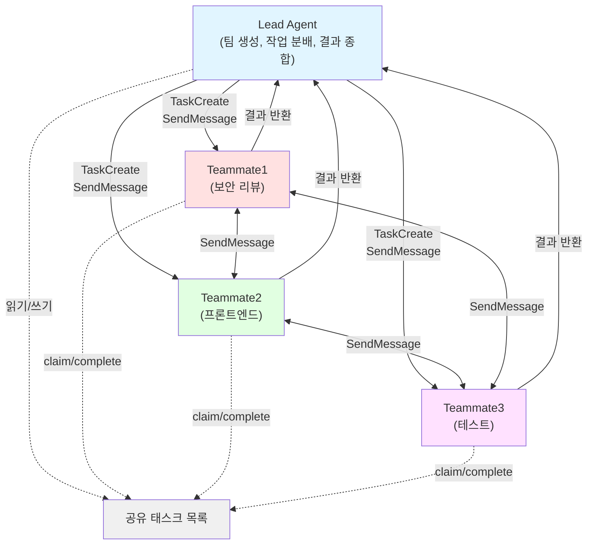
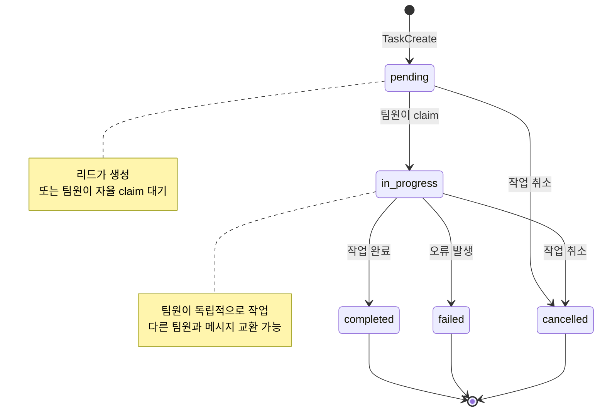

# Agent Teams

> [!tldr] 한줄 요약
> Agent Teams는 여러 Claude Code 인스턴스가 리드/팀원 구조로 공유 태스크 목록을 통해 병렬 협업하는 멀티에이전트 오케스트레이션이다.

## 핵심 내용

### Agent Teams란?

여러 Claude Code 인스턴스가 **리드(lead)/팀원(teammate) 구조**로 협업하는 기능이다. 리드가 작업을 분배하고, 팀원들이 각자의 컨텍스트 윈도우에서 독립적으로 작업한다. 팀원끼리 직접 메시지를 주고받을 수도 있다.

> [!warning] 실험적 기능
> 현재 실험적 기능으로, `CLAUDE_CODE_EXPERIMENTAL_AGENT_TEAMS=1` 환경변수로 활성화해야 한다.

### 서브에이전트(Task) vs Agent Teams

| | 서브에이전트 | Agent Teams |
|--|------------|-------------|
| **컨텍스트** | 독립 윈도우, 결과만 리턴 | 독립 윈도우, 완전 자율 |
| **소통** | 메인에게만 보고 | 팀원끼리 직접 메시지 가능 |
| **조정** | 메인이 모든 작업 관리 | 공유 태스크 목록으로 자율 조정 |
| **비용** | 낮음 (결과 요약) | 높음 (각자 별도 인스턴스) |
| **적합** | 결과만 필요한 집중 작업 | 토론과 협업이 필요한 복잡 작업 |

### 아키텍처

```
┌─────────┐
│  Lead   │ ← 팀 생성, 작업 분배, 결과 종합
└────┬────┘
     │ SendMessage / TaskCreate
     ├──────────────┬──────────────┐
┌────▼────┐  ┌─────▼─────┐  ┌────▼────┐
│Teammate1│  │Teammate2  │  │Teammate3│
│(보안)   │  │(프론트)   │  │(테스트) │
└─────────┘  └───────────┘  └─────────┘
     ↕ 팀원끼리도 직접 메시지 가능
```



### 팀원 표시 모드

| 모드 | 설명 | 비고 |
|------|------|------|
| **in-process** | 메인 터미널 안에서 실행 | 기본값, 어디서나 동작 |
| **tmux** | 각 팀원이 별도 pane | tmux 또는 iTerm2 필요 |
| **auto** | tmux 세션이면 split, 아니면 in-process | 권장 |

```bash
claude --teammate-mode tmux
```

### 작업 흐름

1. **팀 생성**: 리드가 팀과 팀원을 생성
2. **작업 생성**: `TaskCreate`로 공유 태스크 목록에 추가
3. **작업 할당**: 리드가 직접 할당하거나, 팀원이 자율 claim
4. **작업 수행**: 각 팀원이 독립 작업 (pending → in_progress → completed)
5. **소통**: `SendMessage`로 리드↔팀원, 팀원↔팀원 메시지
6. **종료**: 팀원 셧다운 → 팀 정리 (반드시 리드가 수행)



### Delegate 모드

리드가 직접 코드를 건드리지 않고 **조정에만 집중**하게 하는 [[til/claude-code/permission-mode|Permission 모드]]다. `Shift+Tab`으로 전환하면 리드는 팀원 생성, 메시지, 작업 관리만 할 수 있다.

### Hooks 연동

| [[til/claude-code/hooks\|Hook]] | 용도 |
|------|------|
| **TeammateIdle** | 팀원이 멈추려 할 때 검증. exit 2로 계속 작업 강제 |
| **TaskCompleted** | 작업 완료 시 검증. exit 2로 완료 차단 |

### 실제 사용법

별도 API 호출 없이 **리드에게 자연어로 지시**하면 된다.

**1단계: 활성화** (`~/.claude/settings.json`)

```json
{
  "env": {
    "CLAUDE_CODE_EXPERIMENTAL_AGENT_TEAMS": "1"
  }
}
```

**2단계: 프롬프트로 팀 생성 & 작업 지시**

```
이 프로젝트의 인증 모듈을 리팩토링해줘.
3명의 팀원을 만들어서 병렬로 작업해:
- backend: API 라우트와 미들웨어 리팩토링
- frontend: 로그인/회원가입 UI 수정
- tester: 리팩토링된 코드의 테스트 작성

각 팀원이 작업 완료하면 결과를 종합해줘.
```

**3단계: 모니터링**

| 단축키 | 기능 |
|--------|------|
| `Shift+Up/Down` | 팀원 간 전환 |
| `Ctrl+T` | 태스크 목록 보기 |
| `Enter` | 선택한 팀원 세션 보기 |
| `Escape` | 팀원 인터럽트 |

**4단계: 종료**

```
모든 팀원을 종료하고 팀을 정리해줘.
```

### 적합한 사용 사례

- **병렬 코드 리뷰**: 보안, 성능, 테스트 관점에서 동시 리뷰
- **경쟁 가설 디버깅**: 여러 팀원이 각각 다른 원인을 조사
- **크로스 레이어 개발**: 프론트/백엔드/테스트를 각 팀원이 담당
- **리서치 & 비교**: 여러 라이브러리를 동시에 조사

### 주의사항

- 팀원은 리드의 대화 이력을 **상속하지 않음** → 충분한 컨텍스트 제공 필요
- 같은 파일을 여러 팀원이 수정하면 **덮어쓰기 위험** → 파일 소유권 분리
- 팀원 당 별도 컨텍스트 윈도우 → **토큰 비용이 팀 규모에 비례**
- 세션 resume 시 in-process 팀원은 복원되지 않음
- 팀 중첩 불가 (팀원이 자기 팀을 만들 수 없음)
- 리드 고정 (팀원을 리드로 승격 불가)

## 예시

```bash
# tmux 모드로 시작
claude --teammate-mode tmux
```

```
# 프롬프트 예시: PR 병렬 리뷰
이 PR을 3명이 동시에 리뷰해줘.
보안, 성능, 코드 품질 관점에서 각각 검토하고 결과를 정리해.
```

```
# 프롬프트 예시: 버그 조사
로그인 실패 버그를 조사해줘.
팀원 3명이 각각 다른 가설을 테스트해:
- auth: 토큰 만료 로직 확인
- db: 세션 저장소 상태 확인
- network: API 게이트웨이 로그 확인
```

> [!example] 리드에게 자연어로 지시
> 사용자가 `TeamCreate()` 같은 API를 직접 호출하는 게 아니다. 리드(Claude)에게 자연어로 지시하면 리드가 내부적으로 TeamCreate, TaskCreate, SendMessage 도구를 사용해 팀을 운영한다.

## 참고 자료

- [Orchestrate teams of Claude Code sessions - 공식 문서](https://code.claude.com/docs/en/agent-teams)
- [Claude Code Agent Teams: Multi-Session Orchestration](https://claudefa.st/blog/guide/agents/agent-teams)
- [Claude Code Swarms - Addy Osmani](https://addyosmani.com/blog/claude-code-agent-teams/)

## 관련 노트

- [[til/claude-code/agent|Claude Code Agent 동작 방식]]
- [[til/claude-code/hooks|Hooks]]
- [[til/claude-code/permission-mode|Permission 모드(Permission Mode)]]
- [[til/claude-code/cli-reference|CLI 레퍼런스(CLI Reference)]]
- [[MCP(Model Context Protocol)]]
