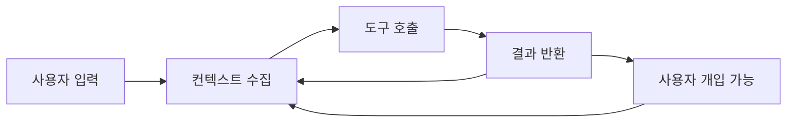
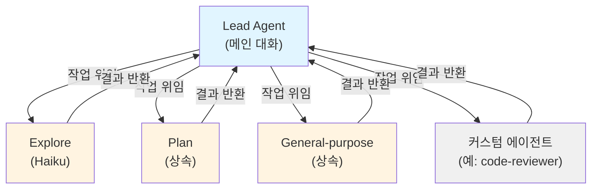

# TIL: Claude Code에서 Agent가 동작하는 방식

> [!tldr] 한줄 요약
> Claude Code는 "컨텍스트 수집 - 액션 실행 - 결과 검증"의 에이전틱 루프를 반복하며, 서브에이전트로 작업을 위임해 병렬 처리와 컨텍스트 관리를 수행한다.

## 핵심 내용

### 에이전틱 루프 (Agentic Loop)

Claude Code의 핵심 동작 방식. 3단계를 반복한다:

```
프롬프트 → 컨텍스트 수집 → 액션 실행 → 결과 검증 → (반복)
```



- 각 도구 사용 결과가 다음 단계의 입력이 됨
- 사용자가 언제든 **중간에 개입**하여 방향 전환 가능
- **모델**(추론)과 **도구**(행동) 두 컴포넌트로 구동

### 도구 (Tools) - Agent를 Agent답게 만드는 것

도구가 없으면 텍스트 응답만 가능. 도구가 있어야 **행동**할 수 있다:

| 카테고리 | 할 수 있는 것 |
|---------|-------------|
| **파일 조작** | 읽기, 편집, 생성, 이름 변경 |
| **검색** | 파일 패턴 찾기, 정규식 검색 |
| **실행** | 셸 명령, 테스트, git |
| **웹** | 웹 검색, 문서 조회 |

### 서브에이전트 (Sub-agents)

독립된 **컨텍스트 윈도우(Context Window)**에서 특정 작업을 처리하는 전문 AI 어시스턴트.



#### 빌트인 서브에이전트

| 에이전트 | 모델 | 역할 |
|---------|------|------|
| **Explore** | Haiku (빠름) | 읽기 전용 코드베이스 탐색 |
| **Plan** | 상속 | 계획 모드에서 리서치 |
| **General-purpose** | 상속 | 복잡한 멀티스텝 작업 |

#### 커스텀 서브에이전트

`.claude/agents/` 또는 `~/.claude/agents/`에 마크다운 파일로 정의한다:

```yaml
---
name: code-reviewer
description: 코드 리뷰 전문가
tools: Read, Glob, Grep
model: sonnet
memory: user          # 세션 간 영구 메모리
---

시스템 프롬프트 내용...
```

#### 실행 방식

| 방식 | 설명 |
|------|------|
| **포그라운드** | 메인 대화를 블로킹, 권한 요청 가능 |
| **백그라운드** | 병렬 실행, 미리 권한 승인 필요 |

> [!warning] 핵심 제약
> 서브에이전트는 다른 서브에이전트를 생성할 수 없다 (1단계 위임만 가능).

### 컨텍스트 관리

| 개념 | 설명 |
|------|------|
| **컨텍스트 윈도우** | 대화 히스토리 + 파일 + 명령 출력 + [[til/claude-code/claude-md|CLAUDE.md]] + [[til/claude-code/skill|스킬]] |
| **자동 압축** | 한계 도달 시 오래된 도구 출력 제거 후 대화 요약 |
| **CLAUDE.md** | 압축에서 보존되는 영구 지시사항 |
| **서브에이전트 격리** | 별도 컨텍스트 사용으로 메인 대화 공간 보호 |

### 안전장치

- **체크포인트**: 모든 파일 수정 전 스냅샷. `Esc` 두 번으로 되돌리기
- **권한 모드**: `Shift+Tab`으로 전환 (기본 / 자동승인 / 플랜모드 / 위임모드)

## 예시

```
> Fix the failing tests

1. 테스트 스위트 실행 → 실패 확인
2. 에러 출력 읽기
3. 관련 소스 파일 검색
4. 파일 읽고 컨텍스트 파악
5. 파일 수정해서 이슈 해결
6. 테스트 재실행해서 검증
```

> [!example] 각 단계가 에이전틱 루프의 한 사이클
> 도구 사용 결과가 다음 행동을 결정한다. 이것이 "에이전틱"의 핵심이다.

## 참고 자료

- [How Claude Code Works](https://code.claude.com/docs/en/how-claude-code-works)
- [Create Custom Subagents](https://code.claude.com/docs/en/sub-agents)

## 관련 노트

- [[til/claude-code/overview|Claude Code 개요]]
- [[til/claude-code/skill|Claude Code Skill]]
- [[til/claude-code/plugin|Claude Code Plugin]]
