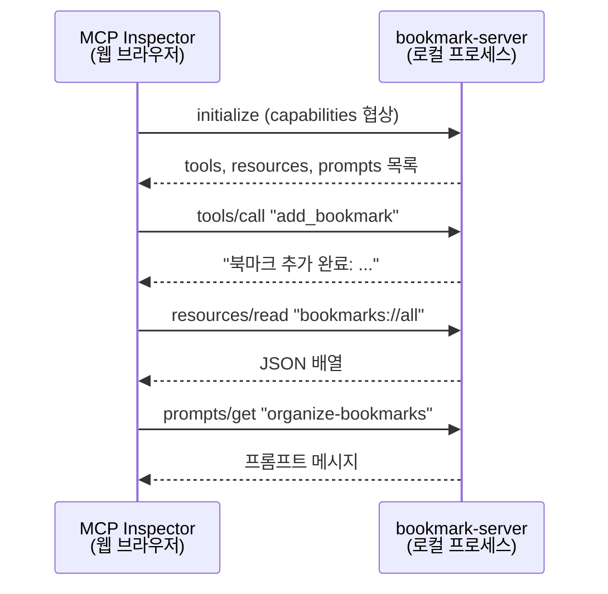

# MCP Server 개발 실습

> [!tldr] 한줄 요약
> TypeScript SDK로 Tool/Resource/Prompt를 모두 갖춘 MCP 서버를 처음부터 만들고, MCP Inspector로 테스트한 뒤 Claude Code에 연결하는 핸즈온 과정이다.

## 핵심 내용

> [!tip] 선행 학습
> [MCP Server 개발](til/claude-code/mcp-server-development.md)에서 3가지 프리미티브 개념과 SDK API를 먼저 익히고 오면 좋다.

### Step 1: 프로젝트 초기화

```bash
mkdir bookmark-mcp && cd bookmark-mcp
npm init -y
npm install @modelcontextprotocol/sdk zod
npm install -D typescript @types/node
```

`package.json`에 두 가지를 추가한다:

```json
{
  "type": "module",
  "scripts": {
    "build": "tsc && chmod 755 build/index.js"
  }
}
```

`tsconfig.json`:

```json
{
  "compilerOptions": {
    "target": "ES2022",
    "module": "Node16",
    "moduleResolution": "Node16",
    "outDir": "./build",
    "rootDir": "./src",
    "strict": true,
    "esModuleInterop": true,
    "skipLibCheck": true
  },
  "include": ["src/**/*"]
}
```

### Step 2: 서버 구현

`src/index.ts` — 북마크 관리 MCP 서버로 세 가지 프리미티브를 모두 사용한다:

```typescript
import { McpServer } from "@modelcontextprotocol/sdk/server/mcp.js";
import { StdioServerTransport } from "@modelcontextprotocol/sdk/server/stdio.js";
import { z } from "zod";

const server = new McpServer({ name: "bookmark-server", version: "1.0.0" });

// 인메모리 저장소
const bookmarks: Map<string, { url: string; title: string; tags: string[] }> = new Map();
```

#### Tool: 북마크 추가/삭제 (쓰기 작업)

```typescript
server.registerTool("add_bookmark", {
  description: "북마크를 추가합니다",
  inputSchema: {
    url: z.string().url().describe("북마크 URL"),
    title: z.string().describe("북마크 제목"),
    tags: z.array(z.string()).optional().describe("태그 목록"),
  },
}, async ({ url, title, tags }) => {
  bookmarks.set(url, { url, title, tags: tags ?? [] });
  return {
    content: [{ type: "text", text: `북마크 추가 완료: ${title} (${url})` }],
  };
});

server.registerTool("delete_bookmark", {
  description: "URL로 북마크를 삭제합니다",
  inputSchema: {
    url: z.string().url().describe("삭제할 북마크 URL"),
  },
}, async ({ url }) => {
  const deleted = bookmarks.delete(url);
  return {
    content: [{ type: "text", text: deleted ? `삭제 완료: ${url}` : "해당 북마크가 없습니다" }],
  };
});
```

#### Resource: 전체 목록 조회 (읽기 전용)

```typescript
server.registerResource("all-bookmarks", "bookmarks://all", {
  description: "저장된 모든 북마크 목록",
  mimeType: "application/json",
}, async (uri) => ({
  contents: [{
    uri: uri.href,
    text: JSON.stringify([...bookmarks.values()], null, 2),
  }],
}));
```

#### Prompt: 정리 요청 템플릿

```typescript
server.registerPrompt("organize-bookmarks", {
  description: "저장된 북마크를 카테고리별로 정리해달라는 프롬프트",
}, async () => ({
  messages: [{
    role: "user",
    content: {
      type: "text",
      text: `다음 북마크를 카테고리별로 정리하고 요약해주세요:\n\n${JSON.stringify([...bookmarks.values()], null, 2)}`,
    },
  }],
}));
```

#### 서버 시작

```typescript
const transport = new StdioServerTransport();
await server.connect(transport);
console.error("Bookmark MCP 서버 시작됨");  // stderr로 로깅!
```

### Step 3: 빌드 & MCP Inspector로 테스트

```bash
# 빌드
npm run build

# MCP Inspector 실행 (웹 UI에서 Tool/Resource/Prompt 테스트)
npx @modelcontextprotocol/inspector node build/index.js
```



MCP Inspector에서 확인할 것:
- **Tools 탭**: `add_bookmark`, `delete_bookmark`가 보이는지
- **Resources 탭**: `bookmarks://all`이 보이는지
- **Prompts 탭**: `organize-bookmarks`가 보이는지
- 각 항목을 실행해서 응답이 올바른지

### Step 4: Claude Code에 연결

```bash
# CLI로 등록
claude mcp add --transport stdio bookmark-server -- node /absolute/path/to/build/index.js

# 확인
claude mcp list
```

또는 [settings.json](til/claude-code/settings.md)에 직접 추가:

```json
{
  "mcpServers": {
    "bookmark-server": {
      "command": "node",
      "args": ["/absolute/path/to/build/index.js"]
    }
  }
}
```

> [!warning] 경로는 반드시 절대 경로
> 상대 경로를 쓰면 Claude Code의 작업 디렉토리에 따라 서버를 찾지 못할 수 있다.

### SDK v2 마이그레이션 포인트

SDK v2에서 API가 변경되었다. 기존 가변 인수(variadic) 방식에서 **설정 객체(config object)** 패턴으로 바뀌었다:

```typescript
// v1 (Deprecated) — 위치 기반 인수
server.tool("greet", { name: z.string() }, async ({ name }) => { ... });

// v2 (현재) — 설정 객체 패턴
server.registerTool("greet", {
  description: "Greet a user",
  inputSchema: { name: z.string() },
}, async ({ name }) => { ... });
```

| v1 메서드 | v2 메서드 | 설정 객체 키 |
|-----------|-----------|-------------|
| `server.tool()` | `server.registerTool()` | `inputSchema`, `outputSchema`, `description` |
| `server.resource()` | `server.registerResource()` | `description`, `mimeType` |
| `server.prompt()` | `server.registerPrompt()` | `argsSchema`, `description` |

### 디버깅 체크리스트

서버가 동작하지 않을 때 순서대로 확인한다:

1. **stdout 오염 확인** — `console.log()` 사용했는지 검색 (반드시 `console.error()` 사용)
2. **단독 실행 테스트** — `echo '{}' | node build/index.js` 로 프로세스가 뜨는지
3. **MCP Inspector** — `npx @modelcontextprotocol/inspector node build/index.js`
4. **Claude Code 로그** — `tail -f ~/Library/Logs/Claude/mcp*.log` (macOS)
5. **서버 재시작** — Claude Code에서 `/mcp` 입력 후 서버 상태 확인

> [!warning] stdio 서버의 가장 흔한 실수
> `console.log()`를 쓰면 stdout에 디버그 메시지가 섞여 JSON-RPC 프로토콜이 깨진다. 에러 메시지도 없이 조용히 실패하므로 원인을 찾기 어렵다. **항상 `console.error()`를 사용**해야 한다.

### MCP 서버로 만들면 좋은 영역

| 영역 | 예시 | 왜 MCP가 적합한가 |
|------|------|-------------------|
| **사내 운영 도구** | 고객 조회, 쿠폰 발급, 주문 관리 | UI 개발 없이 Tool 함수만 추가 |
| **DB 조회** | 신규 가입자 수, 매출 상위 상품 | Resource로 스키마 노출 → 자연어 쿼리 |
| **모니터링** | 에러율 확인, 슬로우 쿼리 목록 | 여러 시스템을 한 대화에서 탐색 |
| **개인 생산성** | 노트 검색, 캘린더 조회 | 자연어로 빠른 접근 |
| **CI/CD** | 빌드 상태, 배포 트리거 | 복잡한 파이프라인을 대화로 제어 |

> [!tip] 첫 프로젝트 추천
> "자기 프로젝트 DB를 읽기 전용으로 조회하는 서버"가 가장 실용적이다. Resource로 테이블 스키마를, Tool로 SELECT 쿼리를 노출하면 즉시 활용 가능하고 위험도도 낮다.

## 예시

### 완성된 프로젝트 구조

```
bookmark-mcp/
├── package.json           ← "type": "module"
├── tsconfig.json
├── src/
│   └── index.ts           ← McpServer + Tool/Resource/Prompt
└── build/
    └── index.js           ← 컴파일 결과 (chmod 755)
```

### 테스트 명령어 모음

```bash
# 빌드
npm run build

# MCP Inspector로 대화형 테스트
npx @modelcontextprotocol/inspector node build/index.js

# Claude Code에 등록
claude mcp add --transport stdio bookmark-server -- node $(pwd)/build/index.js

# 등록 확인
claude mcp list

# 문제 발생 시 로그 확인 (macOS)
tail -f ~/Library/Logs/Claude/mcp*.log
```

> [!example] Claude Code에서 사용하기
> 서버를 등록하면 Claude Code가 자동으로 Tool을 인식한다:
> - "https://example.com을 'MCP 튜토리얼' 제목으로 북마크해줘"
> - "저장된 북마크 전부 보여줘"
> - "북마크를 카테고리별로 정리해줘"

## 참고 자료

- [MCP TypeScript SDK 공식 문서](https://github.com/modelcontextprotocol/typescript-sdk)
- [Build a MCP Server 튜토리얼](https://modelcontextprotocol.io/docs/develop/build-server)
- [MCP Inspector 사용법](https://modelcontextprotocol.io/docs/tools/inspector)
- [SDK v2 마이그레이션 가이드](https://github.com/modelcontextprotocol/typescript-sdk/blob/main/docs/migration.md)
- [Claude Code MCP 연동 가이드](https://code.claude.com/docs/en/mcp)

## 관련 노트

- [MCP Server 개발](til/claude-code/mcp-server-development.md) — 이론편: 프리미티브 개념, SDK API, 트랜스포트
- [MCP(Model Context Protocol)](til/claude-code/mcp.md) — MCP 프로토콜 자체의 개념과 아키텍처
- [Settings와 Configuration](til/claude-code/settings.md) — MCP 서버 등록이 저장되는 설정 체계
- [Hooks](til/claude-code/hooks.md) — `disableAllHooks: true` 시 MCP 서버도 비활성화됨
