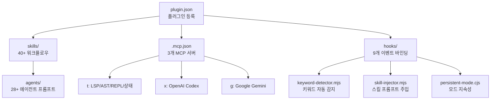
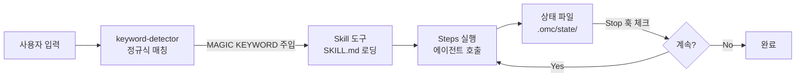

# oh-my-claudecode (OMC)

> [!tldr] 한줄 요약
> OMC는 28+ 에이전트와 40+ 스킬을 마크다운 프롬프트로 정의하고, 훅 기반 오케스트레이션으로 조합하는 Claude Code 플러그인이다. 마크다운이 곧 프로그래밍 언어가 되는 "Prompt-as-Code" 패러다임을 구현한다.

## 핵심 내용

### 프로젝트 구조

OMC 플러그인은 6개의 핵심 디렉토리로 구성된다:

```
oh-my-claudecode/
├── agents/          ← 에이전트 프롬프트 (마크다운)
├── skills/          ← 스킬 워크플로우 (SKILL.md)
├── hooks/           ← 이벤트 핸들러 (hooks.json + JS)
├── scripts/         ← 키워드 감지 등 런타임 스크립트
├── src/             ← TypeScript 소스 (MCP 서버, 훅 로직)
└── .claude-plugin/
    └── plugin.json  ← 플러그인 등록 (skills, mcpServers)
```



### 에이전트 프롬프트 패턴

에이전트는 `.md` 파일로 정의되며, 11개 섹션의 XML 구조를 사용한다:

| 섹션 | 역할 |
|------|------|
| `<Role>` | 정체성과 모델 티어 |
| `<Why_This_Matters>` | 이 역할이 왜 필요한지 |
| `<Success_Criteria>` | 완료 기준 |
| `<Constraints>` | 행동 제약 |
| `<Investigation_Protocol>` | 탐색 방법론 |
| `<Tool_Usage>` | 사용 가능한 도구 |
| `<Execution_Policy>` | 실행 규칙 |
| `<Output_Format>` | 출력 형식 |
| `<Failure_Modes_To_Avoid>` | 피해야 할 패턴 |
| `<Examples>` | Good/Bad 대조 예시 |
| `<Final_Checklist>` | 완료 전 점검 |

5가지 핵심 프롬프트 엔지니어링 패턴:

1. **역할 경계(Role Boundary)** — architect는 READ-ONLY (`disallowedTools: Write, Edit`), executor는 쓰기 전용
2. **존재 이유(Why_This_Matters)** — "왜 이 에이전트가 필요한지" 명시해서 역할 이탈 방지
3. **대조 예시(Contrastive Examples)** — Good/Bad를 나란히 보여줘서 경계선을 학습
4. **실패 모드(Failure Modes)** — "하지 말아야 할 것"을 명시적으로 나열
5. **도구 권한 제어(Tool Permission)** — 모델 티어(haiku/sonnet/opus)에 따라 접근 가능한 도구 차등

### 오케스트레이션 메커니즘

사용자 입력이 에이전트 실행으로 이어지는 5단계 흐름:



| 계층 | 역할 | 구현체 |
|------|------|--------|
| 키워드 감지 | 사용자 입력에서 트리거 추출 | `keyword-detector.mjs` (정규식) |
| 스킬 워크플로우 | 단계별 실행 로직 정의 | `SKILL.md` (마크다운/XML) |
| 런타임 훅 | 도구 호출 전후 이벤트 처리 | `hooks.json` → JS 스크립트 |
| 상태 관리 | 모드 활성화/진행 상황 추적 | `.omc/state/*.json` |
| 모드 합성 | 스킬 간 조합 | 링크 상태 (`linked_ultrawork`, `linked_team`) |

### 스킬 구조

스킬은 `skills/{name}/SKILL.md` 형태로 존재하며, 5가지 유형으로 분류된다:

| 유형 | 설명 | 예시 |
|------|------|------|
| **워크플로우 오케스트레이터** | 여러 에이전트를 단계별 파이프라인으로 조합 | autopilot, team, ralph |
| **모디파이어** | 다른 스킬에 덧씌우는 변형 (모델 라우팅 변경) | ecomode |
| **에이전트 단축** | 특정 에이전트를 호출하는 얇은 래퍼 | analyze, deepsearch, build-fix |
| **앨리어스** | 다른 스킬의 특정 모드로 리다이렉트 | review, ralplan |
| **유틸리티** | 상태 파일 조작, 정보 표시 등 시스템 관리 | cancel, note, learner |

SKILL.md는 **이중 독자(Dual Audience)** 설계:
- YAML frontmatter → 플러그인 시스템이 파싱 (스킬 등록)
- XML 태그 (`<Steps>`, `<Use_When>`) → Claude가 읽음 (실행 로직)
- 마크다운 본문 → 사람이 읽음 (설정 참조)

### 마크다운 안의 XML — 프롬프트 엔지니어링

SKILL.md에서 XML 태그를 사용하는 이유:

1. **경계 명확성** — `<Use_When>...</Use_When>`은 열림/닫힘이 명시적. 마크다운 헤딩은 어디서 끝나는지 모호
2. **Claude 최적화** — Anthropic이 공식 권장하는 기법. Claude는 XML 태그를 구조화된 지시의 구분자로 인식하도록 학습됨
3. **의미 전달** — `<Failure_Modes_To_Avoid>`처럼 태그 이름 자체가 의도를 전달
4. **복잡도 기반 선택** — 워크플로우 스킬(복잡)은 XML, 유틸리티 스킬(단순)은 순수 마크다운

### Prompt-as-Code 패러다임

OMC의 가장 흥미로운 특징은 **마크다운이 프로그래밍 언어 역할**을 한다는 점이다. LLM이 런타임이 되어 자연어 지시를 실행한다:

| 프로그래밍 개념 | 전통적 코드 | SKILL.md |
|--------------|-----------|----------|
| 순차 실행 | 함수 내 문장 순서 | Phase 번호 매기기 |
| 반복문 | `for i in range(5)` | "Repeat up to 5 cycles" |
| 조건 분기 | `if/else` | "Preferred / Fallback" 패턴 |
| 함수 호출 | `func(args)` | `Task(subagent_type="...", prompt="...")` |
| 병렬 실행 | `asyncio.gather` | "in parallel" 두 단어 |
| 상태 관리 | 변수, DB | `.omc/state/*.json` |
| 에러 핸들링 | `try/except` | `<Escalation_And_Stop_Conditions>` |
| 모듈 임포트 | `import` | 다른 스킬 참조 ("using Ralph + Ultrawork") |

전통적 코드와의 결정적 차이: **모호성이 허용된다**. "Run independent tasks in parallel"이라고만 써도 Claude가 맥락을 보고 어떤 태스크가 독립적인지 판단해서 실행한다. 이것이 장점(프로그래밍 지식 없이 워크플로우 정의 가능)이자 단점(실행 결과가 비결정적)이다.

```
1950s: 기계어    → 하드웨어가 직접 실행
1970s: C 언어    → 컴파일러가 기계어로 변환
1990s: Python   → 인터프리터가 바이트코드로 변환
2020s: 마크다운  → LLM이 의미를 이해하고 도구를 호출
```

## 예시

### autopilot — 워크플로우 오케스트레이터의 실행 흐름

```
사용자: "autopilot REST API for bookstore with CRUD"
  ↓
keyword-detector: "autopilot" 감지 → [MAGIC KEYWORD: autopilot]
  ↓
SKILL.md 로딩 → Phase 0~5 순차 실행:
  Phase 0: analyst(opus) + architect(opus) → spec.md
  Phase 1: architect(opus) → plan.md, critic(opus) → 검증
  Phase 2: executor(haiku/sonnet/opus) → 구현 (병렬)
  Phase 3: ultraqa → 빌드/린트/테스트 (최대 5회 반복)
  Phase 4: architect + security-reviewer + code-reviewer (병렬 검증)
  Phase 5: 상태 파일 정리
```

### analyze — 에이전트 단축 스킬

```markdown
---
name: analyze
---
<Steps>
1. Identify the analysis type
2. Gather relevant context
3. Route to analyzer:
   - Preferred: ask_codex(agent_role="architect")   ← MCP 우선
   - Fallback: Task(architect, opus)                ← 에이전트 대체
4. Return structured findings
</Steps>
Task: {{ARGUMENTS}}   ← 사용자 입력이 여기로 전달
```

## 참고 자료

- [oh-my-claudecode GitHub](https://github.com/nicobailon/oh-my-claudecode)
- [Claude Code Plugins 문서](https://docs.anthropic.com/en/docs/claude-code/plugins)
- [Anthropic Prompt Engineering — XML Tags](https://docs.anthropic.com/en/docs/build-with-claude/prompt-engineering/use-xml-tags)

## 관련 노트

- [MCP(Model Context Protocol)](til/claude-code/mcp.md)
- [Claude Code Agent 동작 방식](til/claude-code/agent.md)
- [Claude Code Skill](til/claude-code/skill.md)
- [Claude Code Plugin](til/claude-code/plugin.md)
- [Best Practices](til/claude-code/best-practices.md)
