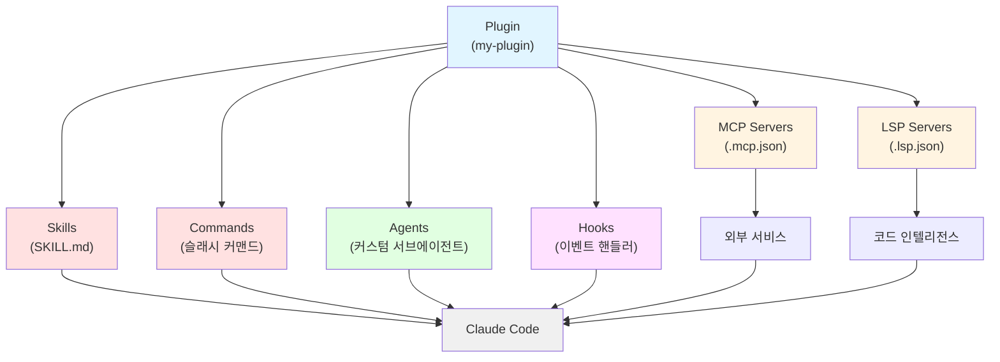

# Claude Code Plugin

> [!tldr] 한줄 요약
> Plugin은 [[til/claude-code/skill|Skills]], [[til/claude-code/agent|Agents]], Hooks, MCP, LSP를 하나의 패키지로 묶어 팀과 커뮤니티에 공유/배포하는 시스템이다.

## 핵심 내용

### Standalone vs Plugin

| 접근 방식 | 스킬 이름 | 적합한 경우 |
|----------|----------|-----------|
| **Standalone** (`.claude/`) | `/hello` | 개인 워크플로우, 프로젝트 한정, 빠른 실험 |
| **Plugin** | `/plugin-name:hello` | 팀/커뮤니티 공유, 여러 프로젝트 재사용, 버전 관리 |

네임스페이스(`plugin-name:`)로 플러그인 간 이름 충돌을 방지한다.

> [!tip] 팁
> `.claude/`에서 standalone으로 먼저 실험한 뒤, 공유가 필요할 때 plugin으로 변환하는 것을 권장한다.

### 디렉토리 구조

```
my-plugin/
├── .claude-plugin/          # plugin.json만 여기에!
│   └── plugin.json
├── skills/                  # Agent Skills (SKILL.md)
│   └── code-review/
│       └── SKILL.md
├── commands/                # 슬래시 커맨드 (마크다운)
├── agents/                  # 커스텀 서브에이전트
├── hooks/                   # 이벤트 핸들러
│   └── hooks.json
├── .mcp.json                # MCP 서버 설정
├── .lsp.json                # LSP 서버 설정
└── scripts/                 # 유틸리티 스크립트
```

> [!warning] 주의
> `commands/`, `agents/`, `skills/` 등은 반드시 **플러그인 루트**에 둬야 한다. `.claude-plugin/` 안에 넣으면 인식되지 않는다.

### plugin.json (매니페스트)

`name`만 필수이고 나머지는 선택이다. `name`이 네임스페이스가 된다:

```json
{
  "name": "my-plugin",
  "version": "1.0.0",
  "description": "플러그인 설명",
  "author": { "name": "이름" },
  "keywords": ["keyword1"]
}
```

### 구성 요소 6가지

| 구성 요소 | 위치 | 역할 |
|----------|------|------|
| **Skills** | `skills/` | Claude가 자동 또는 `/name`으로 호출하는 확장 |
| **Commands** | `commands/` | 슬래시 커맨드 (legacy, skills 권장) |
| **Agents** | `agents/` | 전문 [[til/claude-code/agent\|서브에이전트]] |
| **Hooks** | `hooks/hooks.json` | 이벤트 핸들러 (PreToolUse, PostToolUse 등) |
| **MCP Servers** | `.mcp.json` | 외부 서비스 연결 |
| **LSP Servers** | `.lsp.json` | 코드 인텔리전스 (타입 에러, 정의 이동 등) |



### 설치 범위 (Scope)

| 범위 | 설정 파일 | 용도 |
|------|----------|------|
| `user` | `~/.claude/settings.json` | 개인, 모든 프로젝트 (기본값) |
| `project` | `.claude/settings.json` | 팀 공유 (git 커밋) |
| `local` | `.claude/settings.local.json` | 프로젝트 한정 (gitignore) |

### 핵심 환경 변수

`${CLAUDE_PLUGIN_ROOT}` - 플러그인 디렉토리의 절대 경로. hooks, MCP 서버, 스크립트에서 경로 참조 시 반드시 사용해야 한다.

## 예시

```bash
# 로컬 테스트
claude --plugin-dir ./my-plugin

# 설치/제거
claude plugin install formatter@my-marketplace
claude plugin uninstall formatter

# 프로젝트 범위로 설치 (팀 공유)
claude plugin install formatter --scope project
```

> [!example] 실행 결과
> 플러그인 설치 후 `/plugin-name:skill-name`으로 호출 가능. `/agents`에서 플러그인 에이전트 확인 가능.

## 참고 자료

- [Create Plugins](https://code.claude.com/docs/en/plugins)
- [Plugins Reference](https://code.claude.com/docs/en/plugins-reference)
- [Discover and Install Plugins](https://code.claude.com/docs/en/discover-plugins)
- [Plugin Marketplaces](https://code.claude.com/docs/en/plugin-marketplaces)

## 관련 노트

- [[til/claude-code/overview|Claude Code 개요]]
- [[til/claude-code/skill|Claude Code Skill]]
- [[til/claude-code/agent|Claude Code Agent 동작 방식]]
