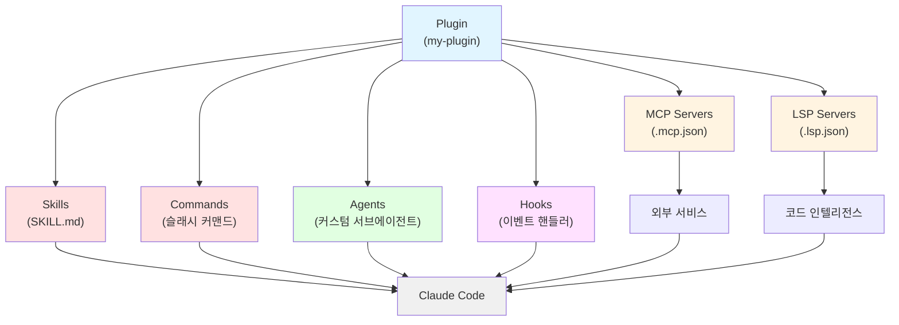

# Claude Code Plugin

> [!tldr] 한줄 요약
> Plugin은 [[til/claude-code/skill|Skills]], [[til/claude-code/agent|Agents]], [[til/claude-code/hooks|Hooks]], [[til/claude-code/mcp|MCP]], LSP를 하나의 패키지로 묶어 공유하는 시스템이며, 3가지 Hook 타입(command/prompt/agent)과 구성 요소 간 조합을 통해 복합적인 자동화 파이프라인을 구축할 수 있다.

## 핵심 내용

### Standalone vs Plugin

| 접근 방식 | 스킬 이름 | 적합한 경우 |
|----------|----------|-----------|
| **Standalone** (`.claude/`) | `/hello` | 개인 워크플로우, 프로젝트 한정, 빠른 실험 |
| **Plugin** | `/plugin-name:hello` | 팀/커뮤니티 공유, 여러 프로젝트 재사용, 버전 관리 |

네임스페이스(`plugin-name:`)로 플러그인 간 이름 충돌을 방지한다.

> [!tip] 팁
> `.claude/`에서 standalone으로 먼저 실험한 뒤, 공유가 필요할 때 plugin으로 변환하는 것을 권장한다.

### 디렉토리 구조

```
my-plugin/
├── .claude-plugin/          # plugin.json만 여기에!
│   └── plugin.json
├── skills/                  # Agent Skills (SKILL.md)
│   └── code-review/
│       └── SKILL.md
├── commands/                # 슬래시 커맨드 (마크다운)
├── agents/                  # 커스텀 서브에이전트
├── hooks/                   # 이벤트 핸들러
│   └── hooks.json
├── .mcp.json                # MCP 서버 설정
├── .lsp.json                # LSP 서버 설정
└── scripts/                 # 유틸리티 스크립트
```

> [!warning] 주의
> `commands/`, `agents/`, `skills/` 등은 반드시 **플러그인 루트**에 둬야 한다. `.claude-plugin/` 안에 넣으면 인식되지 않는다.

### plugin.json (매니페스트)

`name`만 필수이고 나머지는 선택이다. `name`이 네임스페이스가 된다:

```json
{
  "name": "my-plugin",
  "version": "1.0.0",
  "description": "플러그인 설명",
  "author": { "name": "이름" },
  "keywords": ["keyword1"]
}
```

### 구성 요소 6가지

| 구성 요소 | 위치 | 역할 |
|----------|------|------|
| **Skills** | `skills/` | Claude가 자동 또는 `/name`으로 호출하는 확장 |
| **Commands** | `commands/` | 슬래시 커맨드 (legacy, skills 권장) |
| **Agents** | `agents/` | 전문 [[til/claude-code/agent\|서브에이전트]] |
| **Hooks** | `hooks/hooks.json` | 이벤트 핸들러 (PreToolUse, PostToolUse 등) |
| **MCP Servers** | `.mcp.json` | 외부 서비스 연결 |
| **LSP Servers** | `.lsp.json` | 코드 인텔리전스 (타입 에러, 정의 이동 등) |



### 설치 범위 (Scope)

| 범위 | 설정 파일 | 용도 |
|------|----------|------|
| `user` | `~/.claude/settings.json` | 개인, 모든 프로젝트 (기본값) |
| `project` | `.claude/settings.json` | 팀 공유 (git 커밋) |
| `local` | `.claude/settings.local.json` | 프로젝트 한정 (gitignore) |

### 핵심 환경 변수

`${CLAUDE_PLUGIN_ROOT}` - 플러그인 디렉토리의 절대 경로. hooks, MCP 서버, 스크립트에서 경로 참조 시 반드시 사용해야 한다.

### 3가지 Hook 타입 계층

플러그인의 [[til/claude-code/hooks|Hooks]]는 복잡도에 따라 3가지 타입으로 나뉜다:

#### Command Hook (결정론적)

셸 명령어를 실행하는 가장 기본적인 타입이다:

```json
{
  "type": "command",
  "command": "jq -r '.tool_input.file_path' | xargs npx prettier --write"
}
```

- `exit 0` → 허용, `exit 2` → 차단
- stderr로 차단 이유를 Claude에게 피드백

#### Prompt Hook (AI 판단, 단일 턴)

셸 스크립트로 판단하기 어려운 경우 LLM에게 yes/no 결정을 위임한다:

```json
{
  "type": "prompt",
  "prompt": "모든 작업이 완료되었는지 확인하라. 미완료 시 {\"ok\": false, \"reason\": \"남은 작업\"} 반환.",
  "model": "haiku"
}
```

- 기본 모델은 Haiku, `"model"` 필드로 변경 가능
- `ok: true` → 진행, `ok: false` + `reason` → 차단 후 Claude에게 이유 전달

#### Agent Hook (AI 판단, 멀티 턴 + 도구 사용)

파일 읽기, 명령어 실행, 코드 검색 등 **복합 검증**이 필요할 때 사용한다:

```json
{
  "type": "agent",
  "prompt": "테스트 스위트를 실행하고 모든 유닛 테스트가 통과하는지 확인하라. $ARGUMENTS",
  "timeout": 120
}
```

- **최대 50턴**의 도구 사용 가능 (파일 읽기, grep, bash 실행 등)
- 기본 타임아웃 60초, `"timeout"` 필드로 조정
- 응답 형식은 Prompt Hook과 동일 (`ok`/`reason`)

> [!tip] 선택 기준
> **Command** → 패턴 매칭, 포매팅 / **Prompt** → AI 판단이 필요한 게이트 / **Agent** → 코드베이스 상태 확인이 필요한 심층 검증

### 고급 조합 패턴

#### PreToolUse 구조화된 JSON 응답

`PreToolUse`는 **유일하게 도구 실행을 차단할 수 있는** 이벤트이다. exit 코드 대신 구조화된 JSON으로 3가지 세밀한 제어가 가능하다:

```json
{
  "hookSpecificOutput": {
    "hookEventName": "PreToolUse",
    "permissionDecision": "allow | deny | ask",
    "permissionDecisionReason": "deny 시 Claude에게 전달할 이유"
  }
}
```

- `"allow"` → 권한 프롬프트 없이 바로 실행
- `"deny"` → 차단 + reason을 Claude에게 피드백
- `"ask"` → 사용자에게 권한 프롬프트 표시

#### Hook으로 MCP 도구 감시

[[til/claude-code/mcp|MCP]] 도구 이름은 `mcp__<서버>__<도구>` 형식이므로, matcher에서 regex로 특정 MCP 서버의 모든 호출을 게이트키핑할 수 있다:

```json
{
  "PreToolUse": [
    {
      "matcher": "mcp__database__.*",
      "hooks": [
        {
          "type": "prompt",
          "prompt": "이 DB 쿼리가 안전한지 확인. DROP, DELETE, TRUNCATE 포함 시 차단."
        }
      ]
    }
  ]
}
```

#### Stop + Agent 검증 (완료 보장)

Claude가 작업을 끝내려 할 때 Agent Hook이 실제 코드를 검사한다:

```json
{
  "Stop": [
    {
      "hooks": [
        {
          "type": "agent",
          "prompt": "테스트를 실행하고 린트 에러가 없는지 확인하라.",
          "timeout": 120
        }
      ]
    }
  ]
}
```

> [!warning] 무한루프 주의
> Stop Hook 스크립트에서 `stop_hook_active` 필드를 체크하지 않으면 무한 루프에 빠질 수 있다. Agent/Prompt 타입은 자동 처리되지만, Command 타입은 직접 체크해야 한다.

#### 복합 플러그인 아키텍처

모든 구성 요소를 조합한 실전 플러그인의 동작 흐름:

```
1. LSP     → 코드 작성 시 실시간 타입 에러/경고 제공
2. Hook    → 파일 수정 전 PreToolUse로 위험 패턴 감지
3. MCP     → 외부 서비스(DB, API)에서 추가 정보 조회
4. Agent   → 전문 서브에이전트가 종합 분석 수행
5. Skill   → /plugin:skill-name으로 수동 트리거 가능
```

`${CLAUDE_PLUGIN_ROOT}`로 모든 내부 경로를 참조하여 설치 위치에 독립적으로 동작하게 한다.

### 학습용 공식 플러그인 추천

[anthropics/claude-code/plugins](https://github.com/anthropics/claude-code/tree/main/plugins)에 13개 공식 플러그인이 있다:

| 플러그인 | 구성 요소 | 학습 포인트 |
|---------|----------|-----------|
| **plugin-dev** | 7 스킬 + 3 에이전트 + 커맨드 | 전체 구조를 가르치는 메타 플러그인. Hook/MCP/구조/설정/커맨드/에이전트/스킬 단계별 학습 |
| **code-review** | 4 병렬 에이전트 + 커맨드 | 멀티 에이전트 병렬 실행, 신뢰도 스코어링(0~100)으로 false positive 필터링 |
| **hookify** | 4 커맨드 + 에이전트 + 스킬 | 커맨드→에이전트→스킬 협력 구조, Rule 기반 hook 생성 시스템 |
| **security-guidance** | PreToolUse Hook | 9가지 보안 패턴(injection, XSS, eval 등) 실시간 감시 |
| **ralph-wiggum** | Stop Hook + 커맨드 | Stop Hook으로 종료 가로채기, 자기 참조 루프 패턴 |

> [!tip] 추천 학습 순서
> **plugin-dev**로 전체 구조를 잡고 → **code-review**로 실전 멀티 에이전트 패턴을 익히는 순서가 효율적이다.

## 예시

```bash
# 로컬 테스트
claude --plugin-dir ./my-plugin

# 설치/제거
claude plugin install formatter@my-marketplace
claude plugin uninstall formatter

# 프로젝트 범위로 설치 (팀 공유)
claude plugin install formatter --scope project
```

> [!example] 실행 결과
> 플러그인 설치 후 `/plugin-name:skill-name`으로 호출 가능. `/agents`에서 플러그인 에이전트 확인 가능.

## 참고 자료

- [Create Plugins](https://code.claude.com/docs/en/plugins)
- [Plugins Reference](https://code.claude.com/docs/en/plugins-reference)
- [Discover and Install Plugins](https://code.claude.com/docs/en/discover-plugins)
- [Plugin Marketplaces](https://code.claude.com/docs/en/plugin-marketplaces)
- [Automate workflows with hooks](https://code.claude.com/docs/en/hooks-guide)
- [Official Plugins (GitHub)](https://github.com/anthropics/claude-code/tree/main/plugins)

## 관련 노트

- [[til/claude-code/overview|Claude Code 개요]]
- [[til/claude-code/skill|Claude Code Skill]]
- [[til/claude-code/agent|Claude Code Agent 동작 방식]]
- [[til/claude-code/hooks|Hooks]]
- [[til/claude-code/mcp|MCP(Model Context Protocol)]]
- [[til/claude-code/subagents|서브에이전트(Subagents)]]
- [[til/claude-code/security-sandboxing|Security와 Sandboxing]]
