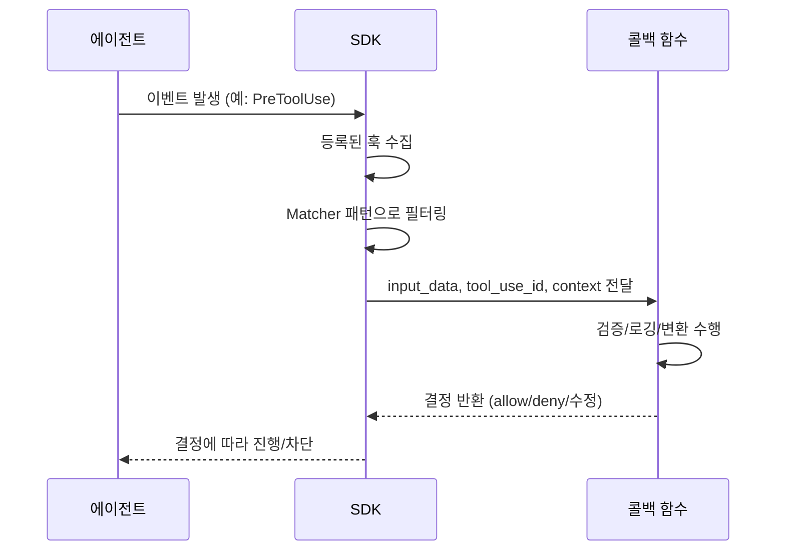

# 훅(SDK Hooks)

> [!tldr] 한줄 요약
> Agent SDK Hook은 Python/TypeScript 콜백 함수로 에이전트 라이프사이클 이벤트를 가로채어 도구 차단, 입력 수정, 로깅, 권한 제어 등을 프로그래밍 방식으로 수행한다. CLI Hook의 셸 커맨드 방식과 달리 네이티브 코드로 동작한다.

## 핵심 내용

### CLI Hook vs SDK Hook

[Hooks](til/claude-code/hooks.md)에서 학습한 CLI Hook은 `settings.json`에 셸 커맨드를 등록하는 방식이었다. SDK Hook은 **콜백 함수**로 에이전트 동작을 제어한다.

| 비교 | CLI Hook | SDK Hook |
|---|---|---|
| 정의 위치 | `settings.json` | 코드 내 `options.hooks` |
| 실행 방식 | 셸 커맨드 (`command`, `prompt`, `agent`) | **콜백 함수** |
| 입출력 | stdin JSON → exit code | 함수 인자 → return 객체 |
| 비동기 | 불가 | `async: true` 지원 |
| 언어 | 셸 스크립트 | Python / TypeScript |
| 타입 안전성 | 없음 | `PreToolUseHookInput` 등 타입 제공 |

### 동작 원리



### 설정 방법

**Python:**

```python
from claude_agent_sdk import ClaudeAgentOptions, HookMatcher

options = ClaudeAgentOptions(
    hooks={
        "PreToolUse": [
            HookMatcher(matcher="Write|Edit", hooks=[protect_env_files])
        ]
    }
)
```

**TypeScript:**

```typescript
import { query, HookCallback } from "@anthropic-ai/claude-agent-sdk";

for await (const message of query({
  prompt: "Your prompt",
  options: {
    hooks: {
      PreToolUse: [{ matcher: "Write|Edit", hooks: [protectEnvFiles] }]
    }
  }
})) {
  console.log(message);
}
```

`hooks` 객체의 키는 이벤트명, 값은 `HookMatcher` 배열이다. 각 matcher는 선택적 정규식 패턴과 콜백 함수 배열을 포함한다.

### 사용 가능한 이벤트

| 이벤트 | Python | TypeScript | 트리거 | 용도 |
|---|---|---|---|---|
| `PreToolUse` | O | O | 도구 호출 요청 | 차단/수정 |
| `PostToolUse` | O | O | 도구 실행 완료 | 로깅/감사 |
| `PostToolUseFailure` | O | O | 도구 실행 실패 | 에러 처리 |
| `UserPromptSubmit` | O | O | 사용자 프롬프트 제출 | 컨텍스트 주입 |
| `Stop` | O | O | 에이전트 실행 종료 | 상태 저장 |
| `SubagentStart` | O | O | [서브에이전트](til/claude-code/subagents.md) 생성 | 병렬 작업 추적 |
| `SubagentStop` | O | O | 서브에이전트 완료 | 결과 집계 |
| `PreCompact` | O | O | 대화 압축 요청 | 전사본 보관 |
| `PermissionRequest` | O | O | 권한 다이얼로그 표시 | 커스텀 권한 처리 |
| `Notification` | O | O | 에이전트 상태 메시지 | Slack/PagerDuty 알림 |
| `SessionStart` | X | O | 세션 초기화 | 텔레메트리 초기화 |
| `SessionEnd` | X | O | 세션 종료 | 리소스 정리 |
| `TeammateIdle` | X | O | 팀원 유휴 상태 | 작업 재배정 |
| `TaskCompleted` | X | O | 백그라운드 작업 완료 | 결과 집계 |

> [!warning] Python SDK 제약
> `SessionStart`/`SessionEnd`는 Python SDK 콜백으로 등록 불가. `setting_sources=["project"]`로 셸 커맨드 Hook을 로드하는 방식으로 대체해야 한다.

### 콜백 함수 구조

**입력 (3개 인자):**

| 인자 | 설명 |
|---|---|
| `input_data` | 이벤트 상세 정보 (`tool_name`, `tool_input`, `session_id`, `cwd` 등) |
| `tool_use_id` | PreToolUse ↔ PostToolUse 상관 관계 ID |
| `context` | TypeScript: `AbortSignal` 제공 / Python: 예약 |

**출력:**

| 필드 | 레벨 | 설명 |
|---|---|---|
| `systemMessage` | 최상위 | 대화에 메시지 주입 (모델에게 보임) |
| `continue` | 최상위 | 에이전트 계속 실행 여부 |
| `hookSpecificOutput` | 중첩 | 이벤트별 제어 |
| → `permissionDecision` | | `"allow"` / `"deny"` / `"ask"` |
| → `permissionDecisionReason` | | 사유 (Claude에게 전달) |
| → `updatedInput` | | 도구 입력 수정 (`allow` 필수) |

`{}` 반환 시 아무 변경 없이 허용한다.

> [!important] 우선순위 규칙
> 여러 훅이 동시에 적용될 때: **deny > ask > allow**. 하나라도 deny를 반환하면 다른 훅의 allow와 무관하게 차단된다.

### 비동기 출력

로깅/웹훅 등 사이드 이펙트만 수행하고 에이전트를 기다리게 하지 않으려면:

```python
async def async_hook(input_data, tool_use_id, context):
    asyncio.create_task(send_to_logging_service(input_data))
    return {"async_": True, "asyncTimeout": 30000}  # ms
```

비동기 출력은 차단/수정/컨텍스트 주입이 **불가능**하다 (에이전트가 이미 진행했으므로). 사이드 이펙트 전용.

### 훅 체이닝

훅은 **배열 순서대로** 실행된다. 각 훅은 단일 책임에 집중:

```python
options = ClaudeAgentOptions(
    hooks={
        "PreToolUse": [
            HookMatcher(hooks=[rate_limiter]),        # 1. 속도 제한
            HookMatcher(hooks=[authorization_check]),  # 2. 권한 검증
            HookMatcher(hooks=[input_sanitizer]),      # 3. 입력 살균
            HookMatcher(hooks=[audit_logger]),         # 4. 감사 로깅
        ]
    }
)
```

### Matcher 패턴

| 패턴 | 대상 |
|---|---|
| `"Bash"` | Bash 도구만 |
| `"Write\|Edit\|Delete"` | 파일 수정 도구 |
| `"^mcp__"` | 모든 [MCP](til/claude-code/mcp.md) 도구 |
| 생략 | 모든 이벤트에 반응 |

Matcher는 **도구 이름**만 필터링한다. 파일 경로 등으로 필터링하려면 콜백 내부에서 `tool_input`을 검사해야 한다.

## 예시

### .env 파일 보호 (PreToolUse)

```python
async def protect_env_files(input_data, tool_use_id, context):
    file_path = input_data["tool_input"].get("file_path", "")
    if file_path.split("/")[-1] == ".env":
        return {
            "systemMessage": ".env 파일은 보호 대상입니다.",
            "hookSpecificOutput": {
                "hookEventName": input_data["hook_event_name"],
                "permissionDecision": "deny",
                "permissionDecisionReason": "Cannot modify .env files",
            }
        }
    return {}
```

### 읽기 전용 도구 자동 승인

```python
async def auto_approve_read_only(input_data, tool_use_id, context):
    read_only_tools = ["Read", "Glob", "Grep"]
    if input_data["tool_name"] in read_only_tools:
        return {
            "hookSpecificOutput": {
                "hookEventName": input_data["hook_event_name"],
                "permissionDecision": "allow",
                "permissionDecisionReason": "Read-only tool auto-approved",
            }
        }
    return {}
```

### Slack 알림 전송 (Notification)

```typescript
const notificationHandler: HookCallback = async (input, toolUseID, { signal }) => {
  const notification = input as NotificationHookInput;
  try {
    await fetch("https://hooks.slack.com/services/YOUR/WEBHOOK/URL", {
      method: "POST",
      headers: { "Content-Type": "application/json" },
      body: JSON.stringify({ text: `Agent: ${notification.message}` }),
      signal
    });
  } catch (error) {
    console.error("Failed to send notification:", error);
  }
  return {};
};
```

## 참고 자료

- [Intercept and control agent behavior with hooks - Claude API Docs](https://platform.claude.com/docs/en/agent-sdk/hooks)
- [Hooks reference - Claude Code Docs](https://code.claude.com/docs/en/hooks)
- [TypeScript SDK reference](https://platform.claude.com/docs/en/agent-sdk/typescript)
- [Python SDK reference](https://platform.claude.com/docs/en/agent-sdk/python)

## 관련 노트

- [Hooks](til/claude-code/hooks.md) — CLI 셸 커맨드 방식의 Hook (settings.json 기반)
- [서브에이전트(Subagents)](til/claude-code/subagents.md) — SubagentStart/Stop 훅으로 추적 가능
- [MCP(Model Context Protocol)](til/claude-code/mcp.md) — MCP 도구는 `^mcp__` 패턴으로 매칭
- [Permission 모드(Permission Mode)](til/claude-code/permission-mode.md) — permissionDecision으로 권한 제어
- [Security와 Sandboxing](til/claude-code/security-sandboxing.md) — 훅을 통한 보안 정책 강제
