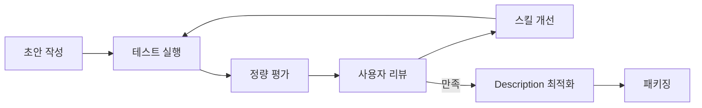

# 스킬 생성기(Skill Creator)

> [!tldr] 한줄 요약
> Skill Creator는 Anthropic이 공식 제공하는 메타 스킬로, 스킬 설계 원칙과 **평가(Eval) 기반 반복 개선 프레임워크**를 제공한다. v2(2026-02)에서 "작성 가이드"에서 "개발+검증 환경"으로 진화했다.

## 핵심 내용

### Skill Creator란?

[anthropics/skills](https://github.com/anthropics/skills) 리포지토리에 포함된 공식 메타 스킬이다. `skill-creator` 자체가 하나의 [스킬(Skill)](til/claude-code/skill.md)이며, Claude에게 새로운 스킬을 설계하는 방법론과 베스트 프랙티스를 주입한다.

### v1 → v2 변화 (PR #465, 2026-02-25)

| | v1 | v2 |
|---|---|---|
| 역할 | 스킬 **작성** 가이드 | 스킬 **개발 환경** (IDE처럼) |
| 완료 기준 | SKILL.md 작성 + 패키징 | 벤치마크 통과 + 사용자 만족 |
| 품질 보증 | 원칙 준수 여부 (주관적) | eval 통과율, 트리거 정확도 (정량적) |
| 톤 | 공식 문서체 | 대화체, 실용적 |
| 초기화 | `init_skill.py` 의존 | 수동 생성 |

v1의 설계 원칙(간결함, 점진적 공개 등)은 여전히 유효하지만, v2는 **"만든 스킬을 어떻게 검증하고 개선하는가"**에 초점을 맞춘다.

### 설계 원칙 (v1에서 유지)

#### 간결함이 핵심(Concise is Key)

[컨텍스트 윈도우](til/claude-code/context-management.md)는 공공재다. Claude는 이미 충분히 똑똑하므로 **Claude가 모르는 정보만** 담아야 한다.

#### 점진적 공개(Progressive Disclosure)

| 단계 | 로드 시점 | 크기 |
|------|----------|------|
| 메타데이터 (name + description) | 항상 | ~100단어 |
| SKILL.md 본문 | 스킬 트리거 시 | <500줄 |
| 번들 리소스 (scripts/references/assets) | 필요할 때만 | 무제한 |

#### 작성 스타일 (v2 강조)

- **Why를 설명하라** — `ALWAYS`/`NEVER` 대문자 강조보다 이유를 설명하는 게 더 효과적
- Description은 약간 "pushy"하게 — 언더트리거(undertrigger) 방지
- "Not for" 패턴으로 스킬 간 경계를 명확히

### 핵심 워크플로우 (v2)

v2의 전체 프로세스는 **소프트웨어 개발의 CI/CD 파이프라인**과 유사하다:



#### 1단계: 스킬 작성

- **Capture Intent** — 무엇을, 언제 트리거할지, 출력 형식은?
- **Interview & Research** — 엣지 케이스, 의존성, 성공 기준 조사
- **Write SKILL.md** — name, description(트리거 메커니즘), body

#### 2단계: 평가(Eval) 실행

테스트 케이스 2~3개를 `evals/evals.json`에 저장 후 **with-skill / without-skill 병렬 실행**:

```
<skill-name>-workspace/
├── iteration-1/
│   ├── eval-0-descriptive-name/
│   │   ├── with_skill/outputs/
│   │   ├── without_skill/outputs/
│   │   └── eval_metadata.json
│   ├── benchmark.json
│   └── benchmark.md
├── iteration-2/
└── feedback.json
```

- 실행 중 대기하지 않고 **assertion 초안 작성** (시간 활용)
- 완료 시 `timing.json`에 토큰/시간 기록

#### 3단계: 채점 + 벤치마크

1. **Grader 에이전트**(`agents/grader.md`)로 assertion 기반 자동 채점
2. **`aggregate_benchmark.py`**로 pass_rate, 토큰, 시간 집계
3. **Analyst 패스** — 항상 통과하는 assertion(비차별적), 높은 분산(flaky), 시간/토큰 트레이드오프 분석
4. **`generate_review.py`**로 인터랙티브 뷰어 생성 → 사용자에게 제공

> [!tip] 뷰어 구성
> - **Outputs 탭**: 테스트 케이스별 출력 + 피드백 입력
> - **Benchmark 탭**: 정량 비교 (pass rate, 토큰, 시간)

#### 4단계: 반복 개선

사용자 `feedback.json`을 읽고 스킬 수정 → 재실행. 개선 시 핵심 원칙:

1. **일반화** — 테스트 케이스에 오버피팅하지 않기. 다양한 메타포와 패턴 시도
2. **린하게 유지** — 비생산적인 지시 제거
3. **Why 설명** — 딱딱한 MUST 대신 이유를 전달
4. **반복 작업 번들링** — 테스트마다 같은 스크립트를 작성하면 `scripts/`에 포함

#### 5단계: Description 최적화

트리거 정확도를 자동으로 높이는 프로세스:

1. **Eval 쿼리 20개 생성** — should-trigger 8~10개 + should-not-trigger 8~10개
   - 구체적이고 현실적인 쿼리 (파일 경로, 개인 맥락, 오타 포함)
   - should-not-trigger는 **near-miss**(키워드는 겹치지만 다른 의도)가 핵심
2. **HTML 리뷰어**(`assets/eval_review.html`)로 사용자 검수
3. **`run_loop.py`** 실행 — train 60%/test 40% 분할, 3회 반복 측정, 최대 5 iteration
4. `best_description`을 SKILL.md에 적용

#### 고급: 블라인드 비교

두 버전을 **Comparator 에이전트**(`agents/comparator.md`)에게 익명으로 제출 → 어느 쪽이 왜 나은지 분석. **Analyzer 에이전트**(`agents/analyzer.md`)가 개선 제안 생성.

### 환경별 대응

| 환경 | 서브에이전트 | 브라우저 | 대응 |
|------|:---:|:---:|------|
| Claude Code | O | O | 전체 워크플로우 사용 가능 |
| Cowork | O | X | `--static` 옵션으로 HTML 파일 생성 |
| Claude.ai | X | X | 직접 실행 + 인라인 피드백, 벤치마크 생략 |

### 번들 리소스 구성

```
my-skill/
├── SKILL.md           ← 메인 지시사항 (필수, 500줄 이하)
├── scripts/           ← 결정적 실행이 필요한 코드 (Python/Bash)
├── references/        ← 컨텍스트에 필요 시 로드되는 문서
└── assets/            ← 출력에 사용되는 파일 (템플릿, 이미지)
```

v2에서 추가된 번들 리소스:

```
skill-creator/
├── agents/            ← 서브에이전트 프롬프트 (grader, comparator, analyzer)
├── eval-viewer/       ← 인터랙티브 결과 뷰어 (generate_review.py, viewer.html)
├── scripts/           ← 벤치마크 집계, description 최적화 등
├── references/        ← JSON 스키마 (schemas.md)
└── assets/            ← eval 리뷰 HTML 템플릿
```

### 고급 패턴

#### 동적 컨텍스트 주입

`` !`command` `` 문법으로 셸 실행 결과를 스킬 내용에 삽입한다. Claude가 보기 전에 전처리된다:

```yaml
---
name: pr-summary
context: fork
agent: Explore
---
- PR diff: !`gh pr diff`
- Changed files: !`gh pr diff --name-only`
```

#### 서브에이전트 실행

`context: fork`로 격리 실행. 대화 이력 없이 SKILL.md 내용만 프롬프트로 전달된다:

```yaml
---
name: deep-research
context: fork
agent: Explore
---
Research $ARGUMENTS thoroughly...
```

> [!warning] 주의
> `context: fork`는 명확한 작업 지시가 있는 스킬에만 적합하다. 가이드라인만 있고 태스크가 없으면 서브에이전트가 할 일을 모른다.

## 예시

이 프로젝트의 `/til` 스킬 시스템이 Skill Creator 원칙을 잘 적용한 실례다:

```
.claude/skills/til/SKILL.md      ← 학습 워크플로우 (93줄)
.claude/skills/save/SKILL.md     ← 저장 전담 (257줄)
.claude/skills/research/SKILL.md ← 백로그 생성 (143줄)
.claude/rules/save-rules.md      ← 핵심 규칙 (항상 로드, 40줄)
```

> [!example] 점진적 공개 적용
> - **항상 로드**: `save-rules.md` (40줄) — 경로/wikilink 규칙
> - **트리거 시 로드**: `/save` (257줄) — 상세 템플릿/워크플로우
> - **필요 시 로드**: [MCP](til/claude-code/mcp.md) 도구로 기존 TIL/백로그 파일 읽기

관심사별로 3개 스킬을 분리해 컨텍스트 효율을 높이고, rules 파일로 "항상 필요한 규칙"을 별도 관리하는 패턴은 Skill Creator 공식 예시에 없는 실용적 응용이다.

## 참고 자료

- [Skill Creator SKILL.md (anthropics/skills)](https://github.com/anthropics/skills/blob/main/skills/skill-creator/SKILL.md)
- [PR #465: export latest skills](https://github.com/anthropics/skills/pull/465) — v2 변경 내역
- [Claude Code Skills 공식 문서](https://code.claude.com/docs/en/skills)
- [Agent Skills 오픈 표준](https://agentskills.io)
- [The Complete Guide to Building Skills for Claude](https://resources.anthropic.com/hubfs/The-Complete-Guide-to-Building-Skill-for-Claude.pdf)

## 관련 노트

- [Claude Code Skill (커스텀 슬래시 커맨드)](til/claude-code/skill.md)
- [Context 관리(Context Management)](til/claude-code/context-management.md)
- [Claude Code Agent 동작 방식](til/claude-code/agent.md)
- [Claude Code Plugin](til/claude-code/plugin.md)
- [Hooks](til/claude-code/hooks.md)
