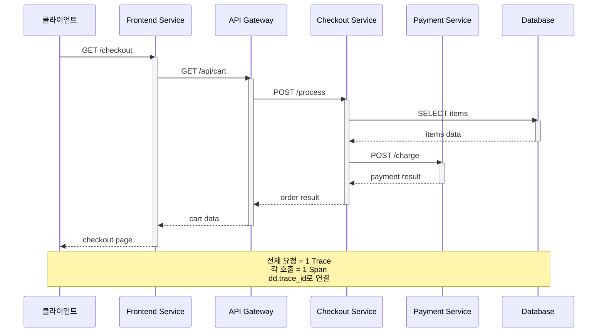

# Datadog APM과 분산 트레이싱(Distributed Tracing)

> [!tldr] 한줄 요약
> Datadog APM은 dd-trace 라이브러리로 자동/수동 계측하여 서비스 간 요청 흐름을 추적하고, Service Map·Flame Graph·Trace Explorer로 병목을 시각화하며, Head-based + Error/Rare 샘플링으로 비용과 가시성을 균형 잡는다.

## 핵심 내용

### 핵심 용어

| 용어 | 설명 |
|------|------|
| **Trace** | 하나의 요청이 여러 서비스를 거치는 전체 여정 |
| **Span** | Trace 안의 개별 작업 단위 (DB 쿼리, HTTP 호출 등) |
| **Service** | 독립적으로 배포되는 소프트웨어 단위 (`checkout`, `user-api`) |
| **Resource** | Service 안의 특정 엔드포인트/쿼리 (`GET /api/orders`) |
| **Operation** | Span의 작업 유형 (`http.request`, `sql.query`) |

하나의 Trace는 여러 Span으로 구성되고, 각 Span은 Service, Resource, Operation 정보를 갖는다.

### 동작 구조

```
애플리케이션 (dd-trace 라이브러리)
    │
    │ Span 데이터 전송 (포트 8126)
    ▼
Datadog Agent (APM Agent)
    │
    │ HTTPS
    ▼
Datadog 백엔드
    │
    ├── Service Map (서비스 의존관계)
    ├── Trace Explorer (트레이스 검색)
    ├── Flame Graph (실행 흐름 시각화)
    └── APM 메트릭 (자동 생성)
```

**분산 트레이싱 요청 흐름 예시:**



### 계측(Instrumentation)

#### 자동 계측 (Auto-instrumentation)

dd-trace 라이브러리 설치만으로 HTTP, DB, 캐시 등 주요 프레임워크를 자동 추적한다. 지원 언어: Java, Python, Node.js, Go, Ruby, .NET, PHP, Rust.

```bash
# Python 예시 - 자동 계측
DD_SERVICE=checkout DD_ENV=production ddtrace-run python app.py
# → Flask/Django의 HTTP, SQLAlchemy 쿼리 등 자동 추적
```

#### 수동 계측 (Custom Instrumentation)

자동 계측이 커버하지 못하는 **비즈니스 로직 내부**를 직접 추적한다.

**수동 계측이 필요한 상황:**

1. **비즈니스 로직 내부 병목** — Flame Graph에서 자식 Span 없이 긴 시간을 차지하는 "빈 공간"
2. **외부 API 호출** — 자동 계측이 지원하지 않는 커스텀 HTTP 클라이언트나 사내 SDK
3. **비동기/백그라운드 작업** — Celery 태스크, cron job 내부 단계 추적
4. **비즈니스 컨텍스트 태깅** — 주문 금액, 결제 수단, 고객 등급 등 분석용 태그 추가
5. **에러 컨텍스트 보강** — 에러 발생 원인에 대한 상세 정보 추가

#### 수동 계측 실전 팁

**Span 이름은 Flame Graph에서 바로 알아볼 수 있게:**

```python
# 좋은 예: {클래스/모듈}.{메서드} 또는 {동사}_{대상}
tracer.trace("OrderService.validate")
tracer.trace("PaymentGateway.charge")
```

**"빈 공간"부터 계측하라** — 모든 함수가 아니라, 설명되지 않는 시간에 집중

**적절한 깊이 유지** — 루프 안에서 Span을 만들기보다 루프 전체를 감싸고 태그로 메타데이터를 남긴다. 하나의 Trace에 Span이 100개를 넘지 않도록.

```python
# 루프 전체를 하나의 Span으로
with tracer.trace("process_cart_items"):
    span = tracer.current_span()
    span.set_tag("cart.item_count", len(cart.items))
    for item in cart.items:
        process_item(item)
```

**태그로 비즈니스 컨텍스트를 남겨라:**

```python
span = tracer.current_span()
span.set_tag("order.total", 150000)
span.set_tag("customer.tier", "premium")
```

> [!warning] 고카디널리티 태그 주의
> `user_id`, `request_body` 같은 고유값이 많은 태그는 비용 폭증 + 개인정보 이슈. 태그에는 카디널리티가 낮은 값만 사용한다.

**Dynamic Instrumentation** — 코드 수정·배포 없이 Datadog UI에서 런타임으로 Span을 추가/제거. 프로덕션 병목 조사에 유용.

### 주요 화면

| 화면 | 용도 |
|------|------|
| **Service Map** | 서비스 간 호출 관계를 노드/엣지로 시각화, 건강 상태 색상 표시 |
| **Flame Graph** | 하나의 Trace를 타임라인으로 시각화, 어디서 시간이 소비되었는지 파악 |
| **Trace Explorer** | 태그/서비스/상태 기반으로 트레이스 검색, 에러·느린 요청 필터링 |

### 자동 생성 APM [메트릭](til/datadog/metrics.md)

| 메트릭 | 설명 |
|--------|------|
| `trace.{operation}.hits` | 요청 수 |
| `trace.{operation}.errors` | 에러 수 |
| `trace.{operation}.duration` | 응답 시간 |
| `trace.{operation}.apdex` | 사용자 만족도 지표 |

→ 별도 커스텀 메트릭 설정 없이 서비스별/리소스별 RED 메트릭이 자동 제공된다.

### 트레이스 샘플링과 보존

| 방식 | 동작 | 기본값 |
|------|------|--------|
| **Head-based** | 트레이스 시작 시점에서 수집 여부 결정 | 10 traces/sec |
| **Error Sampler** | 에러 포함 트레이스 추가 수집 | 10 errors/sec |
| **Rare Sampler** | 저트래픽 서비스/리소스 트레이스 추가 수집 | 자동 |
| **Tail-based** | OTel Collector에서 완료된 트레이스 기반 필터링 | 별도 설정 필요 |

> [!tip] 샘플링 전략
> Head-based만으로는 에러/희귀 경로를 놓칠 수 있지만, Datadog은 Error Sampler와 Rare Sampler가 자동으로 보완한다. 대부분의 경우 기본 설정만으로 충분하다.

**보존(Retention)**: 수집된 Span은 기본 15일 보존. Intelligent Retention이 모든 서비스/리소스의 대표 트레이스를 자동 보존하고, Custom Retention Filter로 특정 조건의 트레이스를 추가 보존할 수 있다.

## 예시

```python
from ddtrace import tracer

# 수동 계측으로 비즈니스 로직 내부 추적
@tracer.wrap(service="checkout", resource="process_payment")
def process_payment(order):
    with tracer.trace("validate_order"):
        validate(order)

    with tracer.trace("call_payment_gateway"):
        result = payment_api.charge(order.total)

    span = tracer.current_span()
    span.set_tag("order.total", order.total)
    span.set_tag("payment.method", order.payment_method)
    return result
```

> [!example] Flame Graph에서 병목 찾기
> ```
> [HTTP POST /api/checkout] ────────── 2.5s ──────────────
>   [validate_order] ── 0.05s
>   [call_payment_gateway] ────────── 2.3s ──────────────  ← 병목!
>     [HTTP POST payment.example.com] ── 2.3s
>   [send_confirmation_email] ── 0.1s
> ```
> → 결제 게이트웨이 응답이 2.3초로 전체 지연의 92%를 차지. 외부 API 타임아웃 설정이나 비동기 처리를 검토해야 한다.

## 참고 자료

- [Datadog APM](https://docs.datadoghq.com/tracing/)
- [Getting Started with APM Tracing](https://docs.datadoghq.com/getting_started/tracing/)
- [Service Map](https://docs.datadoghq.com/tracing/services/services_map/)
- [Custom Instrumentation](https://docs.datadoghq.com/tracing/trace_collection/custom_instrumentation/)
- [Ingestion Mechanisms](https://docs.datadoghq.com/tracing/trace_pipeline/ingestion_mechanisms/)
- [Span Tag Semantics](https://docs.datadoghq.com/tracing/trace_collection/tracing_naming_convention/)

## 관련 노트

- [Datadog Agent](til/datadog/datadog-agent.md)
- [분산 시스템 모니터링(Distributed System Monitoring)](til/devops/distributed-system-monitoring.md)
- [통합 서비스 태깅(Unified Service Tagging)](til/datadog/unified-service-tagging.md)
- [메트릭(Metrics)](til/datadog/metrics.md)
- [로그-트레이스 상관관계(Log-Trace Correlation)](til/datadog/log-trace-correlation.md)
- [로그 관리(Log Management)](til/datadog/log-management.md)
