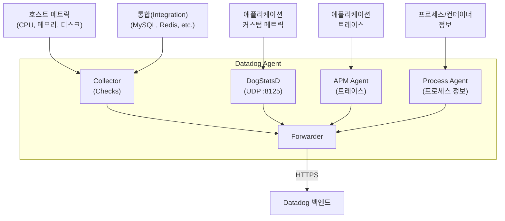

# TIL: Datadog Agent

> [!tldr] 한줄 요약
> Datadog Agent는 호스트에 설치되어 메트릭, 로그, 트레이스를 수집하고 Datadog 백엔드로 전송하는 경량 소프트웨어로, Collector·DogStatsD·Forwarder·APM Agent·Process Agent로 구성된다.

## 핵심 내용

### Datadog Agent란?

호스트에 설치되어 [[메트릭(Metrics)|메트릭]], [[로그 관리(Log Management)|로그]], [[APM과 분산 트레이싱(Distributed Tracing)|트레이스]]를 수집하고 Datadog 서버로 전송하는 경량 소프트웨어. Datadog의 모든 데이터 수집은 Agent에서 시작된다.

### 아키텍처 (Agent 7 기준)

```
┌─────────────────────────────────────────┐
│              Datadog Agent              │
│                                         │
│  ┌───────────┐  ┌──────────────────┐    │
│  │ Collector  │  │   DogStatsD      │    │
│  │ (Checks)  │  │  (UDP :8125)     │    │
│  └─────┬─────┘  └────────┬─────────┘    │
│        │                 │              │
│        ▼                 ▼              │
│  ┌─────────────────────────────────┐    │
│  │         Forwarder               │    │
│  │   (HTTPS → Datadog Backend)     │    │
│  └─────────────────────────────────┘    │
│                                         │
│  ┌──────────────┐  ┌───────────────┐    │
│  │  APM Agent   │  │ Process Agent │    │
│  │ (트레이스)    │  │ (프로세스 정보) │    │
│  └──────────────┘  └───────────────┘    │
└─────────────────────────────────────────┘
```



#### Collector (수집기)

- 15초 간격으로 호스트의 인프라 메트릭(CPU, 메모리, 디스크 등)을 수집
- **Check**: 통합(Integration) 단위의 데이터 수집 로직. MySQL Check, Redis Check 등
- Python 기반 커스텀 Check도 작성 가능

#### DogStatsD

- 애플리케이션에서 **커스텀 메트릭**을 Agent로 보내는 경량 서버
- UDP 포트 8125에서 수신 (비동기, fire-and-forget)
- StatsD 프로토콜 확장판 — 메트릭, 이벤트, 서비스 체크 모두 수신 가능

#### Forwarder (전송기)

- 수집된 모든 데이터를 HTTPS로 Datadog 백엔드에 전송
- 네트워크 장애 시 데이터를 버퍼링하여 재전송

#### APM Agent

- 애플리케이션의 분산 트레이스 데이터를 수신 (기본 포트 8126)
- 트레이싱 라이브러리(dd-trace)가 보내는 Span을 수집

#### Process Agent

- 호스트에서 실행 중인 프로세스 및 컨테이너 정보를 수집

### 설정 파일

핵심 설정 파일은 `datadog.yaml`:

```yaml
# 기본 설정
api_key: <YOUR_API_KEY>        # 필수: Datadog API 키
site: datadoghq.com            # Datadog 사이트 (US/EU)

# 태깅
tags:
  - env:production
  - service:web-api
  - team:backend

# 로그 수집 활성화
logs_enabled: true

# APM 활성화
apm_config:
  enabled: true

# DogStatsD
dogstatsd:
  port: 8125
```

### Kubernetes 환경에서의 배포

| 방법 | 설명 | 권장 |
|------|------|------|
| **Datadog Operator** | CRD 기반 선언적 관리 | 프로덕션 권장 |
| **Helm Chart** | Helm으로 한 번에 설치 | 빠른 시작에 적합 |
| **DaemonSet 직접 작성** | YAML 매니페스트로 수동 관리 | 세밀한 제어 필요 시 |

모든 방식 공통: **DaemonSet**으로 배포하여 클러스터의 모든 노드에 Agent 1개씩 배치한다.

> [!tip] Cluster Agent
> 추가로 **Cluster Agent**를 Deployment로 배포하면 Kubernetes API 서버 부하를 줄일 수 있다. Node Agent가 직접 API 서버에 질의하지 않고 Cluster Agent를 통해 클러스터 수준 메타데이터를 받는다.

### Agent vs Agentless

| | Agent 방식 | Agentless (API 직접) |
|---|---|---|
| 데이터 수집 | 호스트에서 직접 수집 | 클라우드 API로 수집 |
| 실시간성 | 높음 (15초 간격) | 낮음 (API 폴링 주기) |
| 커스텀 메트릭 | DogStatsD로 가능 | 불가 |
| 트레이싱 | APM Agent로 가능 | 불가 |
| 사용 사례 | VM, 컨테이너, K8s | AWS CloudWatch 등 클라우드 서비스 |

## 예시

```python
# DogStatsD로 커스텀 메트릭 전송 (Python)
from datadog import statsd

# 카운터: 주문 수 증가
statsd.increment('orders.count', tags=['env:production', 'service:checkout'])

# 게이지: 현재 활성 사용자 수
statsd.gauge('users.active', 150, tags=['env:production'])

# 히스토그램: API 응답 시간
statsd.histogram('api.response_time', 0.235, tags=['endpoint:/api/orders'])
```

> [!example] DogStatsD 동작 흐름
> 애플리케이션 → UDP :8125 → DogStatsD(집계) → Forwarder → Datadog 백엔드
> UDP이므로 전송 실패가 애플리케이션 성능에 영향을 주지 않는다.

## 참고 자료

- [Datadog Agent Overview](https://docs.datadoghq.com/agent/)
- [Agent Architecture](https://docs.datadoghq.com/agent/architecture/)
- [DogStatsD](https://docs.datadoghq.com/developers/dogstatsd/)
- [Install Datadog Agent on Kubernetes](https://docs.datadoghq.com/containers/kubernetes/installation/)
- [The Datadog Agent: Why it's essential](https://www.datadoghq.com/blog/datadog-agent/)

## 관련 노트

- [[til/devops/observability|옵저버빌리티(Observability)]]
- [[태깅(Tagging)]]
- [[통합 서비스 태깅(Unified Service Tagging)]]
- [[메트릭(Metrics)]]
- [[APM과 분산 트레이싱(Distributed Tracing)]]
- [[로그 관리(Log Management)]]
