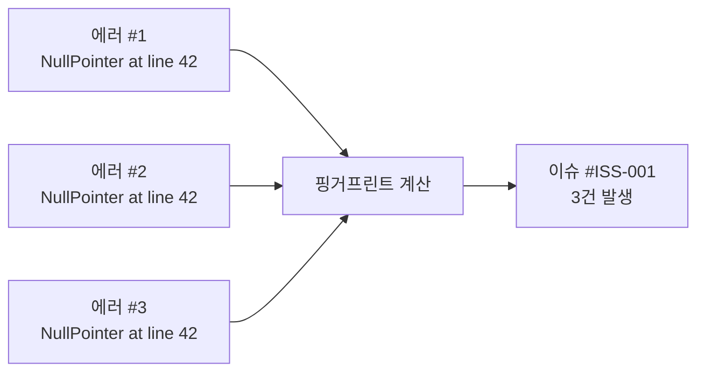
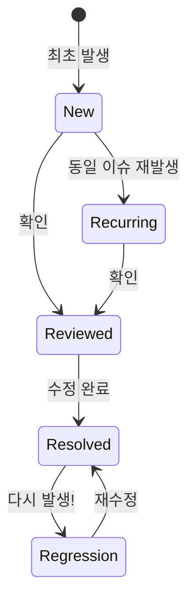

# Error Tracking

> [!tldr] 한줄 요약
> 수천 개의 개별 에러를 스택 트레이스 기반 핑거프린팅으로 자동 그룹핑하여 "이슈" 단위로 추적하며, APM/로그/RUM 에러를 한 화면에서 관리하고, Exception Replay로 프로덕션 변수 값까지 캡처한다.

## 핵심 내용

### Error Tracking이란

APM, 로그, [RUM](til/datadog/rum.md)에서 발생하는 에러를 **자동으로 그룹핑하여 이슈(Issue) 단위로 추적**하는 기능. 개별 에러 수천 개를 일일이 보는 게 아니라, 같은 원인의 에러를 하나의 이슈로 묶어서 빈도·영향 범위·최초 발생 시점을 파악한다.

APM이 이미 동작 중이면 **추가 설정 없이 자동 활성화**된다. 별도 SDK나 설정 변경이 불필요하다.

### 에러 그룹핑 (Fingerprinting)

Error Tracking의 핵심 메커니즘. 에러 Span의 3가지 속성으로 **핑거프린트**를 계산한다:

| 속성 | 설명 | 예시 |
|------|------|------|
| `error.type` | 에러 타입/클래스 | `NullPointerException` |
| `error.message` | 에러 메시지 | `Cannot read property 'id' of null` |
| `error.stack` | 스택 트레이스 | 최상위 프레임(에러 발생 위치)을 중심으로 |

같은 핑거프린트를 가진 에러는 같은 이슈로 그룹핑된다.



> [!tip] 똑똑한 그룹핑
> 메시지 안의 숫자, 따옴표/괄호 안의 내용은 무시한다. `"User 123 not found"`와 `"User 456 not found"`는 같은 이슈로 묶인다. 단어 수준의 토큰만 비교하여 "같은 원인, 다른 값"의 에러를 정확히 그룹핑한다.

### 이슈 생명주기



| 상태 | 설명 |
|------|------|
| **New** | 처음 발생한 이슈. 조사가 필요 |
| **Recurring** | 이전에 본 이슈가 다시 발생 |
| **Regression** | **해결했던 이슈가 다시 발생**. 자동 재오픈되며 이전 수정 이력이 보존됨 |
| **Resolved** | 수정 완료된 이슈 |

Regression 감지가 특히 유용하다. 배포 후 "고쳤던 버그가 다시 나왔다"를 자동으로 알려준다.

### 3가지 에러 소스

Error Tracking은 세 곳에서 에러를 수집하여 하나의 화면에서 보여준다:

| 소스 | 수집 대상 | 필요 조건 |
|------|----------|----------|
| **APM (Traces)** | 백엔드 서비스의 에러 Span | dd-trace 계측 (자동 활성화) |
| **Logs** | 에러 로그 (스택 트레이스 포함) | 로그 수집 + `source` 태그 설정 |
| **RUM** | 프론트엔드 JS 에러, 크래시 | RUM SDK 설치 |

### 핵심 기능

#### Exception Replay

프로덕션 에러 발생 시 **해당 시점의 로컬 변수 값**을 자동 캡처한다. 에러를 재현하지 않고도 "이때 변수 값이 뭐였길래 에러가 났는지" 바로 확인 가능.

#### Suspected Cause

이슈 생성 시 **의심 원인을 자동 라벨링**한다:
- 코드 예외 (Code Exception)
- 실패한 요청 (Failed Request)
- 최근 배포와의 상관관계

#### Source Code Integration

스택 트레이스의 각 프레임에서 **소스 코드로 직접 링크**. GitHub/GitLab 연동 시 해당 커밋의 코드를 바로 볼 수 있다.

#### Error Tracking Monitor

[모니터](til/datadog/monitors-and-alerts.md)를 설정하여 알림을 받을 수 있다:
- 새로운 이슈 발생 시
- 에러 볼륨이 임계치 초과 시
- Regression 발생 시

### Sentry와의 비교

| | Datadog Error Tracking | Sentry |
|---|---|---|
| **포지션** | 옵저버빌리티 스택의 일부 | 에러 추적 전문 도구 |
| **장점** | 에러 → 트레이스 → 로그 → RUM 한 곳에서 연결 | 에러 추적에 특화된 깊은 기능 |
| **설정** | APM 있으면 자동 활성화, 추가 SDK 불필요 | 별도 SDK 설치 필요 |
| **적합한 경우** | 이미 Datadog을 쓰고 있을 때 | 에러 추적만 독립적으로 필요할 때 |

이미 Datadog APM/로그/RUM을 쓰고 있다면, 별도 도구 없이 에러 → 트레이스 → 로그를 한 곳에서 오갈 수 있는 것이 가장 큰 장점이다.

## 예시

```
장애 대응 흐름:

1. Error Tracking Monitor 알림: "새로운 이슈 — PaymentService NullPointerException"

2. Error Tracking Explorer에서 이슈 클릭
   → 발생 횟수: 지난 1시간 동안 342건
   → 영향 받은 사용자: 89명
   → 최초 발생: 10:23 (30분 전 배포 직후)
   → Suspected Cause: Code Exception

3. Exception Replay로 변수 값 확인
   → order.payment_method = null  ← 원인!
   → 새 결제 수단 추가 시 null 체크 누락

4. 스택 트레이스에서 "View in GitHub" 클릭
   → 해당 커밋의 코드 확인

5. 수정 배포 후 이슈 Resolved로 마킹
   → 같은 에러 재발 시 Regression으로 자동 재오픈
```

> [!example] Error Tracking Explorer 화면 구성
> - **이슈 목록**: 핑거프린트별 그룹, 발생 횟수, 영향 사용자 수, 최초/최근 발생 시각
> - **이슈 상세**: 스택 트레이스, Exception Replay (변수 값), 관련 트레이스/로그 링크
> - **필터**: 서비스, 환경, 에러 타입, 상태(New/Regression) 등

## 참고 자료

- [Error Tracking](https://docs.datadoghq.com/error_tracking/)
- [Error Tracking for Backend Services](https://docs.datadoghq.com/tracing/error_tracking/)
- [Error Grouping](https://docs.datadoghq.com/error_tracking/error_grouping/)
- [Error Tracking Monitor](https://docs.datadoghq.com/monitors/types/error_tracking/)
- [The first step to fixing what matters: Datadog Error Tracking (Blog)](https://www.datadoghq.com/blog/datadog-error-tracking/)

## 관련 노트

- [APM과 분산 트레이싱(Distributed Tracing)](til/datadog/apm-distributed-tracing.md)
- [로그 관리(Log Management)](til/datadog/log-management.md)
- [로그-트레이스 상관관계(Log-Trace Correlation)](til/datadog/log-trace-correlation.md)
- [RUM(Real User Monitoring)](til/datadog/rum.md)
- [모니터와 알림(Monitors & Alerts)](til/datadog/monitors-and-alerts.md)
