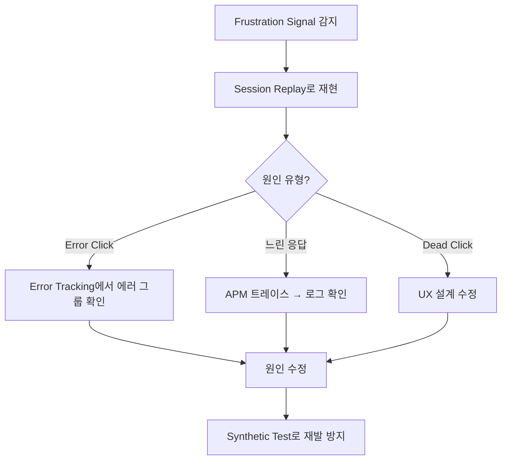

# 프러스트레이션 시그널(Frustration Signals)

> [!tldr] 한줄 요약
> Datadog RUM이 Rage Click, Dead Click, Error Click 3가지 클릭 패턴으로 사용자 좌절을 자동 감지하여, 코드 버그와 UX 결함을 빠르게 찾아내는 기능이다.

## 핵심 내용

프러스트레이션 시그널은 [RUM(Real User Monitoring)](til/datadog/rum.md)의 하위 기능으로, 사용자가 직접 피드백하지 않아도 **클릭 행동 패턴**만으로 어디서 좌절감을 느끼는지 파악할 수 있다.

### 3가지 시그널 유형

| 유형 | 정의 | 의미 |
|------|------|------|
| **Rage Click** | 같은 요소를 **1초 내에 3회 이상** 클릭 | 버튼이 반응하지 않거나 로딩이 느려 사용자가 답답해하는 상황 |
| **Dead Click** | 클릭했지만 **아무 동작도 일어나지 않음** | 클릭 가능해 보이지만 실제로는 아닌 요소 (misleading UX) |
| **Error Click** | 클릭 직후 **JavaScript 에러 발생** | 클릭 액션이 런타임 에러를 유발하는 버그 |

### 시그널 간 관계와 우선순위

Rage Click은 대부분 Dead Click이나 Error Click의 **결과물**이다. 전형적인 에스컬레이션 패턴:

```
클릭 → 반응 없음(Dead Click) → 재시도 → 또 반응 없음 → 연타 → Rage Click
클릭 → 에러 발생(Error Click) → 재시도 → 또 에러 → 연타 → Rage Click
```

따라서 대응 우선순위는:

1. **Error Click** — 기능이 깨져 있으므로 버그 수정이 급함
2. **Dead Click** — UX 설계 결함. 클릭 가능해 보이는데 아닌 요소 수정
3. **순수 Rage Click** — Dead/Error 없이 발생. 기능은 정상이지만 응답이 느리거나 피드백이 부재

Error Click과 Dead Click을 먼저 잡으면 Rage Click의 대부분이 자연스럽게 줄어든다. 순수 Rage Click은 로딩 인디케이터 추가, 응답 속도 개선 등 UX 피드백 강화로 해결한다.

### SDK 설정

Browser SDK **v4.14.0 이상**이 필요하다:

```javascript
datadogRum.init({
  trackUserInteractions: true,  // 클릭, 입력 등 사용자 상호작용 추적
  trackFrustrations: true,      // 프러스트레이션 시그널 활성화
  sessionReplaySampleRate: 20,  // Session Replay와 결합 가능
  defaultPrivacyLevel: 'mask-user-input'
});
```

> [!tip] 최신 SDK
> 최신 SDK에서는 `trackUserInteractions: true`만 설정하면 frustration signals도 자동 수집된다.

### RUM Explorer에서 분석

| 목적 | 검색 쿼리 |
|------|-----------|
| Rage Click만 보기 | `action.frustration.type:rage_click` |
| Dead Click만 보기 | `action.frustration.type:dead_click` |
| Error Click만 보기 | `action.frustration.type:error_click` |
| 좌절 1회 이상 세션 | `session.frustration.count:>1` |
| 좌절 많은 페이지 | `view.frustration.count:>10` |

Options > Add Column에서 `@session.frustration.count`를 추가하면 세션별 좌절 횟수를 한눈에 볼 수 있다. Frustration Type 패싯으로 유형별 필터링도 가능하다.

### 연계 기능과 풀스택 워크플로우

Frustration Signals는 단독으로도 유용하지만, 다른 Datadog 기능과 결합하면 **발견 → 원인 분석 → 해결 → 예방**의 전체 루프를 완성한다:

- **Session Replay**: 좌절 세션을 영상처럼 재생하여 "왜" 좌절했는지 시각적 확인. 한 액션에 2개 이상 signal이면 "What Happened" 요약 자동 생성
- **[Error Tracking](til/datadog/error-tracking.md)**: Error Click의 JS 에러가 자동 그룹핑되어 바로 이슈 추적 가능
- **[APM과 분산 트레이싱](til/datadog/apm-distributed-tracing.md)**: 프론트엔드 좌절의 원인이 백엔드에 있을 때, RUM 세션 → APM 트레이스로 원클릭 연결
- **[로그-트레이스 상관관계](til/datadog/log-trace-correlation.md)**: 트레이스에서 더 깊이 파고들어 서버 로그까지 풀스택 추적
- **[Product Analytics](til/datadog/product-analytics.md)**: 퍼널 분석에서 frustration signal이 많은 단계 = 이탈 원인
- **[Watchdog](til/datadog/watchdog.md)**: frustration signal의 비정상적 급증을 자동 감지
- **[모니터와 알림](til/datadog/monitors-and-alerts.md)**: 비즈니스 크리티컬 페이지에 RUM Monitor로 임계값 초과 시 알림
- **[신서틱 모니터링](til/datadog/synthetic-monitoring.md)**: 문제 수정 후 같은 플로우를 Synthetic Test로 등록하여 재발 방지



## 예시

Datadog 자체 팀의 실제 활용 사례:

Session Replay + Frustration Signals 분석으로 사용자가 "임시 대시보드를 만들어 1~2개 그래프만 보고 버리는" 패턴을 발견했다. Dashboard List 방문 직후 새 대시보드 생성 → 그래프 1~2개 추가 → 이후 재방문 없음. 이 행동 데이터를 기반으로 **Quick Graphs** 기능(아무 페이지에서 `G` 키로 즉석 그래프 생성)을 개발하여 불필요한 대시보드 생성을 줄였다.

> [!example] 핵심 교훈
> 사용자가 "불편하다"고 직접 말하지 않아도, 행동 데이터(Frustration Signals)로 문제를 발견하고 제품 개선으로 연결할 수 있다. 직접 피드백에는 무의식적 편향(unconscious bias)이 있지만, 행동 데이터는 필터 없는 진실을 보여준다.

## 참고 자료

- [Frustration Signals - Datadog Docs](https://docs.datadoghq.com/real_user_monitoring/application_monitoring/browser/frustration_signals/)
- [Detect user pain points with Datadog Frustration Signals](https://www.datadoghq.com/blog/analyze-user-experience-frustration-signals-with-rum/)
- [How we use RUM to make design decisions that enhance user experience](https://www.datadoghq.com/blog/using-rum-to-improve-ux/)

## 관련 노트

- [RUM(Real User Monitoring)](til/datadog/rum.md)
- [Error Tracking](til/datadog/error-tracking.md)
- [Product Analytics](til/datadog/product-analytics.md)
- [APM과 분산 트레이싱(Distributed Tracing)](til/datadog/apm-distributed-tracing.md)
- [로그-트레이스 상관관계(Log-Trace Correlation)](til/datadog/log-trace-correlation.md)
- [Watchdog](til/datadog/watchdog.md)
- [모니터와 알림(Monitors & Alerts)](til/datadog/monitors-and-alerts.md)
- [신서틱 모니터링(Synthetic Monitoring)](til/datadog/synthetic-monitoring.md)
- [대시보드(Dashboards)](til/datadog/dashboards.md)
