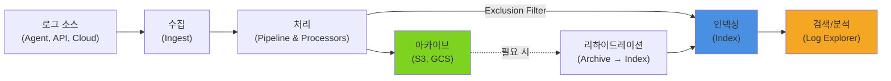

# TIL: Datadog 로그 관리(Log Management)

> [!tldr] 한줄 요약
> Datadog 로그 관리는 수집 → Pipeline 처리(Grok 파싱) → 인덱싱(Exclusion Filter로 비용 제어) → 검색/분석 → 아카이브/리하이드레이션의 전체 파이프라인이며, dd.trace_id 주입으로 트레이스와 자동 연결된다.

## 핵심 내용

### 전체 흐름

```
수집(Ingest) → 처리(Process) → 인덱싱(Index) → 검색(Explore)
                                    │
                                    └→ 아카이브(Archive) → 리하이드레이션(Rehydrate)
```



### 1단계: 수집 (Log Collection)

| 방법 | 설정 위치 | 사용 사례 |
|------|----------|----------|
| **Agent 파일 수집** | `conf.d/` 설정에서 파일 경로 지정 | VM의 로그 파일 |
| **Agent 컨테이너 수집** | Docker/K8s 라벨로 자동 감지 | 컨테이너 stdout/stderr |
| **HTTP API** | 직접 POST 요청 | 서버리스, 외부 시스템 |
| **클라우드 통합** | AWS CloudWatch, S3 등 | 클라우드 서비스 로그 |

[[til/datadog/datadog-agent|Agent]]에서 로그 수집 활성화:

```yaml
# datadog.yaml
logs_enabled: true

# conf.d/nginx.d/conf.yaml
logs:
  - type: file
    path: /var/log/nginx/access.log
    source: nginx          # 자동 파이프라인 매칭에 사용
    service: web-frontend
```

> [!tip] source 태그의 중요성
> `source` 값으로 Datadog이 자동 Integration Pipeline을 매칭한다. `source:nginx`를 설정하면 Nginx 전용 파싱 규칙이 자동 적용된다.

### 2단계: 처리 (Pipeline & Processors)

비정형 텍스트를 검색 가능한 구조화된 속성으로 변환하는 단계.

**Integration Pipeline**: 800+ 소스에 대한 기본 파이프라인 자동 제공
**Custom Pipeline**: 사내 애플리케이션 로그를 위한 커스텀 파이프라인

#### 주요 프로세서

| 프로세서 | 역할 |
|---------|------|
| **Grok Parser** | 정규식 기반 로그 파싱 → 구조화된 속성 추출 |
| **Date Remapper** | 커스텀 날짜 형식을 타임스탬프로 인식 |
| **Status Remapper** | 로그 레벨 매핑 (`level: warn` → WARNING) |
| **Service Remapper** | 서비스명 매핑 |
| **Category Processor** | 조건별 카테고리 분류 |

#### Grok Parser 예시

```
# 비정형 로그:
2024-01-15 10:23:45 INFO [checkout] Payment processed in 235ms

# Grok 규칙:
%{date("yyyy-MM-dd HH:mm:ss"):timestamp} %{word:level} \[%{word:service}\] %{data:message}

# 파싱 결과:
timestamp: 2024-01-15 10:23:45
level: INFO
service: checkout
message: Payment processed in 235ms
```

### 3단계: 인덱싱 (Index & Exclusion Filters)

처리된 로그 중 **어떤 로그를 검색 가능하게 저장할지** 결정한다.

- **Index**: 보존 기간(3일~30일 등) 설정
- **Exclusion Filter**: 가치 낮은 로그를 인덱싱에서 제외하여 비용 절감
  - 예: `status:200 source:health-check` → 헬스체크 성공 로그 제외
  - 샘플링: "디버그 로그의 10%만 인덱싱"

> [!warning] 인덱싱 제외 ≠ 삭제
> Exclusion Filter로 제외된 로그도 **아카이브에는 저장** 가능. 평소 비용을 아끼고, 필요 시 리하이드레이션으로 복구한다.

### 4단계: 검색 (Log Explorer)

- **검색 구문**: `service:checkout status:error @duration:>1000`
- **패턴 분석**: 유사한 로그를 자동 그룹핑하여 빈도 파악
- **분석 뷰**: 그래프, 테이블, 타임시리즈로 로그 데이터 집계

### 5단계: 아카이브와 리하이드레이션

**아카이브**: 모든 수집 로그를 S3, GCS 등에 장기 보관. S3 Glacier로 비용 최대 68% 절감.

**리하이드레이션**: 아카이브 로그를 Datadog으로 다시 불러와 검색/분석. 시간 범위와 검색어를 좁혀서 비용 최소화.

### 로그-트레이스 연결 (Log-Trace Correlation)

로그에 **Trace ID와 Span ID를 주입**하여 같은 요청의 로그와 [[til/datadog/apm-distributed-tracing|트레이스]]를 매칭한다.

#### 자동 주입 (권장)

```bash
DD_LOGS_INJECTION=true
```

dd-trace가 로깅 프레임워크에 `dd.trace_id`, `dd.span_id`, `dd.env`, `dd.service`, `dd.version`을 자동 주입한다.

| 언어 | 지원 프레임워크 |
|------|---------------|
| **Java** | Logback, Log4j2, SLF4J (MDC 주입) |
| **Python** | `logging` 모듈 |
| **Node.js** | Winston, Pino, Bunyan (JSON 필수) |
| **Go** | Logrus |
| **.NET** | Serilog, NLog, log4net |

#### 연결 후 Datadog UI에서

- **트레이스 → 로그**: Flame Graph에서 Span 클릭 → "Logs" 탭에 해당 시점의 로그 표시
- **로그 → 트레이스**: Log Explorer에서 로그 클릭 → "Trace" 버튼으로 트레이스로 이동

> [!tip] 연결 조건 3가지
> 1. 로그가 **JSON이거나 올바르게 파싱**되어야 함
> 2. **[[til/datadog/unified-service-tagging|통합 서비스 태깅]]** 설정 (env, service, version 일치)
> 3. 같은 Datadog 계정으로 수집

### 비용 최적화 전략

| 전략 | 방법 |
|------|------|
| **Exclusion Filter** | 헬스체크, 디버그 로그 인덱싱 제외 |
| **샘플링** | 대량 로그의 일정 비율만 인덱싱 |
| **보존 기간 조정** | Index별 보존 기간 차등 적용 |
| **아카이브 + 리하이드레이션** | 평소 인덱싱하지 않고, 필요 시 복구 |
| **스토리지 클래스** | S3 Glacier 등 저비용 스토리지 활용 |

## 예시

```python
# Python - 로그-트레이스 자동 연결 설정
import logging
from ddtrace import tracer, patch_all

patch_all()

FORMAT = ('%(asctime)s %(levelname)s [%(dd.service)s] '
          '[dd.trace_id=%(dd.trace_id)s dd.span_id=%(dd.span_id)s] '
          '%(message)s')
logging.basicConfig(format=FORMAT)
logger = logging.getLogger(__name__)

logger.error("Payment failed for order #12345")
# 출력: 2024-01-15 10:23:45 ERROR [checkout]
#   [dd.trace_id=abc123 dd.span_id=def456] Payment failed for order #12345
```

> [!example] 장애 대응 시 로그 활용 흐름
> 1. [[모니터와 알림(Monitors & Alerts)|모니터]] 알림: "checkout 에러율 급증"
> 2. Log Explorer에서 `service:checkout status:error` 검색
> 3. 에러 로그 클릭 → "View Trace" 버튼으로 트레이스 이동
> 4. Flame Graph에서 실패한 Span 확인 → 결제 게이트웨이 타임아웃
> 5. → **로그의 에러 메시지 + 트레이스의 실행 흐름으로 근본 원인 파악**

## 참고 자료

- [Log Management](https://docs.datadoghq.com/logs/)
- [Pipelines](https://docs.datadoghq.com/logs/log_configuration/pipelines/)
- [Parsing (Grok)](https://docs.datadoghq.com/logs/log_configuration/parsing/)
- [Log Archives](https://docs.datadoghq.com/logs/log_configuration/archives/)
- [Rehydrating from Archives](https://docs.datadoghq.com/logs/log_configuration/rehydrating/)
- [Correlate Logs and Traces](https://docs.datadoghq.com/tracing/other_telemetry/connect_logs_and_traces/)

## 관련 노트

- [[til/datadog/datadog-agent|Datadog Agent]]
- [[til/datadog/apm-distributed-tracing|APM과 분산 트레이싱(Distributed Tracing)]]
- [[til/datadog/unified-service-tagging|통합 서비스 태깅(Unified Service Tagging)]]
- [[til/datadog/tagging|태깅(Tagging)]]
- [[대시보드(Dashboards)]]
- [[모니터와 알림(Monitors & Alerts)]]
