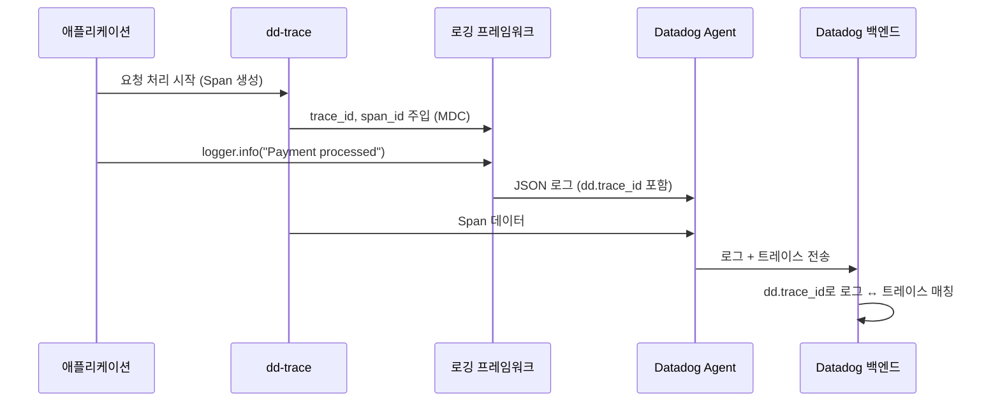

# 로그-트레이스 상관관계(Log-Trace Correlation)

> [!tldr] 한줄 요약
> 로그에 `dd.trace_id`와 `dd.span_id`를 주입하여 같은 요청의 로그와 트레이스를 양방향으로 연결하는 메커니즘이며, JSON 로그 + `DD_LOGS_INJECTION=true` 또는 `tracer.get_log_correlation_context()`로 설정한다.

## 핵심 내용

### 왜 필요한가

분산 시스템에서 장애가 발생하면 **로그**에서 에러 메시지를, **트레이스**에서 요청 흐름을 각각 확인한다. 하지만 둘이 연결되지 않으면 "이 에러가 어떤 요청 흐름에서 발생한 건지" 수동으로 시간대와 서비스를 맞춰 찾아야 한다.

로그-트레이스 상관관계를 설정하면:
- **로그 → 트레이스**: Log Explorer에서 로그 클릭 → "View Trace" 버튼으로 Flame Graph 이동
- **트레이스 → 로그**: Flame Graph에서 Span 클릭 → "Logs" 탭에 해당 시점 로그 표시



### 주입되는 속성 5가지

| 속성 | 설명 | 예시 |
|------|------|------|
| `dd.trace_id` | 요청 전체를 식별하는 Trace ID | `"1234567890abcdef"` |
| `dd.span_id` | 개별 작업 단위를 식별하는 Span ID | `"fedcba0987654321"` |
| `dd.env` | 환경 (env 태그) | `"production"` |
| `dd.service` | 서비스명 (service 태그) | `"checkout-api"` |
| `dd.version` | 서비스 버전 (version 태그) | `"1.2.3"` |

이 5가지가 [[til/datadog/unified-service-tagging|통합 서비스 태깅]]과 연결되어 로그, 트레이스, 메트릭을 하나로 묶는 핵심 역할을 한다.

### Trace ID 형식

| 형식 | 길이 | 기본값 | 설정 |
|------|------|--------|------|
| **128-bit** (W3C) | 32자 hex | O (ddtrace 2.x~) | 기본 |
| **64-bit** (Datadog) | 16자 hex | | `DD_TRACE_128_BIT_TRACEID_GENERATION_ENABLED=false` |

128-bit ID의 하위 64-bit에 랜덤값을 넣어 64-bit 라이브러리와의 하위 호환을 유지한다.

### 설정 방법

#### 방법 1: 자동 주입 (표준 logging 모듈)

`DD_LOGS_INJECTION=true` 환경변수 하나로 활성화. dd-trace가 로깅 프레임워크의 MDC(Mapped Diagnostic Context)에 자동 주입한다.

```python
import logging
logging.basicConfig(format='%(message)s')
logger = logging.getLogger(__name__)

# ddtrace-run으로 실행하면 자동으로 dd.trace_id 등이 주입됨
# DD_LOGS_INJECTION=true ddtrace-run python app.py
```

#### 방법 2: 수동 주입 (`tracer.get_log_correlation_context()`)

커스텀 JSON 로깅을 사용할 때 직접 트레이스 컨텍스트를 가져와 머지한다.

```python
from ddtrace import tracer

ctx = tracer.get_log_correlation_context()
# {"dd.trace_id": "...", "dd.span_id": "...", "dd.env": "...", "dd.service": "...", "dd.version": "..."}

log_dict = {"message": "Payment processed", "order_id": 123}
log_dict.update(ctx)
logger.info(json.dumps(log_dict))
```

### JSON vs Plain Text

| 방식 | 자동 상관관계 | 추가 설정 |
|------|-------------|----------|
| **JSON 로그** | O (자동) | `dd.trace_id`가 최상위 레벨에 있으면 됨 |
| **Plain text** | X | Log Pipeline에서 Grok 파싱 + Trace Remapper 필요 |

> [!warning] JSON이 아니면 자동 인식 불가
> `[dd.trace_id=abc123]`처럼 plain text로 남기면 Datadog이 자동으로 인식하지 못한다. Pipeline에서 Grok Parser로 값을 추출하고 Trace Remapper로 예약 속성에 매핑해야 한다. **JSON 출력이 압도적으로 간편하다.**

### 지원 언어별 자동 주입

| 언어 | 프레임워크 | 주입 방식 |
|------|-----------|----------|
| **Java** | Logback, Log4j2, SLF4J | MDC 자동 주입 |
| **Python** | `logging`, loguru, structlog | LogRecord/extra 패치 |
| **Node.js** | Winston, Pino, Bunyan | JSON 필드 자동 추가 |
| **Go** | Logrus | 컨텍스트 필드 주입 |
| **.NET** | Serilog, NLog, log4net | LogContext 주입 |
| **Ruby** | Lograge | 자동 태그 추가 |
| **PHP** | Monolog | 프로세서로 주입 |

### Loguru에서의 설정

ddtrace는 loguru를 공식 지원한다.

**`serialize=True` 사용 시 (가장 간단):**

```python
from loguru import logger
# ddtrace-run으로 실행하면 dd.* 속성이 자동 포함
logger.add("app.log", serialize=True)
```

**커스텀 JSON 로깅 시 (수동 머지):**

```python
from ddtrace import tracer

# 기존 JSON 로그 dict에 트레이스 컨텍스트를 머지
log_dict = json.loads(context.json())
log_dict.update(tracer.get_log_correlation_context())
logger.info(json.dumps(log_dict, default=str))
```

> [!tip] loguru 알려진 이슈
> `ddtrace-run` + loguru 조합에서 기본 sink(stderr)에는 dd 속성이 안 붙고, `logger.add()`로 **새 sink를 추가한 이후부터** 정상 동작하는 경우가 있다. ([GitHub #7988](https://github.com/DataDog/dd-trace-py/issues/7988))

### OpenTelemetry 연동

OTel SDK를 사용하는 경우, Logging Bridge가 `trace_id`와 `span_id`를 자동 캡처한다. Datadog은 dd-trace 형식(`dd.trace_id`)과 OTel 형식(`trace_id`) 모두 자동 인식한다.

### 상관관계가 안 될 때 체크리스트

1. 로그가 **JSON 형식**인지 확인
2. `dd.trace_id`가 JSON **최상위 레벨**에 있는지 확인
3. Datadog의 Reserved Attributes에서 `dd.trace_id`가 Trace ID로 매핑되어 있는지 확인 (기본값)
4. [[til/datadog/unified-service-tagging|통합 서비스 태깅]] (`DD_ENV`, `DD_SERVICE`, `DD_VERSION`) 환경변수가 설정되어 있는지 확인
5. 로그와 트레이스가 **같은 Datadog 계정**으로 수집되는지 확인
6. 로그의 **타임스탬프**가 트레이스 시간 범위 내에 있는지 확인

## 예시

```python
import json
import logging
from ddtrace import tracer

logging.basicConfig(format='%(message)s')
logger = logging.getLogger(__name__)

# 수동 주입 방식: 커스텀 JSON 로깅에 트레이스 컨텍스트 머지
def log_with_trace(message: str, **extra):
    log_dict = {"message": message, **extra}
    log_dict.update(tracer.get_log_correlation_context())
    logger.info(json.dumps(log_dict))

log_with_trace("Payment processed", order_id=123)
# 출력:
# {"message": "Payment processed", "order_id": 123,
#  "dd.trace_id": "1234567890abcdef", "dd.span_id": "fedcba0987654321",
#  "dd.env": "production", "dd.service": "checkout-api", "dd.version": "1.2.3"}
```

> [!example] Datadog UI에서의 연결
> Log Explorer에서 위 로그를 클릭하면 "View Trace" 버튼이 나타나고, 해당 요청의 Flame Graph로 바로 이동할 수 있다.

## 참고 자료

- [Correlate Logs and Traces](https://docs.datadoghq.com/tracing/other_telemetry/connect_logs_and_traces/)
- [Correlating Python Logs and Traces](https://docs.datadoghq.com/tracing/other_telemetry/connect_logs_and_traces/python/)
- [Correlate request logs with traces automatically (Blog)](https://www.datadoghq.com/blog/request-log-correlation/)
- [Correlated Logs Not Showing Up (Troubleshooting)](https://docs.datadoghq.com/tracing/troubleshooting/correlated-logs-not-showing-up-in-the-trace-id-panel/)
- [Trace and Span ID Formats](https://docs.datadoghq.com/tracing/guide/span_and_trace_id_format/)
- [Correlate OpenTelemetry Traces and Logs](https://docs.datadoghq.com/opentelemetry/correlate/logs_and_traces/)
- [ddtrace Loguru Integration](https://ddtrace.readthedocs.io/en/stable/integrations.html)

## 관련 노트

- [[til/datadog/apm-distributed-tracing|APM과 분산 트레이싱(Distributed Tracing)]]
- [[til/datadog/log-management|로그 관리(Log Management)]]
- [[til/datadog/unified-service-tagging|통합 서비스 태깅(Unified Service Tagging)]]
- [[til/datadog/tagging|태깅(Tagging)]]
- [[til/datadog/monitors-and-alerts|모니터와 알림(Monitors & Alerts)]]
- [[RUM(Real User Monitoring)]]
