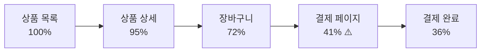

# Product Analytics

> [!tldr] 한줄 요약
> RUM SDK 데이터를 기반으로 퍼널 분석, 리텐션 분석, 사용자 경로(Journeys), 히트맵을 제공하여 "사용자가 무엇을 하는가"를 데이터로 파악하며, RUM이 이미 설정되어 있으면 추가 설정 없이 사용할 수 있다.

## 핵심 내용

### Product Analytics란

[[til/datadog/rum|RUM]] 데이터를 기반으로 **사용자 행동을 분석**하는 기능. RUM이 "성능이 어떤가"에 초점을 둔다면, Product Analytics는 **"사용자가 무엇을 하는가"**에 초점을 둔다.

RUM SDK가 수집하는 동일한 데이터(Session/View/Action)를 RUM은 성능 관점(LCP, INP, CLS)으로, Product Analytics는 행동 관점(퍼널, 리텐션, 경로)으로 분석한다.

RUM SDK가 이미 설치되어 있으면 **추가 설정 없이** 사용할 수 있다. 같은 SDK, 같은 데이터를 공유한다.

### RUM과의 차이

| | [[til/datadog/rum\|RUM]] | Product Analytics |
|---|---|---|
| **관점** | 엔지니어링 (성능) | 프로덕트 (행동) |
| **질문** | "페이지가 얼마나 빨리 로드되는가?" | "사용자가 어디서 이탈하는가?" |
| **데이터 보존** | 30일 | **15개월** (행동 이벤트) |
| **대상** | 개발팀 | PM, 디자이너, 개발팀 |

같은 SDK에서 나온 데이터이므로, 성능 문제와 사용자 행동을 **한 곳에서 연결**하여 분석할 수 있다.

### 핵심 분석 도구

#### Funnel Analysis (퍼널 분석)

핵심 워크플로우의 **단계별 전환율과 이탈 지점**을 분석한다:



- 어느 단계에서 사용자가 가장 많이 이탈하는지
- 전환율이 시간에 따라 어떻게 변하는지
- 새 기능/단계 추가가 이탈율에 미치는 영향
- 평균적으로 퍼널 완료까지 걸리는 시간

#### Retention Analysis (리텐션 분석)

코호트 그래프로 **사용자 재방문율**을 추적한다. "이번 주 신규 가입자 중 다음 주에도 돌아온 비율"같은 장기 인게이지먼트 트렌드를 파악한다. 15개월 데이터 보존 덕분에 장기 리텐션 분석이 가능하다.

#### Journeys / Pathways (사용자 경로)

사용자가 실제로 이동하는 경로를 **Sankey 다이어그램**으로 시각화한다:
- 특정 페이지로/에서 사용자가 어디로 이동하는지
- 가장 많이 사용되는 "골든 패스" 발견
- 예상과 다른 이탈 경로 파악

#### Heatmaps (히트맵)

Session Replay 데이터 위에 사용자 상호작용을 시각화한다:

| 타입 | 설명 |
|------|------|
| **Click Maps** | 어디를 많이 클릭하는지 색상으로 표현 |
| **Scroll Maps** | 페이지를 어디까지 스크롤하는지 |
| **Top Elements** | 가장 많이 상호작용하는 요소 |

#### Session Replay

실제 사용자 세션을 **영상처럼 재생**한다. 퍼널에서 이탈한 세션을 골라 재생하면 "왜 이탈했는지"를 눈으로 확인할 수 있다.

### RUM 성능 데이터와의 연결

Product Analytics의 가장 큰 강점은 **행동 데이터와 성능 데이터가 같은 SDK에서 나온다**는 것이다. 퍼널에서 이탈이 발견되면:
1. 해당 단계의 **Session Replay**로 사용자 행동 확인
2. 같은 세션의 **RUM 성능 데이터** (LCP, CLS 등) 확인
3. "이탈이 UX 문제인지, 성능 문제인지" 한 곳에서 구분

## 예시

### 결제 전환율 하락 원인 찾기

```
상황: 이번 주 결제 전환율이 15% → 8%로 떨어짐

Funnel Analysis:
  상품 목록    → 상품 상세    95% ✅
  상품 상세    → 장바구니     72% ✅
  장바구니     → 결제 페이지   41% ⚠️ (평소 78%)
  결제 페이지  → 결제 완료    89% ✅

→ "장바구니 → 결제 페이지" 단계에서 이탈 급증

이탈 세션을 Session Replay로 확인:
→ 새로 추가된 "배송지 확인" 팝업이 모바일에서 닫기 버튼이 안 보임
→ 사용자가 팝업을 닫지 못하고 이탈

RUM 연동: 해당 팝업의 CLS(Layout Shift)가 0.42로 비정상
```

### 새 기능의 실제 사용 여부 확인

```
상황: "위시리스트" 기능을 출시했는데, 실제로 쓰이는지 모름

Heatmaps (Click Map):
→ 상품 상세 페이지에서 "위시리스트 추가" 버튼 클릭률: 0.3%
→ 근처의 "장바구니 추가" 버튼 클릭률: 12%
→ 위시리스트 버튼을 거의 아무도 안 누름

Scroll Map 확인:
→ 위시리스트 버튼이 페이지 하단에 위치
→ 사용자의 70%는 그 위치까지 스크롤하지 않음

Journeys (Pathways):
→ 위시리스트 페이지에 도달하는 사용자 경로 확인
→ 대부분 직접 URL 입력 (마케팅 이메일 링크)
→ 앱 내 자연스러운 경로로 도달하는 사용자 거의 없음

→ 결론: 버튼 위치를 상단으로 옮기고 UI를 눈에 띄게 변경
```

### 사용자 이탈(Churn) 원인 분석

```
상황: 가입 후 7일 내 이탈율이 60%로 높음

Retention Analysis (코호트):
  Day 0: 100%
  Day 1: 45%  ← 첫날에 절반 이상 이탈
  Day 3: 28%
  Day 7: 18%

이탈 코호트 vs 유지 코호트 비교:
  유지된 사용자: 가입 당일 평균 3.2개 기능 사용
  이탈한 사용자: 가입 당일 평균 0.8개 기능 사용
  → "첫날 핵심 기능을 경험했느냐"가 유지의 핵심

Funnel: 온보딩 흐름 분석
  가입 완료    → 프로필 설정   62%
  프로필 설정  → 첫 검색       34% ⚠️
  첫 검색     → 첫 구매       71%

→ "프로필 설정 → 첫 검색" 단계에서 66%가 이탈
→ 프로필 설정 후 다음에 뭘 해야 할지 안내가 없음
→ 온보딩에 "추천 검색어" CTA 추가
```

> [!tip] Sentry, Amplitude 등과의 차이
> 별도 프로덕트 분석 도구(Amplitude, Mixpanel)는 행동 분석에 특화되어 있지만, Datadog Product Analytics는 **성능(RUM) + 행동(PA) + 에러(Error Tracking) + 세션 재생(Session Replay)을 한 플랫폼에서 연결**할 수 있다는 점이 차별점이다. 이미 Datadog RUM을 쓰고 있다면 추가 도구 없이 바로 활용 가능하다.

## 참고 자료

- [Product Analytics](https://docs.datadoghq.com/product_analytics/)
- [Understanding RUM and Product Analytics](https://docs.datadoghq.com/product_analytics/guide/rum_and_product_analytics/)
- [Funnel Analysis](https://docs.datadoghq.com/product_analytics/charts/funnel_analysis/)
- [Journeys](https://docs.datadoghq.com/product_analytics/journeys/)
- [Heatmaps](https://docs.datadoghq.com/product_analytics/session_replay/heatmaps/)
- [Make data-driven design decisions with Product Analytics (Blog)](https://www.datadoghq.com/blog/datadog-product-analytics/)
- [Use funnel analysis to understand and optimize key user flows (Blog)](https://www.datadoghq.com/blog/reduce-customer-friction-funnel-analysis/)
- [Measure long-term user engagement with Retention Analysis (Blog)](https://www.datadoghq.com/blog/user-engagement-retention-analysis/)
- [Visualize user behavior with Click Maps (Blog)](https://www.datadoghq.com/blog/visualize-behavior-datadog-heatmaps/)

## 관련 노트

- [[til/datadog/rum|RUM(Real User Monitoring)]]
- [[til/datadog/synthetic-monitoring|신서틱 모니터링(Synthetic Monitoring)]]
- [[til/datadog/error-tracking|Error Tracking]]
- [[til/datadog/dashboards|대시보드(Dashboards)]]
