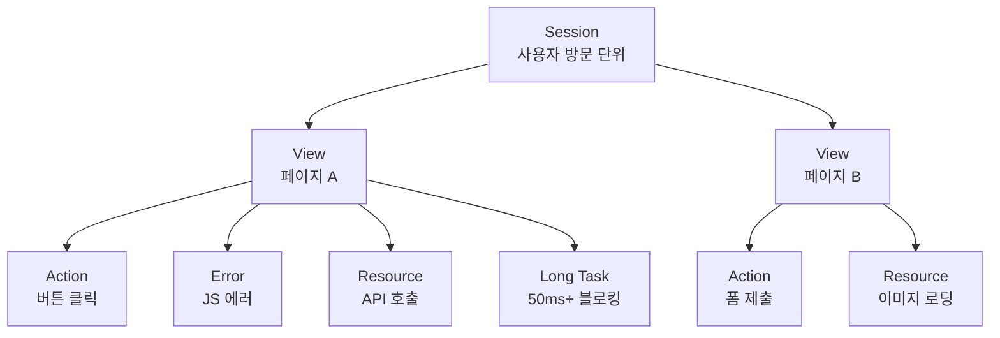
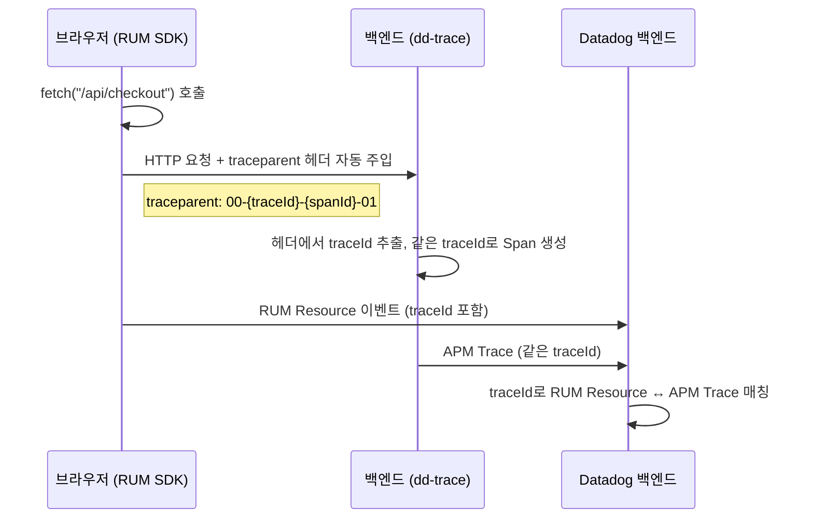
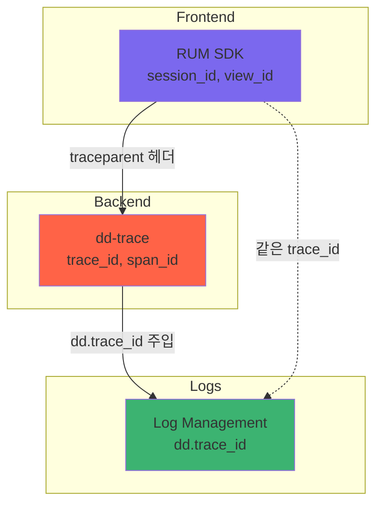

# RUM(Real User Monitoring)

> [!tldr] 한줄 요약
> RUM은 브라우저/모바일에 SDK를 삽입하여 실제 사용자의 페이지 로딩, 에러, 상호작용을 수집하고, `allowedTracingUrls` 설정으로 백엔드 [[til/datadog/apm-distributed-tracing|APM 트레이스]]와 연결하여 프론트엔드→백엔드 end-to-end 옵저버빌리티를 제공한다.

## 핵심 내용

### RUM이란

**Real User Monitoring** — 실제 사용자의 브라우저/모바일에서 발생하는 경험을 수집·분석하는 프론트엔드 모니터링이다. [[신서틱 모니터링(Synthetic Monitoring)]]이 "가상 사용자로 능동적 테스트"라면, RUM은 "실제 사용자의 수동적 관측"이다.

RUM SDK를 앱에 삽입하면 자동으로 수집이 시작된다:
- 페이지 로딩 성능 (Core Web Vitals)
- 사용자 행동 (클릭, 스크롤)
- JS 에러 및 크래시
- 네트워크 요청 (XHR, fetch, 이미지, CSS, JS)
- Long Task (메인 스레드 블로킹)

### 이벤트 계층 구조

RUM이 수집하는 데이터는 계층 구조로 구성된다:



| 이벤트 | 설명 | 예시 |
|--------|------|------|
| **Session** | 사용자 방문 단위. 비활성 15분 만료, 최대 4시간 | 한 사용자의 사이트 방문 |
| **View** | 페이지(SPA의 경우 라우트 변경) 단위 | `/checkout`, `/products/123` |
| **Action** | 사용자 상호작용 | 클릭, 탭, 스크롤 |
| **Error** | JS 에러, 네트워크 에러 | `TypeError: Cannot read property` |
| **Resource** | 네트워크 요청 | XHR, fetch, 이미지, CSS, JS 파일 |
| **Long Task** | 50ms 이상 메인 스레드 블로킹 | 무거운 JS 연산 |

### Core Web Vitals 자동 수집

RUM은 Google의 Core Web Vitals를 자동으로 수집하여 p75 기준으로 대시보드에 표시한다:

| 지표 | 설명 | 좋음 | 나쁨 |
|------|------|------|------|
| **LCP** (Largest Contentful Paint) | 가장 큰 콘텐츠 렌더링 시간 | ≤ 2.5s | > 4.0s |
| **INP** (Interaction to Next Paint) | 사용자 상호작용 후 화면 반응 시간 | ≤ 200ms | > 500ms |
| **CLS** (Cumulative Layout Shift) | 레이아웃 이동 누적 점수 | ≤ 0.1 | > 0.25 |

각 지표마다 해당하는 DOM 엘리먼트의 CSS Selector를 함께 리포트하여, "어떤 요소가 문제인지"까지 알 수 있다.

### Session Replay

사용자 세션을 **영상처럼 재생**하는 기능이다. DOM 스냅샷을 찍고, 이후 발생하는 DOM 변경/마우스 이동/클릭/입력 이벤트를 타임스탬프와 함께 기록한다.

- 에러 재현: "사용자가 뭘 했길래 이 에러가 났지?" → 세션 재생으로 확인
- 개인정보 보호: 입력 필드는 기본 마스킹 처리

### SDK 초기화

```javascript
import { datadogRum } from '@datadog/browser-rum';

datadogRum.init({
  applicationId: '<APPLICATION_ID>',
  clientToken: '<CLIENT_TOKEN>',
  site: 'datadoghq.com',
  service: 'my-web-app',
  env: 'production',
  version: '1.0.0',
  // 세션 수집 비율 (비용 제어)
  sessionSampleRate: 100,
  // Session Replay 비율 (sessionSampleRate의 %)
  sessionReplaySampleRate: 20,
  // 이벤트 수집 옵션
  trackUserInteractions: true,
  trackResources: true,
  trackLongTasks: true,
  // APM 연결 (아래 섹션 참조)
  allowedTracingUrls: ["https://api.example.com"],
});
```

> [!tip] 샘플링 비율 계산
> `sessionSampleRate: 60`, `sessionReplaySampleRate: 50`이면:
> - 40% 세션 버림
> - 30% Browser RUM만 수집
> - 30% Browser RUM + Session Replay 수집

### RUM ↔ APM 상관관계 (End-to-End 연결)

RUM의 가장 강력한 기능은 **프론트엔드 요청을 백엔드 트레이스와 연결**하는 것이다. 이전에 배운 [[til/datadog/log-trace-correlation|로그-트레이스 상관관계]]가 "로그 ↔ 트레이스"를 연결했다면, 이것은 **"브라우저 ↔ 백엔드 트레이스"**를 연결한다.

#### 동작 원리



RUM SDK가 `allowedTracingUrls`에 지정된 URL로 요청할 때, **HTTP 헤더에 trace context를 자동 주입**한다. 백엔드의 dd-trace가 이 헤더를 읽어 같은 `traceId`로 Span을 생성하므로, Datadog 백엔드에서 자동으로 매칭된다.

#### allowedTracingUrls 설정

```javascript
datadogRum.init({
  // ...
  allowedTracingUrls: [
    "https://api.example.com",           // 문자열 매치
    /https:\/\/.*\.example\.com/,         // 정규식
    (url) => url.startsWith("https://")  // 함수
  ],
});
```

> [!warning] 자사 백엔드만 지정할 것
> 외부 서비스(Google Analytics, CDN 등)에 trace 헤더를 보내면 CORS 에러가 나거나 불필요한 트레이스가 생긴다. **자사 백엔드 URL만** 지정해야 한다.

#### 전파 헤더 종류 (propagatorTypes)

| 타입 | 헤더 | 용도 |
|------|------|------|
| **Datadog** | `x-datadog-trace-id`, `x-datadog-parent-id` 등 | dd-trace 기본 |
| **W3C Trace Context** | `traceparent` (`00-{traceId}-{parentId}-{flags}`) | OTel / 표준 |
| **B3** | `X-B3-TraceId`, `X-B3-SpanId` 등 | Zipkin 호환 |

기본값은 Datadog + W3C 둘 다 전송한다. 백엔드가 [[OpenTelemetry 연동|OpenTelemetry]]를 쓴다면 W3C만으로도 충분하다.

#### 연결된 후 Datadog UI에서

**프론트엔드 → 백엔드:**
1. RUM Explorer에서 느린 페이지/에러 세션 선택
2. View 상세 → "Resources" 탭 → API 호출 클릭
3. "View Trace" → APM Flame Graph로 이동
4. 백엔드의 어떤 서비스/DB 쿼리가 느렸는지 확인

**백엔드 → 프론트엔드:**
1. APM에서 에러 트레이스 발견
2. 트레이스에 태깅된 `session_id`, `view_id`로 RUM 세션 확인
3. Session Replay로 사용자가 뭘 했는지 재생

### 로그-트레이스-RUM 전체 연결 그림



세 영역이 모두 같은 `trace_id`로 연결되어, Datadog UI에서 **RUM ↔ APM ↔ 로그를 자유롭게 오갈 수 있다**. 이것이 Datadog이 말하는 "end-to-end [[til/devops/observability|옵저버빌리티]]"의 핵심이다.

### 과금

**1,000 세션** 단위로 과금된다. `sessionSampleRate`와 `sessionReplaySampleRate`로 비용을 제어한다. Session Replay가 포함되면 단가가 더 높다.

| 플랜 | 포함 내용 |
|------|----------|
| **Browser RUM** | RUM 이벤트 수집, Error Tracking |
| **Browser RUM & Session Replay** | 위 + Session Replay 녹화 |

## 예시

```javascript
import { datadogRum } from '@datadog/browser-rum';

datadogRum.init({
  applicationId: '<APPLICATION_ID>',
  clientToken: '<CLIENT_TOKEN>',
  site: 'datadoghq.com',
  service: 'checkout-web',
  env: 'production',
  version: '2.1.0',
  sessionSampleRate: 100,
  sessionReplaySampleRate: 20,
  trackUserInteractions: true,
  trackResources: true,
  trackLongTasks: true,
  allowedTracingUrls: ["https://api.myshop.com"],
});

// 사용자 정보 추가 (세션에 태깅)
datadogRum.setUser({
  id: 'user-123',
  name: 'John Doe',
  email: 'john@example.com',
  plan: 'premium',
});

// 커스텀 액션 추적
datadogRum.addAction('checkout_completed', {
  cart_total: 150000,
  item_count: 3,
});

// 커스텀 에러 추적
try {
  processPayment();
} catch (error) {
  datadogRum.addError(error, {
    source: 'payment',
    order_id: 'ORD-456',
  });
}
```

> [!example] 장애 대응 시 RUM 활용 흐름
> 1. [[til/datadog/monitors-and-alerts|모니터]] 알림: "checkout 페이지 에러율 급증"
> 2. RUM Explorer에서 `service:checkout-web status:error` 필터링
> 3. Error Tracking에서 에러 그룹 확인 → 스택 트레이스 분석
> 4. 해당 세션의 Session Replay로 사용자 행동 재현
> 5. Resource 탭에서 실패한 API 클릭 → "View Trace"로 APM 이동
> 6. Flame Graph에서 백엔드 원인 확인 (예: DB 타임아웃)
> 7. [[til/datadog/log-trace-correlation|로그-트레이스 상관관계]]로 해당 시점 로그 확인
> → **사용자 행동 → 프론트 에러 → 백엔드 원인 → 로그** 전체 흐름 파악

## 참고 자료

- [RUM & Session Replay](https://docs.datadoghq.com/real_user_monitoring/)
- [RUM Browser Monitoring](https://docs.datadoghq.com/real_user_monitoring/browser/)
- [Connect RUM and Traces](https://docs.datadoghq.com/tracing/other_telemetry/rum/)
- [Introducing Datadog Real User Monitoring (Blog)](https://www.datadoghq.com/blog/real-user-monitoring-with-datadog/)
- [Unify APM and RUM data for full-stack visibility (Blog)](https://www.datadoghq.com/blog/unify-apm-rum-datadog/)
- [Monitor Core Web Vitals with RUM (Blog)](https://www.datadoghq.com/blog/core-web-vitals-monitoring-datadog-rum-synthetics/)
- [Understanding the RUM Event Hierarchy](https://docs.datadoghq.com/real_user_monitoring/guide/understanding-the-rum-event-hierarchy/)
- [RUM & Session Replay Billing](https://docs.datadoghq.com/account_management/billing/rum/)

## 관련 노트

- [[til/datadog/apm-distributed-tracing|APM과 분산 트레이싱(Distributed Tracing)]]
- [[til/datadog/log-trace-correlation|로그-트레이스 상관관계(Log-Trace Correlation)]]
- [[til/datadog/log-management|로그 관리(Log Management)]]
- [[til/datadog/unified-service-tagging|통합 서비스 태깅(Unified Service Tagging)]]
- [[til/datadog/monitors-and-alerts|모니터와 알림(Monitors & Alerts)]]
- [[til/devops/observability|옵저버빌리티(Observability)]]
- [[신서틱 모니터링(Synthetic Monitoring)]]
