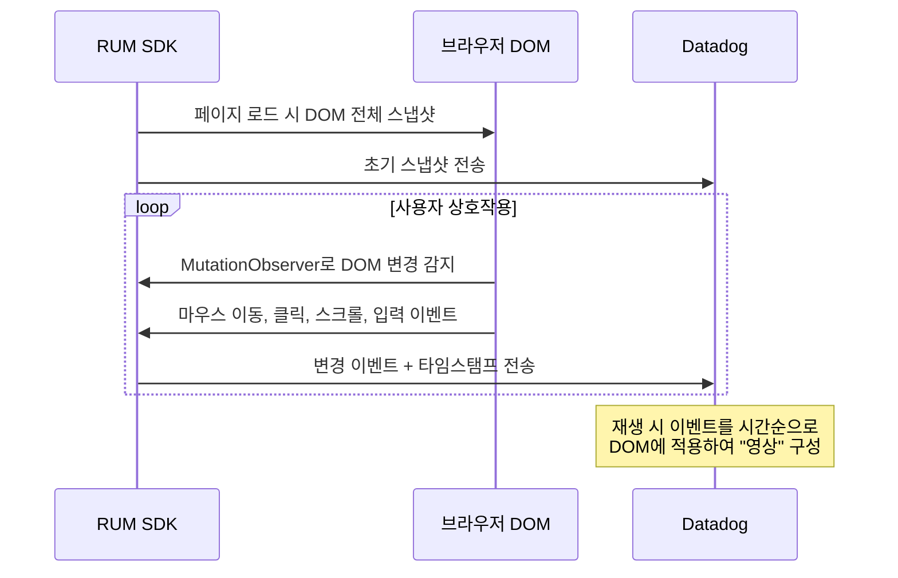
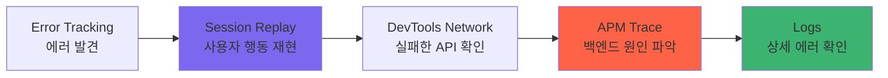

# Session Replay

> [!tldr] 한줄 요약
> Session Replay는 [RUM](til/datadog/rum.md) SDK가 수집한 DOM 변경/마우스/클릭/입력 이벤트를 타임스탬프 기반으로 재조합하여 사용자 세션을 영상처럼 재생하고, 내장 DevTools(Performance/Network/Console/Errors)로 풀스택 디버깅까지 지원하는 기능이다.

## 핵심 내용

### Session Replay란

사용자의 브라우저/모바일 세션을 **영상처럼 재생**할 수 있는 기능이다. 화면을 비디오로 녹화하는 것이 아니라, DOM 변경 사항을 기록하고 재조합하는 방식이다.

핵심 용도:
- 버그 재현: "사용자가 뭘 했길래 이 에러가 났지?" 확인
- UX 분석: 사용자가 어디서 헤매고, 어디서 이탈하는지 시각적 파악
- 고객 지원: 고객에게 스크린샷을 요청할 필요 없이 세션을 직접 재생

### 동작 원리 — 플랫폼별 차이

**브라우저: DOM 스냅샷 + Mutation 기록**



1. 페이지 로드 시 DOM 전체의 초기 스냅샷
2. 이후 MutationObserver로 DOM 변경, 마우스 이동, 클릭, 스크롤, 입력을 타임스탬프와 함께 기록
3. 재생 시 이 이벤트들을 시간순으로 DOM에 적용

**모바일(iOS/Android): 와이어프레임(Wireframe) 방식**

1. 화면을 단순한 직사각형(wireframe)으로 분해하여 스냅샷
2. 변경된 wireframe만 추적하여 업데이트
3. 픽셀 단위 녹화가 아니므로 오버헤드가 매우 적음

| 플랫폼 | 지원 프레임워크 |
|--------|---------------|
| iOS | UIKit, SwiftUI (실험적) |
| Android | XML, Jetpack Compose |
| 크로스플랫폼 | React Native |

### 프라이버시 — 3단계 난독화

Session Replay는 민감 정보 보호를 위해 세 가지 난독화 레벨을 제공한다:

| 레벨 | 설명 | 마스킹 범위 |
|------|------|------------|
| `allow` | 난독화 없음 | 없음 (주의 필요) |
| `mask-user-input` (기본값) | 사용자 입력만 마스킹 | `<input>`, `<textarea>`, `<select>` 등 폼 필드 |
| `mask` | 모든 텍스트/이미지 마스킹 | HTML 텍스트, 입력, 이미지, 링크, `data-*` 속성 전부 |

```javascript
datadogRum.init({
  // ...
  defaultPrivacyLevel: 'mask-user-input', // 기본값
});
```

요소별 오버라이드도 가능하다. HTML 속성 `data-dd-privacy`를 사용한다:

```html
<!-- 전체는 mask인데 이 영역만 allow -->
<div data-dd-privacy="allow">공개해도 되는 콘텐츠</div>

<!-- 전체는 allow인데 이 영역만 mask -->
<div data-dd-privacy="mask">민감한 개인정보</div>

<!-- 아예 녹화에서 제외 -->
<div data-dd-privacy="hidden">녹화 제외 영역</div>
```

### DevTools — 재생 화면 내장 디버깅 도구

Session Replay 뷰어에는 브라우저 개발자 도구와 유사한 내장 DevTools 패널이 있다:

| 탭 | 기능 |
|----|------|
| **Performance** | 리소스 로딩 워터폴 + Core Web Vitals (LCP, FCP, CLS, DCL) 타임라인 |
| **Network** | 네트워크 요청 워터폴, 리소스 타입별 필터(JS, CSS 등), APM 트레이스 아이콘 |
| **Console** | 세션 중 수집된 브라우저 로그, 에러는 빨간색 강조 |
| **Errors** | [Error Tracking](til/datadog/error-tracking.md) 연동 — 시스템적 이슈 여부 표시 |

Network 탭에서 요청 옆의 **APM 트레이스 아이콘**을 클릭하면 [APM Flame Graph](til/datadog/apm-distributed-tracing.md)로 바로 이동하여 백엔드 원인을 추적할 수 있다.

### SDK 설정

```javascript
import { datadogRum } from '@datadog/browser-rum';

datadogRum.init({
  applicationId: '<APPLICATION_ID>',
  clientToken: '<CLIENT_TOKEN>',
  site: 'datadoghq.com',
  service: 'my-web-app',
  env: 'production',
  version: '1.0.0',
  sessionSampleRate: 100,
  sessionReplaySampleRate: 20,  // Session Replay 비율
  defaultPrivacyLevel: 'mask-user-input',
  trackUserInteractions: true,
  trackResources: true,
  trackLongTasks: true,
});

// 수동 제어도 가능
datadogRum.startSessionReplayRecording();
datadogRum.stopSessionReplayRecording();
```

> [!tip] 샘플링 비율 계산
> `sessionSampleRate: 60`, `sessionReplaySampleRate: 50`이면:
> - 40% 세션 버림
> - 30% Browser RUM만 수집
> - 30% Browser RUM + Session Replay 수집

### 풀스택 디버깅 워크플로우

Session Replay의 진짜 가치는 Datadog의 다른 기능과 연결될 때 나온다:



[프러스트레이션 시그널(Frustration Signals)](til/datadog/frustration-signals.md)과 결합하면 "분노 클릭이 발생한 세션"만 필터링하여 재생할 수도 있다.

### 과금

1,000 세션 단위로 과금된다. Session Replay 포함 세션은 Browser RUM 단독보다 단가가 높다.

| 플랜 | 포함 내용 |
|------|----------|
| Browser RUM | RUM 이벤트 수집, Error Tracking |
| Browser RUM & Session Replay | 위 + Session Replay 녹화 |

`sessionReplaySampleRate`로 비율을 조절하여 [비용 관리](til/datadog/cost-management.md)한다.

## 예시

### 결제 실패 디버깅

```
1. RUM Explorer에서 사용자 세션 검색
   → @usr.email:customer@example.com action.type:error
2. Session Replay 재생
   → 카드 번호 입력 → "결제하기" 버튼 2번 클릭 → 에러 표시
3. DevTools Console 탭
   → "TypeError: Cannot read property 'token' of undefined"
4. DevTools Network 탭
   → 첫 번째 /api/payment 성공(200), 두 번째 중복 결제 에러(409)
5. APM 트레이스로 이동
   → 프론트엔드 더블클릭 방지(debounce) 미적용이 원인
```

### Core Web Vitals 저하 원인 추적

```
1. RUM 대시보드에서 LCP p75 > 4초인 /products 페이지 발견
2. 느린 세션의 Session Replay 재생
   → 3초간 빈 화면 → 갑자기 전체 콘텐츠 렌더링
3. DevTools Performance 탭 → LCP: 4.2s, FCP: 0.8s
4. DevTools Network 탭 → /api/products 응답 3.1초
5. APM 트레이스 → DB full table scan (인덱스 미적용)
```

### 고객 지원 워크플로우

```
1. 고객: "주문 내역이 안 보여요"
2. 지원팀: RUM에서 사용자 ID로 최근 세션 검색
3. Session Replay 재생 → 주문 내역 클릭 시 빈 페이지
4. DevTools Network → /api/orders가 403 Forbidden
5. 원인: 계정 권한 설정 오류 → 즉시 수정
```

## 참고 자료

- [Session Replay](https://docs.datadoghq.com/session_replay/)
- [Browser Session Replay](https://docs.datadoghq.com/session_replay/browser/)
- [Session Replay Privacy Options](https://docs.datadoghq.com/real_user_monitoring/session_replay/browser/privacy_options/)
- [Session Replay Developer Tools](https://docs.datadoghq.com/real_user_monitoring/session_replay/browser/developer_tools/)
- [Mobile Session Replay](https://docs.datadoghq.com/real_user_monitoring/session_replay/mobile/)
- [Use Datadog Session Replay to view real-time user journeys (Blog)](https://www.datadoghq.com/blog/session-replay-datadog/)
- [Troubleshoot with Session Replay Developer Tools (Blog)](https://www.datadoghq.com/blog/troubleshoot-with-session-replay-developer-tools/)

## 관련 노트

- [RUM(Real User Monitoring)](til/datadog/rum.md)
- [프러스트레이션 시그널(Frustration Signals)](til/datadog/frustration-signals.md)
- [Error Tracking](til/datadog/error-tracking.md)
- [APM과 분산 트레이싱(Distributed Tracing)](til/datadog/apm-distributed-tracing.md)
- [Product Analytics](til/datadog/product-analytics.md)
- [비용 관리(Cost Management)](til/datadog/cost-management.md)
