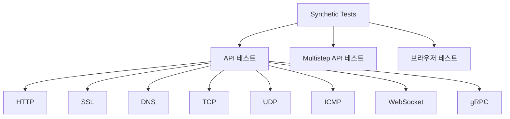

# TIL: 신서틱 모니터링(Synthetic Monitoring)

> [!tldr] 한줄 요약
> 가상 사용자의 요청을 전 세계 여러 위치에서 주기적으로 시뮬레이션하여 API 가용성, 사용자 여정, SSL 인증서 등을 **능동적으로** 감시하고, CI/CD에 통합하여 배포 전 자동 검증 게이트로도 활용한다.

## 핵심 내용

### Synthetic Monitoring이란

코드 없이 API/브라우저/모바일 테스트를 만들어, **가상 사용자 트래픽을 자동 시뮬레이션**하는 능동적(Proactive) 모니터링이다. 실제 사용자가 없는 새벽에도 24/7 감시할 수 있다.

### RUM과의 비교

[[til/datadog/rum|RUM]]이 "실제 사용자를 관측(수동적)"이라면, Synthetic은 "가상 사용자로 테스트(능동적)"이다. 둘은 서로 보완 관계다.

| | Synthetic Monitoring | RUM |
|---|---|---|
| **방식** | 가상 사용자 시뮬레이션 | 실제 사용자 데이터 수집 |
| **시점** | 문제 발생 **전** 감지 | 문제 발생 **후** 분석 |
| **트래픽** | 없어도 24/7 모니터링 | 실제 트래픽 필요 |
| **용도** | 가용성/SLO 감시, 배포 검증 | 사용자 경험 분석, 에러 재현 |
| **과금** | 테스트 실행 횟수 기반 | 세션 수 기반 |

> [!tip] 함께 쓰면 강력하다
> Synthetic으로 **성능 기준선(Baseline)**을 잡고 조기 경고를 받고, RUM으로 **실제 사용자의 다양한 환경**에서의 문제를 파악한다.

### 테스트 종류



#### API 테스트 (단일 요청)

8가지 네트워크 레이어에서 단일 요청을 검증한다:

| 서브타입 | 용도 | 검증 예시 |
|---------|------|----------|
| **HTTP** | API 엔드포인트 가용성/성능 | 상태 코드, 응답 시간, body 내용 |
| **SSL** | 인증서 유효성 | 만료일까지 30일 이상 남았는지 |
| **DNS** | 도메인 해석 | 올바른 IP로 해석되는지, 응답 시간 |
| **TCP** | 포트 연결 | 특정 포트가 열려있는지 |
| **UDP** | UDP 서비스 | DNS 서버 등 UDP 기반 서비스 |
| **ICMP** | 네트워크 연결 | ping 응답, 패킷 손실, traceroute |
| **WebSocket** | WebSocket 연결 | 핸드셰이크 성공, 메시지 응답 |
| **gRPC** | gRPC 서비스 | health check, unary call 응답 |

#### Multistep API 테스트 (체이닝)

여러 API 호출을 **순서대로 실행**하며, 이전 응답에서 추출한 값을 다음 요청에 전달한다. 인증 → 조회 → 수정 같은 흐름 전체를 검증할 때 사용한다.

#### 브라우저 테스트 (사용자 여정)

**Chrome 레코더 확장**으로 사용자 행동을 녹화하여 코드 없이 테스트를 만든다. 실제 브라우저(Chrome, Firefox, Edge)와 디바이스(Desktop, Mobile)에서 실행된다.

- 클릭, 입력, 스크롤 등 사용자 상호작용 녹화
- 텍스트 존재 여부, 엘리먼트 표시 여부 등 어설션(Assertion) 추가
- 로그인 같은 공통 단계는 **서브테스트**로 재사용 가능
- 실패 시 **스크린샷**이 남아서 어떤 화면에서 실패했는지 확인

### 실행 위치

| 위치 | 설명 | 용도 |
|------|------|------|
| **Managed Locations** | Datadog이 운영하는 전 세계 데이터센터 | 공개 웹사이트/API |
| **Private Locations** | Docker 컨테이너로 사내 네트워크에 설치 | 내부 앱, VPN 뒤 시스템 |

Private Location은 Datadog 서버에서 HTTPS로 테스트 설정을 받아와 실행하고, 결과만 Datadog에 전송한다. 내부 네트워크를 외부에 노출하지 않는다.

### CI/CD 연동 (Continuous Testing)

Synthetic 테스트를 배포 파이프라인에 넣어 **배포 전 자동 검증 게이트**로 활용한다.

지원 CI: GitHub Actions, GitLab, Jenkins, CircleCI, Azure DevOps

```yaml
# GitHub Actions 예시
- name: Run Datadog Synthetic Tests
  uses: DataDog/synthetics-ci-github-action@v1
  with:
    api_key: ${{ secrets.DD_API_KEY }}
    app_key: ${{ secrets.DD_APP_KEY }}
    test_search_query: 'tag:critical'
```

`tag:critical`로 태깅된 핵심 테스트만 실행하여, 결제 플로우 테스트가 실패하면 배포를 막는다.

### 과금

| 테스트 타입 | 과금 단위 |
|------------|----------|
| **API 테스트** | 10,000 실행당 |
| **브라우저 테스트** | 1,000 실행당 |

CI/CD에서 병렬 실행 속도를 높이려면 Parallel Testing 슬롯을 추가 구매한다.

## 예시

### API 테스트 — 헬스체크

```
테스트: HTTP GET https://api.example.com/health
실행 주기: 1분마다
실행 위치: 서울, 도쿄, 버지니아
검증 조건:
  - 상태 코드 = 200
  - 응답 시간 < 500ms
  - body에 {"status": "ok"} 포함
알림: 2회 연속 실패 시 Slack #ops 채널
```

### SSL 인증서 만료 감시

```
테스트: SSL → api.example.com:443
검증 조건: 인증서 만료까지 30일 이상
알림: 조건 미달 시 이메일 + PagerDuty
```

### Multistep API — 인증 → 조회 흐름

```
Step 1: POST /auth/login (body: {email, password})
  → 응답에서 access_token 추출

Step 2: GET /api/orders (Header: Bearer {{access_token}})
  → 상태 코드 200, 응답이 배열

Step 3: GET /api/orders/{{orders[0].id}}
  → 주문 상세 조회 성공
```

### 브라우저 테스트 — 결제 플로우

```
Step 1: https://shop.example.com 접속
Step 2: 상품 목록에서 첫 번째 상품 클릭
Step 3: "장바구니 담기" 버튼 클릭
Step 4: 장바구니 아이콘 클릭
Step 5: "결제하기" 버튼 클릭
Step 6: 결제 페이지에 "주문 요약" 텍스트 확인

실행 주기: 15분 / 위치: 서울, 오사카
디바이스: Chrome Desktop, Chrome Mobile
```

> [!example] 실패 시 제공되는 정보
> - 실패한 스텝의 **스크린샷**
> - 각 스텝의 응답 시간
> - 네트워크 워터폴 (어떤 리소스가 느렸는지)
> - APM 트레이스 연결 (백엔드 원인 확인)

### Private Location — 사내 시스템

```bash
docker run -d --name dd-synth-worker \
  -e DATADOG_API_KEY=xxx \
  -e DATADOG_ACCESS_KEY=yyy \
  datadog/synthetics-private-location-worker
```

인터넷에 공개되지 않은 `http://internal-admin.corp.local`도 모니터링 가능.

## 참고 자료

- [Synthetic Testing and Monitoring](https://docs.datadoghq.com/synthetics/)
- [Getting Started with Synthetic Monitoring](https://docs.datadoghq.com/getting_started/synthetics/)
- [Getting Started with API Tests](https://docs.datadoghq.com/getting_started/synthetics/api_test/)
- [Getting Started with Browser Tests](https://docs.datadoghq.com/getting_started/synthetics/browser_test/)
- [Multistep API Testing](https://docs.datadoghq.com/synthetics/multistep/)
- [Private Locations](https://docs.datadoghq.com/synthetics/platform/private_locations/)
- [Synthetic Testing: What It Is & How It Works](https://www.datadoghq.com/knowledge-center/synthetic-testing/)
- [Optimize frontend monitoring with Synthetic and RUM (Blog)](https://www.datadoghq.com/blog/rum-synthetic-monitoring-together/)

## 관련 노트

- [[til/datadog/rum|RUM(Real User Monitoring)]]
- [[til/datadog/apm-distributed-tracing|APM과 분산 트레이싱(Distributed Tracing)]]
- [[til/datadog/monitors-and-alerts|모니터와 알림(Monitors & Alerts)]]
- [[til/datadog/slo-monitoring|SLO 모니터링(SLO Monitoring)]]
- [[til/devops/observability|옵저버빌리티(Observability)]]
- [[til/devops/sli-slo-sla|SLI / SLO / SLA]]
