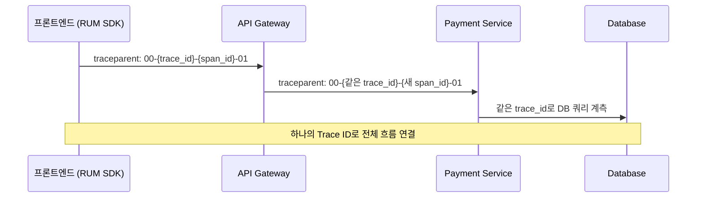

# Trace Explorer 고급 기능

> [!tldr] 한줄 요약
> Trace Pipeline(수집 → 보존 → 분석) 구조에서 보존 필터로 중요한 Span만 15일간 저장하고, Trace Queries로 Span 간 관계를 기반으로 검색하며, Span에서 커스텀 메트릭을 생성하여 15개월간 장기 트렌드를 추적한다.

## 핵심 내용

### Trace Pipeline 전체 구조

[[til/datadog/apm-distributed-tracing|APM]]에서 트레이스가 수집되고 저장되는 흐름은 수집(Ingestion) → 보존(Retention) → 분석(Explorer) 3단계이며, 수집 단계에서 커스텀 메트릭도 별도로 생성(15개월 보존)할 수 있다.

- **수집(Ingestion)**: 모든 Span을 100% 수집 가능
- **보존(Retention)**: 보존 필터로 어떤 Span을 15일간 저장할지 결정
- **분석(Explorer)**: 저장된 Span을 Trace Explorer에서 검색/분석

### Live Search vs Retained Search

| 모드 | 시간 범위 | 데이터 | 용도 |
|------|----------|--------|------|
| **Live Search** | 최근 15분 (롤링) | 수집된 **모든** Span (샘플링 없음) | 실시간 디버깅 |
| **Retained Search** | 15분 이상 | 보존 필터에 의해 **인덱싱된** Span만 | 과거 분석 |

시간 선택기에서 15분 이내를 선택하면 Live Search, 15분 이상을 선택하면 자동으로 Retained Search로 전환된다.

### 보존 필터 (Retention Filters)

어떤 Span을 15일간 저장할지 결정하는 3가지 계층:

| 필터 | 설명 | 설정 |
|------|------|------|
| **Intelligent Retention** | 모든 서비스/엔드포인트의 다양한 지연 분포를 자동 보존 | 자동 (기본) |
| **Default Retention** | 에러 트레이스, 고지연 트레이스 등 | 기본 제공 |
| **Custom Retention** | 태그 기반으로 **직접 정의**하는 필터 | 사용자 설정 |

#### Custom Retention 필터

비즈니스에 중요한 Span을 선택적으로 보존한다:

```
예시:
- env:production AND service:checkout AND status:error → 100% 보존
- @http.url:/api/payments* → 50% 보존
- @customer.tier:enterprise → 100% 보존
```

> [!tip] Span 레벨 vs Trace 레벨
> - **Span 레벨 필터**: 조건에 맞는 Span만 저장
> - **Trace 레벨 필터**: 조건에 맞는 Span이 포함된 **전체 트레이스**를 저장
>
> 장애 분석을 위해서는 Trace 레벨 필터가 유용하다. 에러 Span 하나만 저장하면 문맥을 잃지만, 전체 트레이스를 저장하면 에러 전후의 흐름을 볼 수 있다.

### Trace Queries (트레이스 구조 기반 검색)

일반 검색은 **개별 Span**을 찾지만, Trace Queries는 **여러 Span의 조건과 관계**를 조합하여 검색한다:

```
"API Gateway에서 시작하여 Payment Service에서 에러가 난 트레이스"

Span A: service:api-gateway
  └→ Span B: service:payment-service AND status:error
  관계: A가 B의 상위(ancestor)
```

활용 예시:
- "특정 사용자의 요청이 특정 DB 쿼리까지 도달한 트레이스"
- "에러가 발생한 Span의 부모 서비스가 뭔지"
- "지연이 긴 Span이 포함된 전체 요청 흐름"

### Span에서 커스텀 메트릭 생성

Span의 수치 값을 추출하여 **15개월간 보존되는 커스텀 메트릭**으로 만들 수 있다:

| Span 속성 | 생성 메트릭 | 활용 |
|-----------|-----------|------|
| `@duration` | 응답시간 분포 | 장기 성능 트렌드 |
| `@http.status_code:5xx` 카운트 | 에러율 | 대시보드/모니터 |
| `@db.row_count` | DB 반환 행 수 | 쿼리 효율 추적 |
| `@queue.latency` | 큐 대기 시간 | 메시지 처리 병목 |

> [!warning] 핵심 포인트
> 커스텀 메트릭은 보존 필터와 **무관하게** 수집된 모든 Span에서 생성할 수 있다. Span 자체는 15일 후 삭제되지만, 메트릭은 **15개월** 남는다. 장기 트렌드 분석이 필요하면 메트릭으로 만들어두는 것이 핵심이다.

### 분석 뷰 (Analytics)

Trace Explorer에서 검색 결과를 시각화할 수 있다:

| 뷰 | 용도 |
|----|------|
| **Timeseries** | 시간별 에러 수, 지연 추이 |
| **Top List** | 가장 느린 엔드포인트, 에러가 많은 서비스 |
| **Table** | 서비스/엔드포인트별 집계 테이블 |

### Trace Context Propagation (트레이스 컨텍스트 전파)

Span끼리 연결되려면 서비스 간 요청 시 **HTTP 헤더에 Trace ID를 전달**해야 한다:



| 구간 | 연결 방식 | 설정 |
|------|----------|------|
| **프론트 → 백엔드** | RUM SDK의 `allowedTracingUrls` | 어떤 API에 트레이스 헤더를 붙일지 지정 |
| **백엔드 → 백엔드** | dd-trace가 **자동 전파** | HTTP 클라이언트 계측 시 자동 |
| **백엔드 → DB** | dd-trace가 DB 쿼리 자동 계측 | [[til/datadog/database-monitoring\|DBM]] 연동 시 Explain Plan까지 연결 |

#### 전파 방식 (Propagation Style)

| 방식 | 헤더 | 용도 |
|------|------|------|
| **Datadog** | `x-datadog-trace-id`, `x-datadog-parent-id` | Datadog 기본 |
| **W3C Trace Context** | `traceparent` | 표준, 멀티벤더 환경 |
| **B3** | `X-B3-TraceId`, `X-B3-SpanId` | Zipkin 호환 |

dd-trace는 기본적으로 Datadog + W3C 방식을 둘 다 지원한다.

> [!tip] 프론트 연결이 끊기는 경우
> [[til/datadog/rum|RUM]]에서 `allowedTracingUrls`를 설정하지 않으면 프론트 → 백엔드 구간이 끊긴다. 이 경우 RUM과 APM이 별개의 트레이스로 존재하여 "이 API 호출이 어느 사용자 세션에서 온 건지" 연결할 수 없다.

## 예시

```
보존 필터 + 커스텀 메트릭 설계 예시:

1. Custom Retention 필터 설정
   - env:production AND status:error → 100% (모든 에러 트레이스 보존)
   - service:checkout AND @duration:>2s → 100% (느린 결제 보존)
   - @customer.tier:enterprise → 50% (엔터프라이즈 고객 샘플링)

2. 커스텀 메트릭 생성
   - trace.checkout.duration (p50, p95, p99) → 결제 성능 장기 추적
   - trace.api.error_count by service → 서비스별 에러율 대시보드
   - trace.db.query_time by @db.statement → 쿼리별 성능 추적

3. Trace Queries 활용
   - "지난 1시간 동안, checkout-api에서 시작하여
     payment-service에서 에러가 발생한 트레이스"
   → 결과: 23건의 트레이스
   → 공통점: 모두 Stripe webhook 타임아웃
```

> [!example] 보존 전략
> - **Span 15일**: Trace Explorer에서 개별 요청 수준 디버깅
> - **메트릭 15개월**: 대시보드와 모니터에서 장기 트렌드 분석
> - 보존 필터는 비용에 직결되므로, "모든 것을 100% 보존"하기보다 비즈니스 중요도에 따라 비율을 조절하는 것이 핵심이다.

## 참고 자료

- [Trace Explorer](https://docs.datadoghq.com/tracing/trace_explorer/)
- [Trace Retention](https://docs.datadoghq.com/tracing/trace_pipeline/trace_retention/)
- [The Trace Pipeline](https://docs.datadoghq.com/tracing/trace_pipeline/)
- [Trace Queries](https://docs.datadoghq.com/tracing/trace_explorer/trace_queries/)
- [Generate Custom Metrics from Spans](https://docs.datadoghq.com/tracing/trace_pipeline/generate_metrics/)
- [Trace View](https://docs.datadoghq.com/tracing/trace_explorer/trace_view/)
- [Distributed Tracing: live-query all ingested traces (Blog)](https://www.datadoghq.com/blog/real-time-performance-monitoring-with-datadog-distributed-tracing/)

## 관련 노트

- [[til/datadog/apm-distributed-tracing|APM과 분산 트레이싱(Distributed Tracing)]]
- [[til/datadog/log-trace-correlation|로그-트레이스 상관관계(Log-Trace Correlation)]]
- [[til/datadog/rum|RUM(Real User Monitoring)]]
- [[til/datadog/database-monitoring|Database Monitoring(DBM)]]
- [[til/datadog/metrics|메트릭(Metrics)]]
- [[til/datadog/dashboards|대시보드(Dashboards)]]
