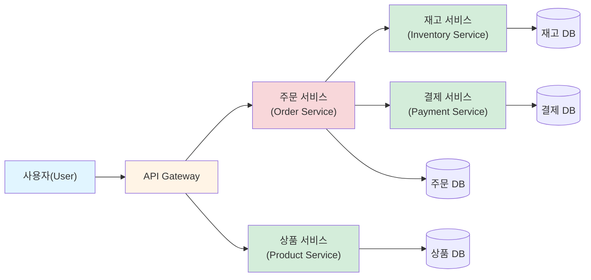
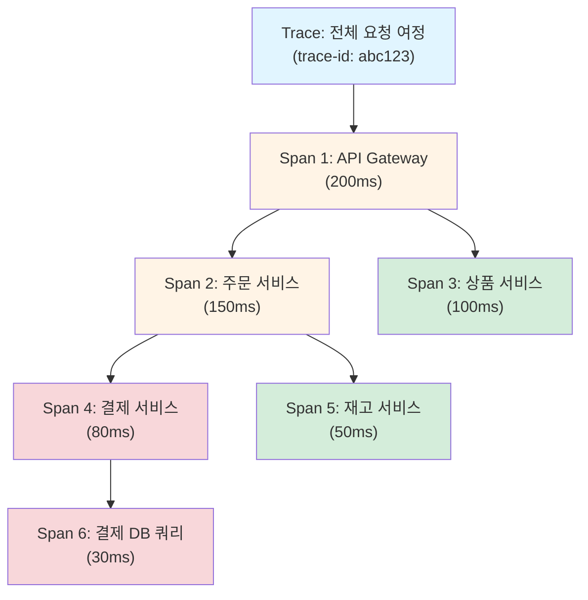

# TIL: 분산 시스템 모니터링(Distributed System Monitoring)

> [!tldr] 한줄 요약
> 분산 시스템은 서비스 수, 의존성, 동적 인프라 때문에 모놀리식보다 모니터링이 어렵고, Golden Signals/RED/USE 같은 방법론과 분산 트레이싱으로 체계적으로 접근해야 한다.

## 핵심 내용

### 왜 분산 시스템 모니터링이 어려운가?

모놀리식 애플리케이션은 하나의 프로세스를 모니터링하면 되지만, 마이크로서비스 환경에서는 근본적으로 다른 문제들이 생긴다:

1. **서비스 수가 많다** — 수백 개의 서비스, 수천 개의 인스턴스
2. **서비스 간 의존성이 복잡하다** — 한 서비스의 장애가 다른 곳에서 증상으로 나타남
3. **인프라가 동적이다** — Kubernetes에서 Pod이 수시로 생성/삭제/이동
4. **표준화가 어렵다** — 각 팀이 다른 언어, 프레임워크, 데이터 저장소를 사용



### 모니터링 방법론 3가지

분산 시스템에서 **무엇을 측정할 것인가**에 대한 대표적 프레임워크:

#### Four Golden Signals (Google SRE Book)

| 시그널 | 설명 | 예시 |
|--------|------|------|
| 지연 시간(Latency) | 요청 처리에 걸리는 시간 | p50=200ms, p99=1.2s |
| 트래픽(Traffic) | 시스템에 들어오는 요청량 | 500 req/s |
| 에러율(Errors) | 실패한 요청의 비율 | 5xx 응답 2.3% |
| 포화도(Saturation) | 리소스가 얼마나 차 있는지 | CPU 85%, 메모리 70% |

#### RED Method (서비스/요청 중심)

- **Rate** — 초당 요청 수
- **Errors** — 에러 수
- **Duration** — 요청 처리 시간

#### USE Method (리소스 중심)

- **Utilization** — 리소스 사용률
- **Saturation** — 대기열 길이
- **Errors** — 에러 수

> [!tip] 방법론 선택 가이드
> **Golden Signals** = RED + USE의 상위 개념. **RED**는 서비스 계층(API, 마이크로서비스)에, **USE**는 인프라 계층(CPU, 메모리, 디스크)에 적합하다. 실무에서는 둘을 조합해 사용한다.

### 분산 트레이싱(Distributed Tracing)

마이크로서비스 환경에서 하나의 요청이 여러 서비스를 거치는 흐름을 추적하는 기법이다.

- **Trace**: 하나의 요청의 전체 여정
- **Span**: Trace 안의 개별 작업 단위 (부모-자식 관계로 트리 구성)
- **Context Propagation**: 서비스 간 Trace ID, Span ID를 HTTP 헤더로 전달
- **W3C TraceContext**: 표준 전파 형식 (`traceparent: {version}-{trace-id}-{parent-id}-{flags}`)



> [!warning] Context Propagation이 핵심
> 분산 트레이싱이 동작하려면 모든 서비스가 Trace Context를 전파해야 한다. 하나라도 빠지면 Trace가 끊긴다.

### 서비스 건강 확인 패턴

- **Health Check API** — `/health` 엔드포인트로 서비스 상태 노출. Kubernetes의 liveness/readiness probe가 대표적
- **Heartbeat** — 서비스가 주기적으로 "살아있다" 신호를 전송. 일정 시간 신호가 없으면 장애로 판단
- **Circuit Breaker** — 하위 서비스 장애 시 요청을 차단하여 장애 전파(cascading failure) 방지

## 예시

```
[사용자] → API Gateway → 주문 서비스 → 재고 서비스
                                    → 결제 서비스 → 결제 DB
```

> [!example] Golden Signals로 모니터링하기
> - **Latency**: 주문 API의 p99 응답 시간이 3초 초과 시 알림
> - **Traffic**: 초당 주문 요청 수 추이로 트래픽 급증 감지
> - **Errors**: 결제 서비스의 5xx 에러율이 1% 초과 시 알림
> - **Saturation**: 결제 DB 커넥션 풀 사용률이 80% 초과 시 알림
>
> 알림이 오면 → 분산 트레이스로 병목 구간 확인 → 로그로 에러 상세 원인 파악

## 참고 자료

- [Monitoring Distributed Systems - Google SRE Book](https://sre.google/sre-book/monitoring-distributed-systems/)
- [Traces - OpenTelemetry](https://opentelemetry.io/docs/concepts/signals/traces/)
- [Context Propagation - OpenTelemetry](https://opentelemetry.io/docs/concepts/context-propagation/)
- [RED Metrics & Monitoring - Splunk](https://www.splunk.com/en_us/blog/learn/red-monitoring.html)
- [Health Check API Pattern - microservices.io](https://microservices.io/patterns/observability/health-check-api.html)

## 관련 노트

- [[til/devops/observability|옵저버빌리티(Observability)]]
- [[SLI-SLO-SLA]]
- [[APM과 분산 트레이싱(Distributed Tracing)]]
- [[OpenTelemetry 연동]]
- [[모니터와 알림(Monitors & Alerts)]]
