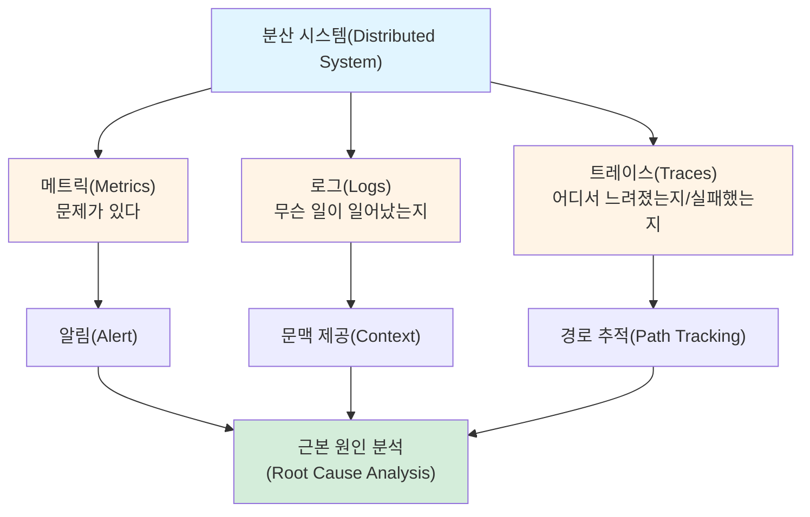

# 옵저버빌리티(Observability)

> [!tldr] 한줄 요약
> 옵저버빌리티는 시스템의 외부 출력(메트릭, 로그, 트레이스)만으로 내부 상태를 추론할 수 있는 능력이다.

## 핵심 내용

### 기원: 제어 이론에서 소프트웨어로

옵저버빌리티는 1959년 Rudolf Kalman이 **제어 이론(Control Theory)** 에서 도입한 개념이다. 원래 정의는 "시스템의 외부 출력만으로 내부 상태를 얼마나 잘 추론할 수 있는가"를 나타내는 척도다.

이 개념이 소프트웨어 엔지니어링으로 넘어오면서, **분산 시스템의 내부 상태를 텔레메트리 데이터로 파악하는 능력**을 뜻하게 되었다.

### 모니터링 vs 옵저버빌리티

| | 모니터링(Monitoring) | 옵저버빌리티(Observability) |
|---|---|---|
| 질문 | "무엇이 잘못됐나?" | "왜 잘못됐고 어떻게 고치나?" |
| 접근 | 사전 정의된 메트릭 수집 | 로그+메트릭+트레이스 상관 분석 |
| 성격 | 반응적(reactive) | 능동적(proactive) |
| 범위 | 개별 시스템 건강 상태 | 시스템 간 상호작용 전체 |

모니터링은 옵저버빌리티의 **부분집합**이다. 모니터링이 사전 정의된 메트릭으로 "무엇이 잘못됐나?"를 알려준다면, 옵저버빌리티는 메트릭·로그·트레이스의 상관 분석을 통해 "왜 잘못됐고 어떻게 고치나?"까지 답한다.

### 세 기둥(Three Pillars)

전통적으로 **[[til/datadog/metrics|메트릭(Metrics)]], [[til/datadog/log-management|로그(Logs)]], [[til/datadog/apm-distributed-tracing|트레이스(Traces)]]** 를 "옵저버빌리티의 3기둥"이라 부른다.

**1. 메트릭(Metrics)** — 숫자로 표현되는 정량 데이터
- CPU 사용률, 응답 시간, 에러율 등
- 시계열로 저장되어 트렌드 분석과 알림에 사용
- **"문제가 있다"** 를 알려줌

**2. 로그(Logs)** — 이벤트의 텍스트 기록
- 타임스탬프, 에러 메시지, 컨텍스트 정보 포함
- 구조화 로그(JSON)가 분석에 유리
- **"무슨 일이 일어났는지"** 를 알려줌

**3. 트레이스(Traces)** — 요청의 전체 경로 추적
- 분산 시스템에서 하나의 요청이 여러 서비스를 거치는 흐름을 시각화
- Span(구간)들의 트리 구조로 구성
- **"어디서 느려졌는지/실패했는지"** 를 알려줌



> [!tip] 세 기둥의 역할 요약
> 메트릭은 **알림(alert)**, 트레이스는 **경로 추적**, 로그는 **문맥(context) 제공**. 이 셋을 상관 분석할 수 있어야 진정한 옵저버빌리티다.

### MELT로의 확장

최근에는 3기둥에 **이벤트(Events)** 를 더한 **MELT**(Metrics, Events, Logs, Traces) 모델이 널리 쓰인다. 이벤트는 배포, 스케일링, 장애 발생 등 **상태 변화 알림**을 의미한다. 여기에 **프로파일링(Profiling)** 까지 추가되는 추세다.

### 최근 동향

- **[[OpenTelemetry 연동|OpenTelemetry]]**: 벤더 중립적 텔레메트리 표준. 메트릭, 로그, 트레이스를 통합 API로 수집
- **AI 기반 옵저버빌리티**: 이상 탐지, 근본 원인 분석 자동화 (예: [[Bits AI]])
- **스마트 텔레메트리**: "모든 것을 수집"에서 "신호 대 잡음비 최적화"로 전환

## 예시

```
[사용자 요청] → 프론트엔드 → API 게이트웨이 → 주문 서비스 → 결제 서비스 → DB
```

> [!example] 장애 시나리오
> 1. **메트릭**: 주문 API 응답 시간이 평소 200ms → 5초로 급증 (알림 발생)
> 2. **트레이스**: 주문 서비스 → 결제 서비스 구간에서 4.8초 지연 확인
> 3. **로그**: 결제 서비스에서 `ConnectionTimeout: payment-db:5432` 에러 발견
> 4. **결론**: 결제 DB 커넥션 풀 고갈이 근본 원인

## 참고 자료

- [Three Pillars of Observability - IBM](https://www.ibm.com/think/insights/observability-pillars)
- [Observability vs Monitoring - AWS](https://aws.amazon.com/compare/the-difference-between-monitoring-and-observability/)
- [MELT Explained - Splunk](https://www.splunk.com/en_us/blog/learn/melt-metrics-events-logs-traces.html)
- [From Kálmán to Kubernetes - Broadcom](https://academy.broadcom.com/blog/aiops/from-kalman-to-kubernetes-a-history-of-observability-in-it)
- [Observability - Wikipedia](https://en.wikipedia.org/wiki/Observability)

## 관련 노트

- [[til/devops/distributed-system-monitoring|분산 시스템 모니터링(Distributed System Monitoring)]]
- [[SLI-SLO-SLA]]
- [[til/datadog/tagging|태깅(Tagging)]]
- [[til/datadog/log-trace-correlation|로그-트레이스 상관관계(Log-Trace Correlation)]]
