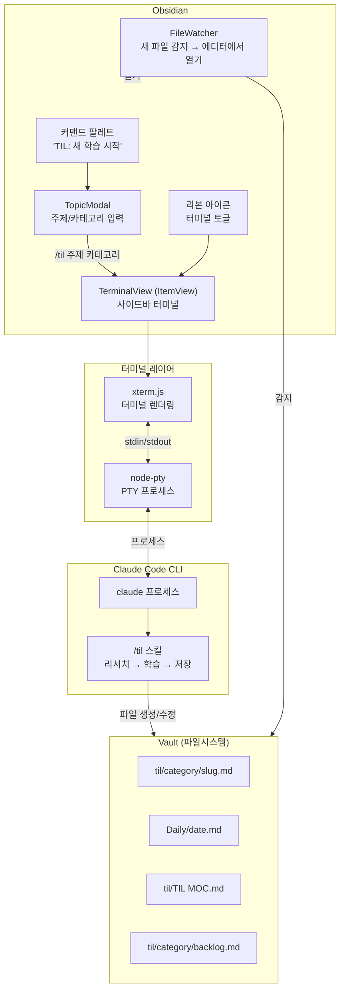

# obsidian-claude-til 프로젝트 명세

> [!tldr] 한줄 요약
> Obsidian 사이드바에 Claude Code 터미널을 임베딩하여, 지금의 `/til` 스킬 워크플로우를 Obsidian 안에서 그대로 사용할 수 있게 하는 플러그인.

## 프로젝트 개요

### 목표

현재 터미널에서 Claude Code의 `/til` 스킬로 수행하는 학습 워크플로우를 Obsidian 사이드바에서 동일한 UI/UX로 실행한다.

### 접근 방식: 터미널 임베딩

커스텀 채팅 UI와 Claude API 직접 호출 대신, **xterm.js + node-pty**로 실제 터미널을 사이드바에 렌더링하고 Claude Code CLI를 그 안에서 실행한다.

| | 커스텀 채팅 UI | 터미널 임베딩 (채택) |
|--|--|--|
| **복잡도** | 높음 (API, 채팅 UI, 파일 조작 직접 구현) | 낮음 (터미널 렌더링 + 프로세스 관리) |
| **UI/UX** | 별도로 만들어야 함 | Claude Code 터미널 그대로 |
| **스킬** | 리서치/학습 로직 재구현 | 기존 `/til` 스킬 그대로 사용 |
| **비용** | API 토큰 과금 | Claude Code 구독 그대로 |
| **기능 범위** | TIL에 한정 | `/research`, `/backlog` 등 모든 스킬 사용 가능 |

### 선행 레퍼런스

> [!tip] 이미 동일한 구조의 플러그인이 존재한다

- [claude-code-terminal](https://github.com/dternyak/claude-code-terminal) — xterm.js + node-pty로 Claude Code를 Obsidian에 임베딩한 플러그인. 사이드바/플로팅 모드 지원. **이 프로젝트의 핵심 레퍼런스.**
- [O-Terminal](https://github.com/Quorafind/O-Terminal) — Obsidian 범용 터미널 플러그인
- [obsidian-terminal](https://github.com/polyipseity/obsidian-terminal) — 또 다른 터미널 통합 구현

### 기존 플러그인과의 차별점

`claude-code-terminal`은 범용 Claude Code 터미널이다. 이 프로젝트는 **TIL 학습 워크플로우에 특화된 기능**을 추가한다:

1. **주제 입력 모달** — 커맨드 팔레트에서 주제/카테고리를 입력하면 자동으로 `/til <주제> <카테고리>` 명령 실행
2. **파일 감지** — 새 TIL 파일이 생성되면 자동으로 에디터에서 열기
3. **카테고리 자동완성** — vault의 기존 `til/` 하위 폴더를 스캔하여 카테고리 목록 제공
4. **백로그 연동** — 커맨드 팔레트에서 백로그 항목을 선택하면 해당 주제로 `/til` 실행
5. **CLAUDE.md 자동 주입** — vault의 CLAUDE.md를 Claude Code가 인식하도록 작업 디렉토리 설정

---

## 문서 읽기 순서 (개발 로드맵)

> [!tip] 아래 순서대로 공식 문서를 읽으면서 개발하면 된다

### Step 1: 환경 세팅과 첫 플러그인

| 순서 | 문서 | 목적 |
|------|------|------|
| 1-1 | [Build a plugin](https://docs.obsidian.md/Plugins/Getting+started/Build+a+plugin) | 프로젝트 스캐폴딩, 빌드, 첫 실행 |
| 1-2 | [obsidian-sample-plugin](https://github.com/obsidianmd/obsidian-sample-plugin) | 샘플 코드 구조, esbuild 설정 |
| 1-3 | [obsidian-api type definitions](https://github.com/obsidianmd/obsidian-api) | API 타입 정의 참조 |

> [!example] 산출물
> "Hello World" 수준의 플러그인이 개발 vault에서 동작하는 상태

### Step 2: 터미널 임베딩 핵심

| 순서 | 문서 | 목적 |
|------|------|------|
| 2-1 | [claude-code-terminal 소스](https://github.com/dternyak/claude-code-terminal/blob/main/src/main.ts) | **핵심 레퍼런스.** xterm.js + node-pty 통합 패턴, Electron require, PTY 프로세스 관리 |
| 2-2 | [xterm.js docs](https://xtermjs.org/docs/) | 터미널 에뮬레이터 API, 테마, 애드온 |
| 2-3 | [node-pty README](https://github.com/microsoft/node-pty) | PTY(의사 터미널) 생성, 플랫폼별 차이 |
| 2-4 | [@electron/rebuild](https://github.com/electron/rebuild) | node-pty 네이티브 모듈을 Obsidian의 Electron 버전에 맞춰 재빌드 |
| 2-5 | [Views](https://docs.obsidian.md/Plugins/User+interface/Views) | ItemView로 사이드 패널 구현 |

> [!example] 산출물
> 사이드바에 터미널이 렌더링되고, 셸 명령을 실행할 수 있는 상태

### Step 3: Claude Code 통합 + TIL 특화 기능

| 순서 | 문서 | 목적 |
|------|------|------|
| 3-1 | [Modals](https://docs.obsidian.md/Plugins/User+interface/Modals) | 주제 입력 모달 구현 |
| 3-2 | [Commands](https://docs.obsidian.md/Plugins/User+interface/Commands) | 커맨드 팔레트 등록 |
| 3-3 | [Settings](https://docs.obsidian.md/Plugins/User+interface/Settings) | 설정 탭 구현 |
| 3-4 | [Vault API](https://docs.obsidian.md/Reference/TypeScript+API/Vault) | 파일/폴더 감시, 카테고리 목록 스캔 |
| 3-5 | [Events](https://docs.obsidian.md/Plugins/Events) | vault 파일 생성 이벤트 감지 (`vault.on('create', ...)`) |

> [!example] 산출물
> 주제 입력 → 터미널에서 `/til` 자동 실행 → 새 파일 생성 시 자동으로 에디터에서 열기

### Step 4: 마감 + 배포

| 순서 | 문서 | 목적 |
|------|------|------|
| 4-1 | [Ribbon actions](https://docs.obsidian.md/Plugins/User+interface/Ribbon+actions) | 리본 아이콘 |
| 4-2 | [Release your plugin](https://docs.obsidian.md/Plugins/Releasing/Release+your+plugin+with+GitHub+Actions) | GitHub Actions 릴리스 자동화 |
| 4-3 | [Submission requirements](https://docs.obsidian.md/Plugins/Releasing/Submission+requirements+for+plugins) | 커뮤니티 등록 요구사항 |
| 4-4 | [Plugin guidelines](https://docs.obsidian.md/Plugins/Releasing/Plugin+guidelines) | 리뷰 가이드라인 |

> [!warning] node-pty 네이티브 모듈 주의
> node-pty는 C++ 네이티브 모듈이라 Obsidian의 Electron 버전에 맞춰 `@electron/rebuild`로 재빌드해야 한다. `isDesktopOnly: true` 필수. 커뮤니티 배포 시 플랫폼별 바이너리 관리가 까다로울 수 있다.

---

## 아키텍처



### 핵심 흐름

1. 사용자가 커맨드 팔레트에서 "TIL: 새 학습 시작" 실행
2. `TopicModal`에서 주제와 카테고리 입력 (카테고리는 기존 폴더에서 자동완성)
3. 사이드바 `TerminalView`가 열리고, PTY에 `/til <주제> <카테고리>` 명령이 자동 전송
4. Claude Code가 평소처럼 리서치 → 학습 → 저장 수행
5. `FileWatcher`가 `til/` 디렉토리의 새 파일을 감지하면 에디터에서 자동으로 열기

### 파일 구조

```
obsidian-claude-til/
├── manifest.json
├── package.json
├── tsconfig.json
├── esbuild.config.mjs
├── versions.json
├── styles.css                ← 터미널 테마 + 모달 스타일
├── CLAUDE.md                 ← Claude Code 작업용 (아래 참조)
└── src/
    ├── main.ts               ← TILPlugin (진입점, 커맨드/뷰/설정 등록)
    ├── settings.ts           ← TILSettingTab + TILSettings
    ├── terminal/
    │   ├── TerminalView.ts   ← 사이드바 터미널 뷰 (ItemView + xterm.js)
    │   └── pty.ts            ← PTY 프로세스 관리 (node-pty 래핑)
    ├── ui/
    │   └── TopicModal.ts     ← 주제/카테고리 입력 모달
    └── watcher.ts            ← 새 TIL 파일 감지 + 에디터에서 열기
```

---

## 설정 항목

| 설정 | 타입 | 기본값 | 설명 |
|------|------|--------|------|
| `shellPath` | string | `process.env.SHELL` | 셸 경로 |
| `autoLaunchClaude` | boolean | `true` | 터미널 열 때 `claude` 자동 실행 |
| `fontSize` | number | `13` | 터미널 폰트 크기 |
| `tilPath` | string | `"til"` | TIL 저장 루트 경로 |
| `dailyPath` | string | `"Daily"` | Daily 노트 경로 |
| `autoOpenNewTIL` | boolean | `true` | 새 TIL 파일 생성 시 에디터에서 자동 열기 |

---

## Claude Code Team 활용 개발 가이드

> [!tip] 프로젝트 디렉토리에서 Claude Code를 열고 아래처럼 진행한다

### 1단계: 프로젝트 초기화

```
claude-code-terminal 레포(https://github.com/dternyak/claude-code-terminal)를
참고해서 프로젝트를 세팅해줘.
- manifest.json: id "claude-til", name "Claude TIL", isDesktopOnly true
- package.json: @xterm/xterm, @xterm/addon-fit, node-pty, @electron/rebuild
- esbuild.config.mjs: node-pty를 external로 처리
- tsconfig.json, versions.json
```

### 2단계: 터미널 코어 구현 (Team 활용)

```
team 다음 작업들을 병렬로 진행해줘:
1. src/terminal/TerminalView.ts - ItemView 상속, xterm.js 터미널 렌더링,
   Obsidian 테마 색상 연동, ResizeObserver로 자동 리사이즈
2. src/terminal/pty.ts - node-pty 래핑 클래스.
   electronRequire로 로드, PTY 생성/종료/리사이즈, vault 경로를 cwd로 설정
3. src/settings.ts - TILSettings 인터페이스와 TILSettingTab 구현
   (shellPath, autoLaunchClaude, fontSize, tilPath, dailyPath, autoOpenNewTIL)
4. styles.css - 터미널 컨테이너 스타일 (Obsidian 테마 통합)
```

### 3단계: TIL 특화 기능 구현 (Team 활용)

```
team 다음 작업들을 병렬로 진행해줘:
1. src/ui/TopicModal.ts - 주제 텍스트 입력 + 카테고리 드롭다운
   (vault의 til/ 하위 폴더를 스캔해서 목록 생성). 확인 시 터미널에
   "/til <주제> <카테고리>" 자동 전송
2. src/watcher.ts - vault.on('create') 이벤트로 til/ 아래 새 .md 파일
   감지 시 workspace.getLeaf().openFile()로 에디터에서 열기
3. src/main.ts - TILPlugin 진입점. 커맨드 3개 등록:
   (a) TIL: 새 학습 시작 → TopicModal 열기
   (b) TIL: 터미널 열기 → TerminalView 토글
   (c) TIL: 백로그에서 선택 → 백로그 파일 파싱, 미완료 항목 선택 모달
```

### 4단계: 통합 테스트

```
전체 플러그인을 빌드하고 테스트해줘:
1. npm run build가 성공하는지
2. 개발 vault에 설치해서 동작 확인
3. 커맨드 팔레트 → 주제 입력 → 터미널에서 claude 실행 → /til 자동 전송 흐름
4. 새 파일 생성 감지 → 에디터에서 자동 열기
```

---

## CLAUDE.md (새 프로젝트에 복사)

아래 내용을 새 프로젝트의 `CLAUDE.md`로 사용한다:

````markdown
# CLAUDE.md - obsidian-claude-til

## 프로젝트 개요

Obsidian 플러그인. 사이드바에 Claude Code 터미널을 임베딩하여 TIL 학습 워크플로우를 Obsidian 안에서 실행한다. xterm.js + node-pty 기반.

핵심 흐름: 커맨드 팔레트 → 주제 입력 모달 → 사이드바 터미널에서 `/til` 자동 실행 → 새 파일 감지 시 에디터에서 열기

## 기술 스택

- TypeScript + Obsidian Plugin API
- xterm.js (@xterm/xterm) — 터미널 렌더링
- node-pty — PTY(의사 터미널) 프로세스 관리
- @electron/rebuild — 네이티브 모듈 재빌드
- esbuild — 번들러

## 핵심 레퍼런스

- [claude-code-terminal](https://github.com/dternyak/claude-code-terminal) — xterm.js + node-pty Obsidian 통합 패턴의 원본 구현

## 구조

```
src/
├── main.ts               ← TILPlugin 진입점 (커맨드/뷰/설정 등록)
├── settings.ts           ← 설정 탭 + 인터페이스
├── terminal/
│   ├── TerminalView.ts   ← 사이드바 터미널 (ItemView + xterm.js)
│   └── pty.ts            ← PTY 프로세스 관리 (node-pty)
├── ui/
│   └── TopicModal.ts     ← 주제/카테고리 입력 모달
└── watcher.ts            ← 새 TIL 파일 감지 → 에디터에서 열기
```

## 빌드

```bash
npm install
npx @electron/rebuild    # node-pty를 Obsidian Electron 버전에 맞춰 재빌드
npm run dev              # 워치 모드
npm run build            # 프로덕션 빌드
```

## 규칙

- Obsidian API는 `obsidian` 모듈에서 import
- node-pty는 `electronRequire`로 로드 (일반 import 불가, 네이티브 모듈)
- `onload()`에서 등록한 리소스는 자동 해제됨
- `onunload()`에서 PTY 프로세스를 반드시 kill
- 파일 감시는 `vault.on('create', ...)` 사용
- manifest.json의 `isDesktopOnly`는 반드시 `true` (node-pty 네이티브 모듈 때문)
- esbuild에서 node-pty는 external로 처리

## 참고 문서

- [Obsidian Developer Docs](https://docs.obsidian.md/Home)
- [Plugin API Reference](https://docs.obsidian.md/Reference/TypeScript+API/Plugin)
- [xterm.js docs](https://xtermjs.org/docs/)
- [node-pty (GitHub)](https://github.com/microsoft/node-pty)
- [claude-code-terminal 소스](https://github.com/dternyak/claude-code-terminal)
````

## 관련 노트

- [[til/obsidian/plugin-development|Plugin 개발]]
- [[til/obsidian/core-plugins|Core Plugins]]
- [[til/obsidian/community-plugins|Community Plugins]]
