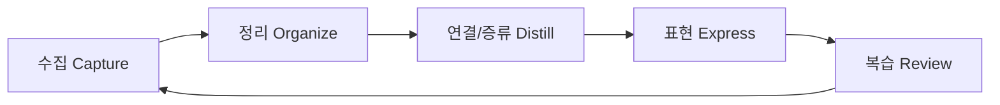

# PKM(Personal Knowledge Management)

> [!tldr] 한줄 요약
> 개인이 정보를 수집 → 정리 → 내재화 → 활용하는 체계적인 지식 관리 방법론. Obsidian 같은 도구로 "제2의 뇌(Second Brain)"를 구축하는 것이 핵심이다.

## 핵심 내용

### PKM이란?

PKM(Personal Knowledge Management)은 개인이 일상과 업무에서 마주치는 정보를 **수집, 분류, 저장, 연결, 활용**하는 일련의 과정이다. 정보 과부하 시대에 기억에만 의존하지 않고, 외부 시스템에 지식을 축적하여 장기 기억과 창의적 사고를 보조한다.

### PKM의 핵심 사이클



이 사이클을 반복하면서 지식이 축적되고, 노트 간 연결에서 새로운 통찰이 생긴다.

## 대표 방법론

### CODE (Tiago Forte - Building a Second Brain)

**행동 중심**의 지식 관리 프레임워크:

| 단계 | 의미 | 설명 |
|------|------|------|
| **C**apture | 수집 | 인상 깊은 정보를 선별적으로 캡처 |
| **O**rganize | 정리 | PARA 구조로 분류 |
| **D**istill | 증류 | 점진적 요약(Progressive Summarization)으로 핵심만 추출 |
| **E**xpress | 표현 | 글, 발표, 프로젝트 등 창작물로 아웃풋 생성 |

> [!tip] 점진적 요약(Progressive Summarization)
> 노트를 읽을 때마다 핵심을 한 단계씩 강조해나가는 기법. 1차: 볼드, 2차: 하이라이트, 3차: 자기 말로 요약. 나중에 노트를 다시 볼 때 깊이에 따라 다르게 읽을 수 있다.

### PARA (Tiago Forte)

정보를 **행동 가능성(Actionability)** 기준으로 4계층 분류:

- **Projects** - 기한이 있는 진행 중 작업
- **Areas** - 기한 없이 지속적으로 관리하는 책임 영역
- **Resources** - 관심사, 참고 자료, 언젠가 쓸 수 있는 것
- **Archives** - 완료되거나 보류된 비활성 항목

### [[til/obsidian/zettelkasten|Zettelkasten]] (니클라스 루만)

**사고 중심**의 지식 네트워크 구축법:

- **원자적 노트(Atomic Note)** - 하나의 노트에 하나의 아이디어만 담는다
- **연결(Link)** - 노트 간 링크를 통해 지식 네트워크를 구축한다
- **폴더보다 연결** - 계층 구조보다 노트 간 관계를 중시한다

## PARA vs Zettelkasten 비교

| | PARA | [[til/obsidian/zettelkasten\|Zettelkasten]] |
|---|---|---|
| 철학 | **행동** 중심 | **사고** 중심 |
| 구조 | 폴더 기반 계층 | 링크 기반 네트워크 |
| 단위 | 프로젝트/영역 | 원자적 노트 |
| 적합한 사람 | 실행/프로젝트 관리 중심 | 연구/아이디어 탐구 중심 |
| Obsidian 활용 | 폴더 구조 + [[Properties]] | [[Wikilink와 Backlink]] + [[til/obsidian/graph-view\|Graph View]] |

> [!tip] 하이브리드 접근
> 두 방법론은 배타적이지 않다. PARA로 전체 구조를 잡고, 개별 노트는 Zettelkasten 방식으로 연결하는 혼합 접근이 실용적이다.

## 예시

Obsidian에서의 PKM 실천:

```markdown
# 일상적인 PKM 사이클 예시

1. Capture: 흥미로운 기술 글 발견 → Obsidian에 메모
2. Organize: 적절한 카테고리 폴더에 배치, 태그 부여
3. Distill: 핵심 내용을 자기 말로 정리 (TIL 작성)
4. Express: 블로그 포스팅이나 팀 공유
5. Review: 주기적으로 오래된 노트 재방문, 새 연결 발견
```

> [!example] Obsidian 도구 매핑
> - Capture → Daily Notes, Web Clipper
> - Organize → 폴더, 태그, [[Properties]]
> - Distill → [[til/obsidian/map-of-content|Map of Content]], 점진적 요약
> - Express → Obsidian Publish, GitHub
> - Review → [[til/obsidian/dataview|Dataview]] 쿼리, [[til/obsidian/graph-view|Graph View]]

## 참고 자료

- [Building a Second Brain: The Definitive Introductory Guide](https://fortelabs.com/blog/basboverview/)
- [Personal Knowledge Management - Wikipedia](https://en.wikipedia.org/wiki/Personal_knowledge_management)
- [Zettelkasten Method and Building a Second Brain](https://zettelkasten.de/posts/building-a-second-brain-and-zettelkasten/)
- [PARA Method vs. Zettelkasten](https://mattgiaro.com/para-method-and-zettelkasten/)

## 관련 노트

- [[til/obsidian/zettelkasten|Zettelkasten]] - 원자적 노트와 연결 기반 지식 관리 방법론
- [[til/obsidian/map-of-content|Map of Content]] - 노트들을 체계적으로 조직하는 허브 노트 패턴
- [[til/obsidian/yaml-frontmatter|YAML Frontmatter]] - PKM에서 메타데이터 관리의 기반
