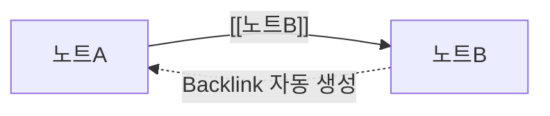

# Wikilink와 Backlink

> [!tldr] 한줄 요약
> `[[이중 대괄호]]`로 노트 간 연결을 만드는 Obsidian의 핵심 링크 문법. 링크를 걸면 대상 노트에 Backlink(역링크)가 자동으로 생성되어 양방향 연결이 이루어진다.

## 핵심 내용

### Wikilink 기본 문법

| 문법 | 설명 | 예시 |
|------|------|------|
| `[[노트]]` | 노트에 링크 | `[[Vault]]` |
| `[[노트\|표시텍스트]]` | 별칭으로 표시 | `[[vault\|Obsidian 볼트]]` |
| `[[폴더/노트]]` | 경로 포함 링크 | `[[til/obsidian/vault]]` |

### 헤딩 링크

특정 헤딩(섹션)으로 직접 링크할 수 있다:

| 문법 | 설명 |
|------|------|
| `[[노트#헤딩]]` | 다른 노트의 특정 헤딩으로 링크 |
| `[[#헤딩]]` | 같은 노트 내 헤딩으로 링크 |
| `[[노트#헤딩\|표시텍스트]]` | 헤딩 링크 + 별칭 |
| `[[노트#H1#H2]]` | 중첩 헤딩 경로 |

### 블록 참조

문단, 리스트 아이템 등 특정 블록 단위로 링크할 수 있다:

| 문법 | 설명 |
|------|------|
| `[[노트#^block-id]]` | 특정 블록으로 링크 |
| `[[#^block-id]]` | 같은 노트 내 블록으로 링크 |

블록 ID는 두 가지 방식으로 지정한다:

- **자동 생성**: `[[노트#^`까지 입력하면 블록 목록이 표시되고, 선택하면 랜덤 ID가 자동으로 대상 블록 끝에 추가됨
- **수동 지정**: 블록 끝에 `^my-id`를 직접 작성 (영문 소문자, 숫자, 하이픈만 사용 가능)

```markdown
PKM의 핵심은 수집, 정리, 연결, 표현이다. ^pkm-cycle

<!-- 다른 노트에서 참조 -->
[[pkm#^pkm-cycle]]
```

### 임베딩

`!`를 앞에 붙이면 링크 대신 **내용을 삽입**한다:

| 문법 | 결과 |
|------|------|
| `![[노트]]` | 노트 전체 내용 삽입 |
| `![[노트#헤딩]]` | 특정 섹션만 삽입 |
| `![[노트#^block-id]]` | 특정 블록만 삽입 |
| `![[이미지.png]]` | 이미지 삽입 |
| `![[이미지.png\|300]]` | 이미지 삽입 (너비 300px) |

### Backlink (역링크)

Wikilink가 "A → B" 방향의 링크라면, Backlink는 자동으로 "B ← A"를 보여준다:



```markdown
<!-- 노트A에서 -->
[[노트B]]를 참고하세요

<!-- 노트B의 Backlink 패널에 "노트A"가 자동 표시됨 -->
```

### Backlink 패널 구성

Backlink 패널(사이드바)은 두 섹션으로 나뉜다:

- **Linked mentions** - 나를 `[[wikilink]]`로 명시적으로 링크한 노트들
- **Unlinked mentions** - 나의 이름을 텍스트로 언급하지만 링크를 걸지 않은 노트들. "Link" 버튼으로 즉시 wikilink로 전환 가능

> [!tip] Unlinked mentions 활용
> 새 노트를 만든 뒤 Unlinked mentions를 확인하면, 이미 다른 노트에서 해당 이름을 텍스트로 언급한 곳을 발견할 수 있다. 클릭 한 번으로 링크를 만들어 지식 네트워크를 확장할 수 있다.

### Outgoing links (발신 링크)

현재 노트에서 다른 노트로 나가는 링크 목록. Backlink의 반대 방향이다. 마찬가지로 unlinked mentions를 발견하여 링크로 전환할 수 있다.

### 링크 경로 설정

Settings > Files & Links > New link format에서 선택:

| 설정 | 동작 | 추천 상황 |
|------|------|-----------|
| **Shortest path** (기본) | 이름이 유일하면 `[[파일명]]`만 사용 | 대부분의 경우 |
| **Relative path** | `[[../폴더/파일명]]` 형태 | 다른 마크다운 도구와 호환 필요 시 |
| **Absolute path** | `[[폴더/하위/파일명]]` 전체 경로 | 동명 파일이 여러 폴더에 있을 때 |

### Wikilink vs Markdown Link

| | Wikilink | Markdown Link |
|---|---|---|
| 문법 | `[[노트]]` | `[텍스트](노트.md)` |
| Backlink | 자동 생성 | 지원 안 됨 |
| 자동완성 | `[[` 입력 시 노트 목록 표시 | 없음 |
| 파일 이동 시 | 경로 자동 업데이트 | 수동 수정 필요 |
| 호환성 | Obsidian 전용 | 표준 Markdown |

> [!warning] 호환성 vs 편의성
> Obsidian 내에서만 사용한다면 Wikilink가 압도적으로 편리하다. GitHub, Jekyll 등 외부 도구와 호환이 필요하면 Settings에서 Markdown Link로 전환할 수 있다.

## 예시

실제 TIL 노트에서의 활용:

```markdown
<!-- 기본 링크 -->
[[til/obsidian/pkm|PKM]]의 핵심 사이클 중 "연결" 단계가
Wikilink로 구현된다.

<!-- 헤딩 링크 -->
자세한 내용은 [[til/obsidian/vault#.obsidian 폴더|설정 폴더]]를 참고.

<!-- 임베딩 -->
![[til/obsidian/pkm#PKM의 핵심 사이클]]
```

> [!example] 미생성 링크의 활용
> `[[아직 없는 노트]]`를 링크하면 Obsidian에서 보라색(미생성)으로 표시된다. 클릭하면 해당 노트를 바로 생성할 수 있다. 백로그의 `[[개념]]` 항목들이 이 방식으로 동작하여, `/til`로 학습 후 노트가 생기면 자동으로 연결된다.

## 참고 자료

- [Internal links - Obsidian Help](https://help.obsidian.md/links)
- [Backlinks - Obsidian Help](https://help.obsidian.md/plugins/backlinks)

## 관련 노트

- [[til/obsidian/vault|Vault]] - Wikilink는 같은 Vault 안에서만 동작한다
- [[til/obsidian/pkm|PKM]] - 지식 연결의 핵심 도구로서의 Wikilink
- [[til/obsidian/graph-view|Graph View]] - Wikilink로 만든 연결을 시각화하는 기능
- [[til/obsidian/map-of-content|Map of Content]] - Wikilink를 활용한 노트 조직 패턴
