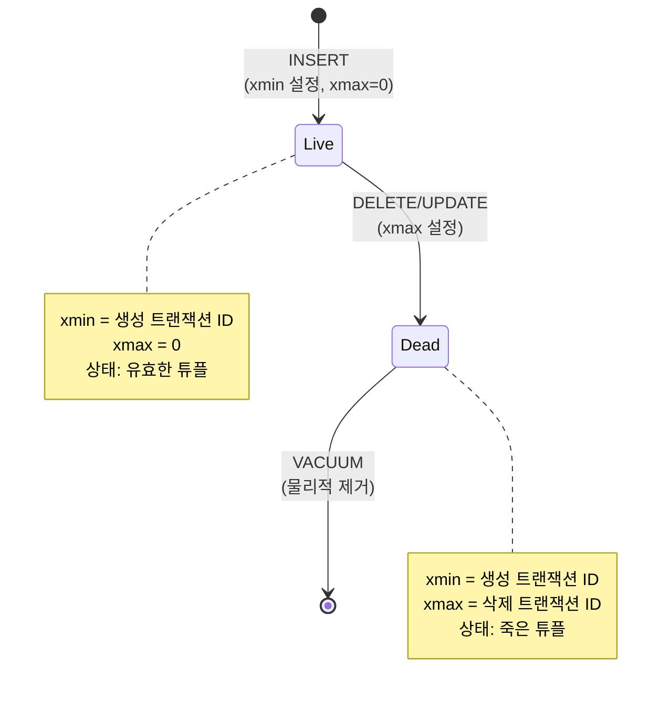
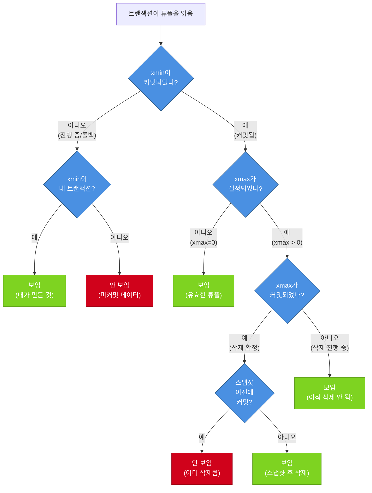

# MVCC (Multi-Version Concurrency Control)

> [!tldr] 한줄 요약
> PostgreSQL은 데이터를 수정할 때 기존 행을 덮어쓰지 않고 새 버전을 만들어, 읽기와 쓰기가 서로를 차단하지 않는 동시성 제어(MVCC)를 구현한다.

## 핵심 원칙

**"읽는 사람은 쓰는 사람을 기다리지 않고, 쓰는 사람은 읽는 사람을 기다리지 않는다."**

| | 락 기반 | MVCC (PostgreSQL) |
|---|---|---|
| 읽기 vs 쓰기 | 서로 블로킹 | 블로킹 없음 |
| 쓰기 vs 쓰기 | 블로킹 | 블로킹 (같은 행만) |
| 구현 방식 | 행 잠금 | 행 버전 관리 |
| 부작용 | 대기/데드락 | 죽은 튜플 누적 → [VACUUM](VACUUM.md) 필요 |

## 튜플의 숨겨진 필드: xmin, xmax

PostgreSQL의 모든 행(튜플)은 눈에 보이지 않는 시스템 컬럼을 가진다.

| 필드 | 의미 |
|------|------|
| **xmin** | 이 튜플을 **생성(INSERT)**한 트랜잭션 ID |
| **xmax** | 이 튜플을 **삭제(DELETE/UPDATE)**한 트랜잭션 ID. 0이면 아직 유효 |
| **ctid** | 튜플의 물리적 위치 (page번호, offset). UPDATE 시 새 버전을 가리킴 |



## 동작 시나리오

### INSERT

```
트랜잭션 100: INSERT INTO users VALUES ('Alice');

튜플: { xmin=100, xmax=0, data='Alice' }
       ↑ 트랜잭션 100이 생성   ↑ 아직 삭제 안 됨
```

### UPDATE (= DELETE + INSERT)

PostgreSQL에서 UPDATE는 **기존 튜플을 삭제 표시 + 새 튜플 생성**이다.

```
트랜잭션 200: UPDATE users SET name='Bob' WHERE name='Alice';

기존 튜플: { xmin=100, xmax=200, data='Alice' }  ← dead tuple
                       ↑ 200이 삭제 표시

새 튜플:   { xmin=200, xmax=0,   data='Bob' }    ← live tuple
```

기존 행을 직접 수정하지 않기 때문에, 다른 트랜잭션이 여전히 이전 버전을 읽을 수 있다.

### DELETE

```
트랜잭션 300: DELETE FROM users WHERE name='Bob';

튜플: { xmin=200, xmax=300, data='Bob' }  ← dead tuple
                   ↑ 300이 삭제 표시
```

물리적으로 제거되지 않고 xmax만 설정된다. 실제 정리는 [VACUUM](VACUUM.md)이 담당한다.

## 스냅샷과 가시성 판단

트랜잭션이 시작되면 **스냅샷(Snapshot)**을 찍는다. 스냅샷은 "이 시점에 어떤 트랜잭션이 커밋되었는가"를 기록한다.

```
스냅샷 구성:
  - xmin: 현재 활성 트랜잭션 중 가장 작은 ID
  - xmax: 다음에 할당될 트랜잭션 ID
  - xip[]: 현재 진행 중인(아직 커밋 안 된) 트랜잭션 ID 목록
```

가시성 규칙을 간단히 요약하면:

| 조건 | 보이나? |
|------|---------|
| xmin 커밋됨 & xmax 없음(0) | 보임 |
| xmin 커밋됨 & xmax 커밋됨 | 안 보임 (삭제됨) |
| xmin이 내 트랜잭션 | 보임 (내가 만든 것) |
| xmin이 진행 중(미커밋) | 안 보임 |



### 동시 읽기 흐름

```
시간 →
트랜잭션 A (xid=100)          트랜잭션 B (xid=101)
─────────────────────         ─────────────────────
BEGIN                         BEGIN
                              스냅샷: {활성=[100]}
UPDATE name='Bob'
  기존: xmax=100 설정
  신규: xmin=100 생성
                              SELECT * FROM users
                              → 기존 튜플 보임 (xmax=100은 미커밋)
                              → 신규 튜플 안 보임 (xmin=100은 미커밋)
                              → 결과: 'Alice' ✓
COMMIT
                              SELECT * FROM users
                              → Read Committed: 'Bob' (새 스냅샷)
                              → Repeatable Read: 'Alice' (기존 스냅샷 유지)
```

[트랜잭션 격리 수준(Isolation Level)](트랜잭션 격리 수준(Isolation Level).md)에 따라 스냅샷을 갱신하는 시점이 달라진다.

## UPDATE가 비싼 이유

PostgreSQL의 UPDATE는 실질적으로 DELETE + INSERT이므로:

1. 기존 튜플 xmax 설정
2. 새 튜플 생성 (전체 행 복사)
3. 모든 인덱스에 새 튜플 위치 추가
4. [WAL](WAL(Write-Ahead Logging).md) 레코드 기록

> [!warning] HOT (Heap-Only Tuple) 최적화
> 인덱스 컬럼이 변경되지 않고 같은 페이지에 공간이 있으면, 인덱스 업데이트를 건너뛰는 HOT 최적화가 작동한다. 하지만 조건이 까다로워 항상 되는 건 아니다.

## VACUUM과의 관계

MVCC의 부작용으로 **죽은 튜플(dead tuple)**이 계속 쌓인다. 이를 정리하는 것이 [VACUUM](VACUUM.md)이다.

| MVCC가 남긴 것 | VACUUM이 하는 것 |
|---------------|-----------------|
| dead tuple 쌓임 | dead tuple의 공간 회수 |
| xmin/xmax 누적 | 오래된 트랜잭션 ID 동결 (Freeze) |
| 테이블 비대화(bloat) | 재사용 가능한 공간 확보 |

## 예시

```sql
-- 숨겨진 필드 직접 확인
SELECT xmin, xmax, ctid, * FROM my_table;

-- 현재 트랜잭션 ID 확인
SELECT txid_current();

-- dead tuple 수 확인
SELECT relname, n_dead_tup, n_live_tup
FROM pg_stat_user_tables
ORDER BY n_dead_tup DESC;
```

> [!example] 실행 결과
> `n_dead_tup`이 `n_live_tup` 대비 높으면 VACUUM이 필요한 상태다. `autovacuum`이 자동 처리하지만, 대량 UPDATE/DELETE 후에는 수동 VACUUM을 고려한다.

## 참고 자료

- [MVCC in PostgreSQL — Row Versions (Postgres Professional)](https://postgrespro.com/blog/pgsql/5967892)
- [MVCC in PostgreSQL — Snapshots (Postgres Professional)](https://postgrespro.com/blog/pgsql/5967899)
- [PostgreSQL Concurrency with MVCC (Heroku)](https://devcenter.heroku.com/articles/postgresql-concurrency)
- [Internals of MVCC in Postgres: Hidden Costs of Updates vs Inserts](https://www.sahaj.ai/internals-of-mvcc-in-postgres-hidden-costs-of-updates-vs-inserts/)

## 관련 노트

- [PostgreSQL 아키텍처](til/postgresql/postgresql-architecture.md)
- [VACUUM](VACUUM.md)
- [트랜잭션 격리 수준(Isolation Level)](트랜잭션 격리 수준(Isolation Level).md)
- [WAL(Write-Ahead Logging)](til/postgresql/wal.md)
- [공유 메모리와 버퍼 풀(Shared Buffer)](til/postgresql/shared-buffer.md)
