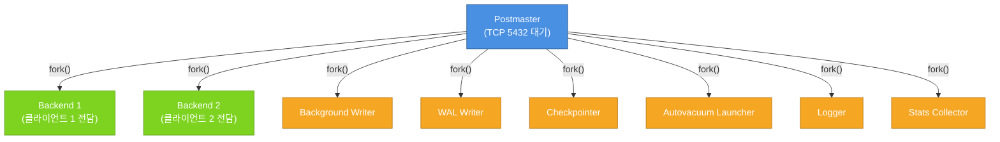
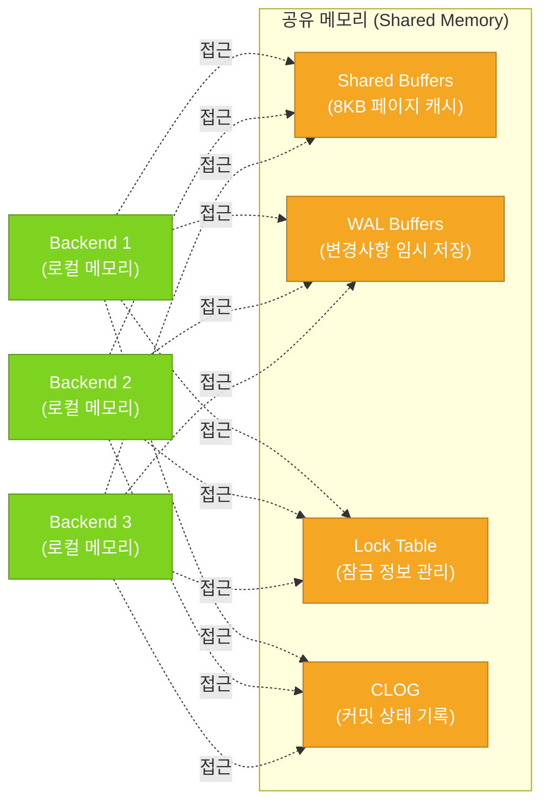

# PostgreSQL 아키텍처

> [!tldr] 한줄 요약
> PostgreSQL은 멀티프로세스 모델로 동작하며, Postmaster가 클라이언트 연결마다 Backend 프로세스를 fork하고, 백그라운드 프로세스들이 WAL 기록·체크포인트·VACUUM 등을 처리한다.

## 멀티프로세스 모델

PostgreSQL은 스레드가 아닌 **프로세스 단위**로 동작한다. 하나의 연결 실패가 다른 연결에 영향을 주지 않도록 **장애 격리(Fault Isolation)**를 우선한 설계다.

| | 멀티프로세스 (PostgreSQL) | 멀티스레드 (MySQL) |
|---|---|---|
| 장애 격리 | 프로세스 단위로 격리 | 스레드 하나가 전체에 영향 가능 |
| 메모리 효율 | 낮음 (프로세스별 할당) | 높음 (메모리 공유) |
| 연결 비용 | `fork()`로 높음 | 스레드 생성으로 낮음 |
| 보완책 | PgBouncer 등 커넥션 풀링 | 스레드풀 |

역사적으로도 Postgres가 1986년 시작했을 때 POSIX 스레드가 표준화 전이었고, `fork()`가 이식성이 높았다.

## 프로세스 구조

```
┌──────────┐
│ Postmaster│ ← 슈퍼바이저 (TCP 5432 대기)
└────┬─────┘
     │ fork()
     ├──→ Backend 1  (클라이언트 1 전담)
     ├──→ Backend 2  (클라이언트 2 전담)
     ├──→ Background Writer
     ├──→ WAL Writer
     ├──→ Checkpointer
     ├──→ Autovacuum Launcher
     ├──→ Logger
     └──→ Stats Collector
```



### Postmaster

서버 시작 시 가장 먼저 생성되는 슈퍼바이저 프로세스다.

- TCP 포트(기본 5432)에서 클라이언트 연결 대기
- 연결 요청 시 Backend 프로세스를 `fork()`하여 할당
- 서버 시작 시 복구(Recovery), [[til/postgresql/shared-buffer|공유 메모리]] 초기화, 백그라운드 프로세스 기동

### Backend 프로세스

클라이언트 연결과 **1:1 매핑**되는 프로세스다.

- 클라이언트 쿼리를 파싱 → 최적화 → 실행
- `max_connections`으로 최대 수 제한 (기본 100)
- 각 프로세스가 자체 로컬 메모리(`work_mem` 등)를 가짐

### 백그라운드 프로세스

Postmaster가 시작 시 fork하는 상주 프로세스들이다.

| 프로세스 | 역할 |
|---------|------|
| **Background Writer** | 주기적으로 Shared Buffer의 dirty 페이지를 디스크에 기록 |
| **WAL Writer** | WAL 버퍼를 [[til/postgresql/wal|WAL]] 파일로 기록 |
| **Checkpointer** | 체크포인트 시 모든 dirty 버퍼를 디스크에 flush |
| **Autovacuum Launcher** | [[VACUUM]]이 필요한 테이블을 감지해 worker 기동 요청 |
| **Logger** | 에러 메시지를 로그 파일에 기록 |
| **Stats Collector** | 테이블/인덱스 통계 정보 수집 |

## 공유 메모리 (Shared Memory)

모든 프로세스가 공유하는 메모리 영역이다. 프로세스 격리의 이점을 유지하면서 필요한 데이터만 명시적으로 공유한다.

```
┌─────────┐  ┌─────────┐  ┌─────────┐
│Backend 1│  │Backend 2│  │Backend 3│
│(로컬 메모리)│  │(로컬 메모리)│  │(로컬 메모리)│
└────┬────┘  └────┬────┘  └────┬────┘
     │            │            │
     ▼            ▼            ▼
┌────────────────────────────────────┐
│         Shared Memory              │
│  ┌──────────────┐ ┌───────────┐   │
│  │Shared Buffers│ │WAL Buffers│   │
│  └──────────────┘ └───────────┘   │
│  ┌──────────────┐ ┌───────────┐   │
│  │  Lock Table  │ │ CLOG      │   │
│  └──────────────┘ └───────────┘   │
└────────────────────────────────────┘
```



- **Shared Buffers** — 디스크 데이터를 8KB 페이지 단위로 캐싱하여 I/O 감소
- **WAL Buffers** — 변경 사항을 WAL 파일에 쓰기 전 임시 저장
- **Lock Table** — 행 수준/테이블 수준 잠금 정보 관리
- **CLOG (Commit Log)** — 트랜잭션 커밋 상태 기록

## WAL (Write-Ahead Logging)

**"데이터를 변경하기 전에, 변경 내용을 먼저 로그에 기록한다"**는 원칙이다.

```
COMMIT 시점:
  Backend → WAL Buffer → WAL 파일 (fsync, 순차 I/O)
                          ↑ 여기서 트랜잭션 확정

나중에 (Checkpoint):
  Shared Buffer → 데이터 파일 (랜덤 I/O)
```

COMMIT 시에는 WAL 순차 쓰기만 하면 되어 빠르고, 무거운 랜덤 I/O는 Checkpoint에서 한꺼번에 처리한다.

> [!tip] WAL의 4가지 이점
> 1. **장애 복구** — 크래시 후 WAL을 재생하여 데이터 복구
> 2. **성능 향상** — 랜덤 I/O 대신 순차 I/O로 COMMIT
> 3. **복제** — WAL을 다른 서버에 전송하면 [[스트리밍 복제(Streaming Replication)|Streaming Replication]] 가능
> 4. **PITR** — 특정 시점까지 WAL 재생으로 Point-in-Time Recovery

## 예시

```sql
-- Backend 프로세스 확인
SELECT pid, usename, application_name, state, query
FROM pg_stat_activity;

-- Shared Buffer 설정 확인
SHOW shared_buffers;     -- 기본 128MB
SHOW wal_buffers;        -- 기본 -1 (자동, shared_buffers의 1/32)
SHOW max_connections;    -- 기본 100
```

> [!example] 실행 결과
> `pg_stat_activity`에서 각 행이 하나의 Backend 프로세스에 해당한다. `state`가 `active`이면 쿼리 실행 중, `idle`이면 대기 상태다.

## 참고 자료

- [Postgres Internals Deep Dive: Process Architecture (EDB)](https://www.enterprisedb.com/blog/postgres-internals-deep-dive-process-architecture)
- [How PostgreSQL Works: Internal Architecture Explained](https://blog.algomaster.io/p/postgresql-internal-architecture)
- [DB 인사이드 | PostgreSQL Architecture - Process, Memory](https://blog.ex-em.com/1645)
- [PostgreSQL 아키텍처 및 특징](https://snowturtle93.github.io/posts/Postgresql-%EC%95%84%ED%82%A4%ED%85%8D%EC%B2%98-%EB%B0%8F-%ED%8A%B9%EC%A7%95/)

## 관련 노트

- [[til/postgresql/backlog|PostgreSQL 학습 백로그]]
- [[til/postgresql/shared-buffer|공유 메모리와 버퍼 풀(Shared Buffer)]]
- [[til/postgresql/wal|WAL(Write-Ahead Logging)]]
- [[MVCC]]
- [[VACUUM]]
