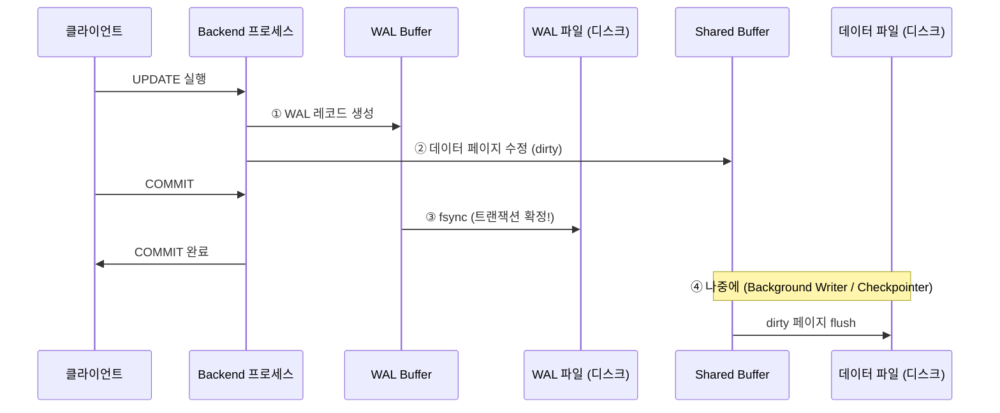
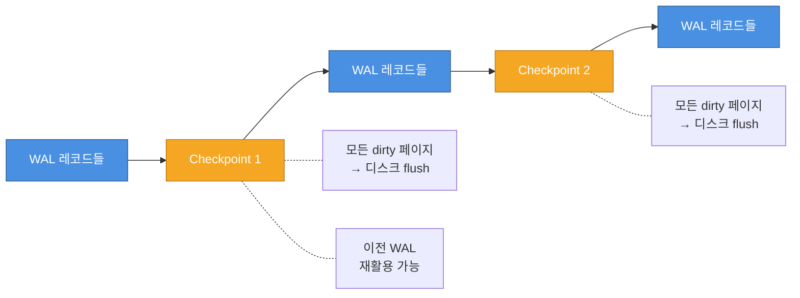

# WAL(Write-Ahead Logging)

> [!tldr] 한줄 요약
> WAL은 데이터를 변경하기 전에 변경 내용을 먼저 로그에 기록하는 메커니즘으로, 장애 복구·성능 향상·복제·PITR의 기반이 된다.

## 핵심 원칙

**"데이터를 변경하기 전에, 변경 내용을 먼저 로그에 기록한다."**

COMMIT 시에는 WAL만 디스크에 확실히 기록하면 되고, 실제 데이터 파일은 나중에 써도 복구가 가능하다.



> [!tip] WAL의 4가지 이점
> 1. **장애 복구** — 크래시 후 WAL을 재생하여 데이터 복구
> 2. **성능 향상** — 랜덤 I/O 대신 순차 I/O로 COMMIT
> 3. **복제** — WAL을 다른 서버에 전송하면 [[til/postgresql/streaming-replication|Streaming Replication]] 가능
> 4. **PITR** — 특정 시점까지 WAL 재생으로 Point-in-Time Recovery

## 순차 I/O가 빠른 이유

```
랜덤 I/O (WAL 없이 직접 쓰기):
  페이지A → 디스크 위치 1023  ↗ 헤드 이동
  페이지B → 디스크 위치 5847  ↗ 헤드 이동
  페이지C → 디스크 위치 312   ↗ 헤드 이동

순차 I/O (WAL):
  WAL 레코드 → 파일 끝에 append, append, append...
  (헤드 이동 최소화, SSD에서도 순차 쓰기가 유리)
```

COMMIT 시에는 WAL 순차 쓰기만 하면 되어 빠르고, 무거운 랜덤 I/O는 Checkpoint에서 한꺼번에 처리한다.

## WAL 파일 구조

WAL은 `pg_wal/` 디렉토리에 **세그먼트 파일**로 저장된다.

```
pg_wal/
├── 000000010000000000000001   ← 세그먼트 파일 (기본 16MB)
├── 000000010000000000000002
├── 000000010000000000000003
└── ...
```

| 구성 | 설명 |
|------|------|
| 세그먼트 파일 크기 | 기본 16MB (`--wal-segsize`로 변경 가능) |
| 파일명 규칙 | `{타임라인}{논리적세그먼트번호}` (24자리 16진수) |
| 내부 구성 | 8KB 페이지 → 각 페이지에 여러 WAL 레코드 |

### WAL 레코드 구성

```
WAL 레코드:
┌──────────────────────────────────────────┐
│ Header                                    │
│  - xl_tot_len: 레코드 전체 길이            │
│  - xl_xid: 트랜잭션 ID                    │
│  - xl_prev: 이전 WAL 레코드 위치 (LSN)     │
│  - xl_rmgr: 리소스 매니저 ID (heap, btree) │
│  - xl_info: 연산 종류 (INSERT, UPDATE 등)   │
├──────────────────────────────────────────┤
│ Data                                      │
│  - 변경된 데이터 (행 내용 또는 Full Page)    │
└──────────────────────────────────────────┘
```

## LSN (Log Sequence Number)

LSN은 WAL 내에서의 **바이트 오프셋**이다. 모든 WAL 레코드에 고유한 위치를 부여한다.

| 용도 | 설명 |
|------|------|
| 복제 지연 측정 | Primary LSN - Replica LSN = 복제 지연량 |
| Checkpoint 추적 | 마지막 Checkpoint의 LSN 기록 |
| 복구 목표 지정 | PITR에서 "이 LSN까지 복구" 가능 |
| 페이지 무결성 | 각 데이터 페이지 헤더에 마지막 수정 LSN 기록 |

## Checkpoint

Checkpoint는 **"이 시점까지의 모든 변경이 디스크에 확실히 반영되었다"**를 보장하는 시점이다.



Checkpoint가 발생하면:
1. 모든 dirty 페이지를 데이터 파일에 flush
2. 특별한 Checkpoint 레코드를 WAL에 기록
3. 이전 WAL 세그먼트는 재활용 가능 (복구에 불필요)

| 트리거 조건 | 설정 파라미터 | 기본값 |
|------------|-------------|--------|
| 일정 시간 경과 | `checkpoint_timeout` | 5분 |
| WAL 용량 초과 | `max_wal_size` | 1GB |
| 수동 실행 | `CHECKPOINT` 명령 | - |

> [!warning] Checkpoint의 성능 영향
> Checkpoint 시 대량의 dirty 페이지를 한꺼번에 디스크에 쓰므로 I/O 스파이크가 발생할 수 있다. `checkpoint_completion_target` (기본 0.9)으로 I/O를 다음 Checkpoint까지 분산시킨다.

## Full Page Write (FPW)

Checkpoint 후 페이지가 **처음 수정될 때**, 변경된 부분만이 아니라 **페이지 전체(8KB)**를 WAL에 기록한다.

### 왜 필요한가?

OS가 8KB 페이지를 디스크에 쓰는 도중 크래시가 나면, 페이지의 절반만 기록된 **torn page(찢어진 페이지)**가 발생할 수 있다.

```
정상 상태:                   크래시 후 (torn page):
┌──────────┐               ┌──────────┐
│ 새 데이터  │               │ 새 데이터  │ ← 4KB만 기록됨
│ 새 데이터  │               │ 옛 데이터  │ ← 기록 안 됨
└──────────┘               └──────────┘
                            ↑ 일관성 깨짐!
```

일반 WAL 레코드(행 단위 변경)로는 찢어진 페이지를 복구할 수 없다. 그래서 Checkpoint 직후 첫 수정 시 전체 페이지를 WAL에 백업해둔다.

```
Checkpoint → 페이지 첫 수정 → Full Page Image를 WAL에 기록
          → 같은 페이지 두 번째 수정 → 변경 부분만 기록 (효율적)
          → 다음 Checkpoint → 다시 FPW 발생
```

> [!tip] FPW와 WAL 증폭
> Checkpoint 직후 많은 페이지가 처음 수정되므로 WAL 양이 급증한다. `full_page_writes = off`로 끌 수 있지만 torn page 위험이 생기므로 프로덕션에서는 절대 끄지 않는다.

## WAL 수준 (wal_level)

WAL에 얼마나 상세한 정보를 기록할지 결정한다.

| wal_level | 용도 | WAL 양 |
|-----------|------|--------|
| `minimal` | 크래시 복구만 | 가장 적음 |
| `replica` (기본) | 스트리밍 복제 + PITR | 중간 |
| `logical` | [[til/postgresql/logical-replication\|논리적 복제]] (테이블 단위) | 가장 많음 |

## 아카이빙과 PITR

WAL 아카이빙은 세그먼트가 가득 찰 때 외부 저장소에 복사해두는 것이다. 이를 이용해 **Point-in-Time Recovery(PITR)**가 가능하다.

```
기본 백업 (base backup)
     │
     │  + WAL 아카이브 순차 재생
     ▼
  WAL 001 → WAL 002 → WAL 003 → ... → 목표 시점까지
```

복구 흐름:
1. 기본 백업을 복원
2. 아카이브된 WAL을 순차적으로 재생
3. `recovery_target_time` 또는 `recovery_target_lsn`에 도달하면 중단
4. 해당 시점의 일관된 데이터베이스 상태 복원

## 관련 백그라운드 프로세스

| 프로세스 | 역할 |
|---------|------|
| **WAL Writer** | WAL 버퍼를 주기적으로 WAL 파일에 기록 (COMMIT 전에도) |
| **Checkpointer** | 주기적으로 [[til/postgresql/shared-buffer\|Shared Buffer]]의 dirty 페이지를 데이터 파일에 flush |
| **Archiver** | 가득 찬 WAL 세그먼트를 아카이브 저장소에 복사 |

## 예시

```sql
-- 현재 WAL 위치 확인
SELECT pg_current_wal_lsn();
-- 결과: 0/1A3B5C80

-- LSN 간 차이 = WAL 생성량 (바이트)
SELECT pg_wal_lsn_diff('0/1A3B5C80', '0/19000000') AS wal_bytes;

-- WAL 통계 확인 (PostgreSQL 14+)
SELECT * FROM pg_stat_wal;

-- 마지막 Checkpoint 정보
SELECT * FROM pg_control_checkpoint();
```

> [!example] 실행 결과
> `pg_stat_wal`에서 `wal_bytes`가 급증하면 대량 쓰기 작업이 진행 중인 것이다. `pg_control_checkpoint()`의 `checkpoint_lsn`과 현재 LSN의 차이가 크면 다음 Checkpoint까지 많은 WAL이 쌓인 상태다.

## 주요 설정 파라미터

| 파라미터 | 기본값 | 설명 |
|---------|--------|------|
| `wal_level` | replica | WAL 상세 수준 |
| `max_wal_size` | 1GB | Checkpoint 트리거 WAL 용량 |
| `min_wal_size` | 80MB | 최소 WAL 보유량 |
| `checkpoint_timeout` | 5min | Checkpoint 주기 |
| `checkpoint_completion_target` | 0.9 | I/O 분산 비율 |
| `full_page_writes` | on | torn page 방지 |
| `wal_buffers` | -1 (자동) | WAL 버퍼 크기 (shared_buffers의 1/32) |
| `synchronous_commit` | on | COMMIT 시 WAL fsync 대기 여부 |

## 참고 자료

- [WAL Internals (PostgreSQL 18 공식 문서)](https://www.postgresql.org/docs/current/wal-internals.html)
- [WAL Configuration (PostgreSQL 18 공식 문서)](https://www.postgresql.org/docs/current/wal-configuration.html)
- [Continuous Archiving and PITR (PostgreSQL 18 공식 문서)](https://www.postgresql.org/docs/current/continuous-archiving.html)
- [Understanding WAL Internals in PostgreSQL (CloudThat)](https://www.cloudthat.com/resources/blog/understanding-wal-internals-in-postgresql)

## 관련 노트

- [[til/postgresql/postgresql-architecture|PostgreSQL 아키텍처]]
- [[til/postgresql/shared-buffer|공유 메모리와 버퍼 풀(Shared Buffer)]]
- [[til/postgresql/mvcc|MVCC]]
- [[VACUUM]]
- [[til/postgresql/streaming-replication|스트리밍 복제(Streaming Replication)]]
- [[til/postgresql/rds-backup-restore|RDS 백업과 복원]]
