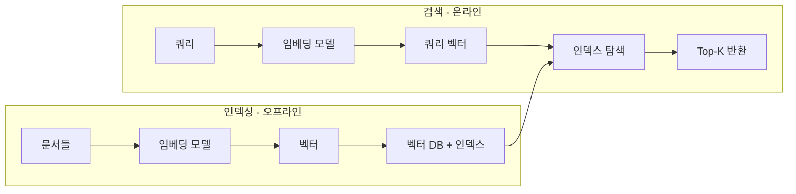

# 유사도 검색(Similarity Search)

> [!tldr] 쿼리 벡터와 저장된 벡터 간의 거리를 측정하여 가장 유사한 K개를 반환하는 검색 방식. 소규모에서는 Exact Search(KNN), 대규모에서는 ANN 알고리즘을 사용한다.

## 핵심 개념

유사도 검색은 "이것과 비슷한 것을 찾아줘"를 수학적으로 수행하는 것이다. [벡터 임베딩(Vector Embedding)](til/vector-db/vector-embedding.md)으로 데이터를 변환하고, [거리 메트릭(Distance Metrics)](til/vector-db/distance-metrics.md)으로 거리를 측정하여, **가장 가까운 K개의 벡터**를 반환한다.

## 전체 파이프라인



### 코드 예시

```python
from openai import OpenAI
import pinecone

client = OpenAI()

# 1. 문서 임베딩 & 저장
docs = ["Python은 범용 프로그래밍 언어다", "JavaScript는 웹 개발에 쓰인다"]
for i, doc in enumerate(docs):
    vector = client.embeddings.create(
        input=doc, model="text-embedding-3-small"
    ).data[0].embedding
    index.upsert([(str(i), vector, {"text": doc})])

# 2. 쿼리 임베딩 & 검색
query = "웹 프론트엔드 개발 언어"
q_vector = client.embeddings.create(
    input=query, model="text-embedding-3-small"
).data[0].embedding
results = index.query(vector=q_vector, top_k=3)
# → "JavaScript는 웹 개발에 쓰인다"가 상위에 랭크됨
```

## Exact Search (KNN) vs Approximate Search (ANN)

벡터가 1억 개라면, 쿼리할 때마다 1억 번 거리를 계산해야 할까?

### Exact Search (Brute Force / KNN)

모든 벡터와 하나씩 비교한다.

- **시간 복잡도**: O(n × d) — n: 벡터 수, d: 차원
- **장점**: 100% 정확한 결과 (Recall = 1.0)
- **단점**: 1천만 개 × 300차원 = **30억 번 연산**. 수 초~수 분 소요

수천 개 이하의 소규모 데이터셋에서만 실용적이다.

### Approximate Nearest Neighbor (ANN)

벡터를 미리 **인덱스 구조**(그래프, 클러스터, 트리 등)로 조직화하여, 전체를 탐색하지 않고 후보군만 빠르게 좁힌다.

```
쿼리 벡터 → 인덱스 구조 탐색 → 후보 ~1000개로 축소 → 정확한 거리 계산 → Top-K
```

- **시간 복잡도**: O(log n) ~ O(√n)
- **장점**: 수십억 벡터에서도 **밀리초 단위** 응답
- **단점**: 약간의 정확도 손실 (Recall < 1.0, 보통 0.95~0.99)

### 비교 요약

| | Exact (KNN) | Approximate (ANN) |
|---|---|---|
| 정확도 | 100% | 95~99% |
| 속도 (1천만 벡터) | 수 초~수 분 | 수 밀리초 |
| 메모리 | 벡터 원본만 | 인덱스 추가 필요 |
| 적합 규모 | < 수천 개 | 수백만~수십억 개 |

> [!tip] 실무에서는 거의 항상 ANN을 사용한다. 모든 벡터 DB(Pinecone, Weaviate, Milvus 등)의 기본 동작이 ANN이다.

## 대표적인 ANN 알고리즘

| 알고리즘 | 방식 | 대표 구현 |
|----------|------|-----------|
| **HNSW** | 계층적 그래프 탐색 | 대부분의 벡터 DB 기본값 |
| **IVF** | 클러스터 기반 파티셔닝 | Milvus, FAISS |
| **Annoy** | 랜덤 트리 포레스트 | Spotify |
| **ScaNN** | 양자화 + 내적 최적화 | Google |

(HNSW, IVF는 별도 TIL에서 자세히 다룬다 → [HNSW 인덱스](til/vector-db/hnsw.md), [IVF 인덱스](til/vector-db/ivf.md))

## 검색 품질 지표

| 지표 | 의미 | 목표 |
|------|------|------|
| **Recall@K** | 실제 Top-K 중 반환된 비율 | 0.95 이상 |
| **Latency** | 쿼리 응답 시간 | < 100ms (보통 < 10ms) |
| **QPS** | 초당 처리 쿼리 수 | 높을수록 좋음 |

> [!warning] Recall과 Latency는 트레이드오프 관계다. 인덱스 파라미터를 조정하여 둘 사이의 균형점을 찾아야 한다.

## References

- [Vector Similarity - Pinecone](https://www.pinecone.io/learn/vector-similarity/)
- [Vector Search Explained - Weaviate](https://weaviate.io/blog/vector-search-explained)
- [KNN vs ANN for Semantic Search](https://medium.com/@zawanah/knn-vs-ann-for-semantic-search-2d0bc4d2e287)

## Related Notes

- [벡터 임베딩(Vector Embedding)](til/vector-db/vector-embedding.md)
- [거리 메트릭(Distance Metrics)](til/vector-db/distance-metrics.md)
- [ANN 알고리즘(Approximate Nearest Neighbor)](til/vector-db/ann.md)
- [HNSW 인덱스](til/vector-db/hnsw.md)
- [IVF 인덱스](til/vector-db/ivf.md)