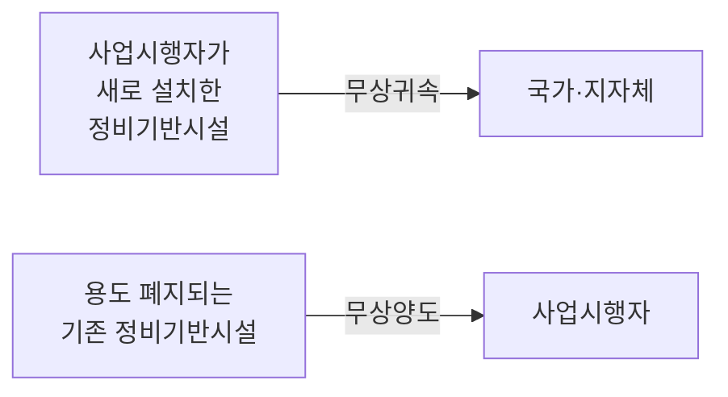

# 정비기반시설

> [!tldr] 한줄 요약
> 도로·상하수도·공원 등 정비구역 내 주민 생활에 필수적인 인프라로, 이것의 열악 여부가 재개발과 재건축을 구분하는 핵심 기준이다.

## 핵심 내용

### 법적 정의 (도정법 제2조 제4호)

[[til/도시정비사업/도시-및-주거환경정비법|도시 및 주거환경정비법]] 제2조에서 정비기반시설을 다음과 같이 정의한다:

> 도로·상하수도·구거(溝渠)·공원·공용주차장·공동구, 그 밖에 주민의 생활에 필요한 열·가스 등의 공급시설로서 대통령령으로 정하는 시설

| 시설 | 설명 |
|------|------|
| 도로 | 차량·보행자 통행을 위한 교통 인프라 |
| 상하수도 | 급수 및 하수처리 시설 |
| 구거(溝渠) | 도랑, 배수로 등 배수 시설 |
| 공원 | 주민 여가를 위한 녹지 공간 |
| 공용주차장 | 공공 주차 시설 |
| 공동구 | 전기·통신·수도 등을 함께 수용하는 지하 구조물 |
| 열·가스 공급시설 | 난방·가스 등 에너지 공급 인프라 |

### 유사 개념과의 관계

국토계획법과 도정법에서 비슷한 용어가 등장하는데, 포함 관계는 공공시설 ⊃ 기반시설 ⊃ 도시·군계획시설이며, 정비기반시설은 도정법에서 별도 정의한다.

| 용어 | 근거 법률 | 정의 |
|------|-----------|------|
| **공공시설** | 국토계획법 | 국가·지자체가 설치하는 도로, 공원, 철도, 항만 등 |
| **기반시설** | 국토계획법 | 도시기능 유지에 필요한 시설 (7개 유형, 53종) |
| **도시계획시설** | 국토계획법 | 기반시설 중 도시관리계획으로 **결정된** 시설 |
| **정비기반시설** | 도정법 | 정비사업 맥락에서의 기반 인프라 (도로, 상하수도, 공원 등) |

> [!tip] 구분 포인트
> 기반시설은 국토계획법의 넓은 개념(7유형 53종)이고, 정비기반시설은 도정법이 정비사업에 필요한 범위로 한정한 좁은 개념이다.

### 정비사업 유형을 결정하는 핵심 기준

정비기반시설의 상태가 [[til/도시정비사업/정비사업-유형|정비사업의 유형]]을 나누는 가장 중요한 기준이다:

| 정비기반시설 상태 | 건축물 상태 | 사업 유형 |
|-----------------|-----------|----------|
| **열악** | 노후·불량 밀집 | 재개발 |
| **양호** | 노후 공동주택 밀집 | 재건축 |
| **극히 열악** | 노후·불량 과도 밀집 | 주거환경개선 |

## 예시

### 재개발 대상 (정비기반시설 "열악")
- 폭 4m 미만의 좁은 도로, 소방차 진입 곤란
- 노후한 상하수도관, 빗물 배수 불량
- 주차장·공원 등 편의시설 부족

### 재건축 대상 (정비기반시설 "양호")
- 단지 내 도로·상하수도가 정상 작동
- 주변 공원·주차장 확보
- 건물 자체만 노후 (1980년대 아파트 등)

### 주거환경개선 대상 (정비기반시설 "극히 열악")
- 차량 진입 자체가 불가능한 산비탈 골목길
- 상수도 미설치, 공동수도·우물 의존
- 공동화장실 사용, 하수관 미비
- 재해 시 피난·구조 활동 곤란

> [!example] 대표 사례
> 서울의 과거 달동네들이 전형적인 주거환경개선사업 대상이었다. 산비탈에 무허가 주택이 밀집하고, 기본적인 생활 인프라 자체가 부재한 수준이었다.

### 무상귀속과 무상양도 (도정법 제97조)

정비사업 완료 후 정비기반시설의 소유권이 이전되는 구조:

- **무상귀속**: 사업시행자가 새로 설치한 정비기반시설 → 국가·지자체 소유로 귀속
- **무상양도**: 용도 폐지되는 기존 정비기반시설 → 사업시행자에게 양도 (새 시설 설치비용 상당 범위 내)
- 귀속 시기: 준공인가 후 관리청에 통지한 때
- 이 규정은 **강행규정**으로, 위반 시 부당이득반환 청구 가능 (대법원 판례)

## 참고 자료

- [도시 및 주거환경정비법 제2조 - 국가법령정보센터](https://www.law.go.kr/LSW/lsInfoP.do?lsId=009410&ancYnChk=0)
- [공공시설, 기반시설, 도시계획시설의 정의와 차이](https://anbak4.com/entry/%EA%B3%B5%EA%B3%B5%EC%8B%9C%EC%84%A4-%EA%B8%B0%EB%B0%98%EC%8B%9C%EC%84%A4-%EB%8F%84%EC%8B%9C%EA%B5%B0%EA%B3%84%ED%9A%8D%EC%8B%9C%EC%84%A4%EC%9D%98-%EC%A0%95%EC%9D%98%EC%99%80-%EC%B0%A8%EC%9D%B4)
- [정비기반시설 무상귀속과 무상양도 - 하우징헤럴드](https://www.housingherald.co.kr/news/articleView.html?idxno=47553)

## 관련 노트

- [[til/도시정비사업/도시-및-주거환경정비법|도시 및 주거환경정비법]]
- [[노후불량건축물]]
- [[정비사업의 유형]]
- [[정비구역 지정]]
